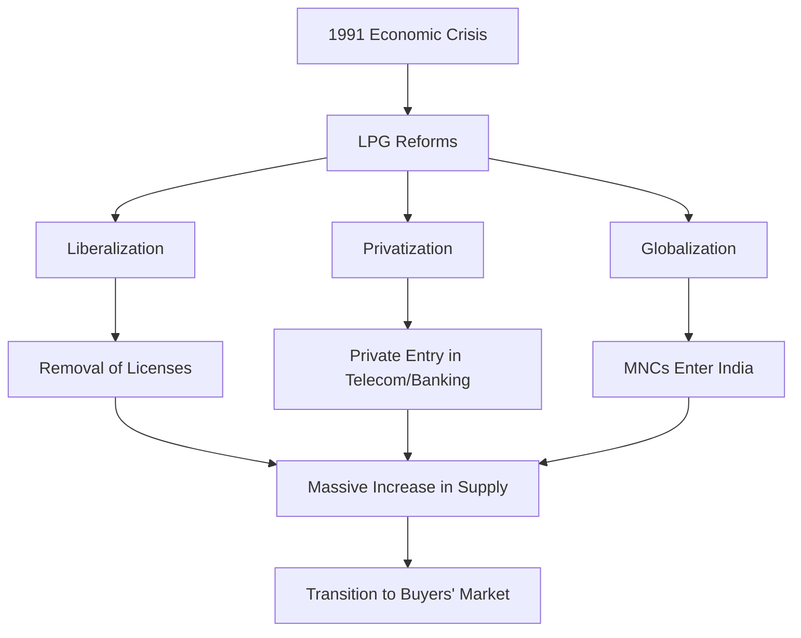

# Markets: The Paradigm Shift - An Advanced Academic Deep Dive

## 1. Introduction: The Evolution of the Indian Economic Market

The chapter chronicles the evolution of the Indian economy from a **Sellers’ Market** (production-oriented, shortage-driven) to a **Buyers’ Market** (consumer-oriented, competition-driven). To understand this shift, one must understand the economic environment of India from 1947 to 1991.

### 1.1 The Pre-1991 Era: The "License Raj" and the Sellers' Market
Following independence in 1947, India adopted a mixed economy model heavily influenced by Soviet-style central planning. The government controlled the "commanding heights" of the economy. Private enterprises were heavily regulated under the Industries (Development and Regulation) Act, 1951.
- **Production-Oriented:** The focus was merely on producing goods. Quality was secondary because demand constantly outstripped supply.
- **Shortage-Driven:** Scarcity was a defining feature. If a family wanted a Bajaj scooter or a BSNL landline, the waiting period was often 5 to 10 years. 
- **Monopolistic Dominance:** Due to strict licensing, only a few companies were allowed to operate. Hindustan Motors (Ambassador) and Premier Automobiles (Padmini) completely monopolized the passenger car segment.

| Characteristic | Description in Sellers' Market (Pre-1991) |
| :--- | :--- |
| **Bargaining Power** | Rested entirely with the seller. |
| **Consumer Choice** | Extremely limited or non-existent. |
| **Pricing Strategy** | Cost-plus pricing; inefficiencies passed to consumers. |
| **Innovation** | Stagnant. No incentive to upgrade products. |
| **Marketing Function** | Non-existent. Selling and distribution were the only requirements. |

### 1.2 The Catalyst: The 1991 LPG Reforms
In 1991, facing a severe Balance of Payments (BoP) crisis with foreign exchange reserves sufficient for only two weeks of imports, the Government of India, led by Finance Minister Dr. Manmohan Singh, initiated radical economic reforms. 

These reforms are summarized by the acronym **LPG**:
1.  **Liberalization:** Dismantling the "License Raj." Removing quotas, tariffs, and restrictions on industrial expansion. Companies could now decide their own production capacities based on market demand rather than government dictation.
2.  **Privatization:** Reducing the role of the public sector. Selling government equity in Public Sector Undertakings (PSUs) and allowing private players into sectors like telecommunications, aviation, and banking.
3.  **Globalization:** Integrating the Indian economy with the world economy. Lowering import duties, allowing Foreign Direct Investment (FDI), and welcoming Multinational Corporations (MNCs).

### 1.3 The Core Philosophy: Caveat Emptor to Caveat Vendor

The fundamental legal and ethical shift in this transition is captured by two Latin maxims.

#### A. Caveat Emptor (Let the Buyer Beware)
Under the Sale of Goods Act, 1930, the principle of *Caveat Emptor* dominated. It implied that it was the buyer's responsibility to examine the goods thoroughly before purchase. If the buyer made a bad choice, the seller was generally not held liable unless there was outright fraud.
- **Environment:** Thrives in a Sellers' Market where buyers have no alternatives.

#### B. Caveat Vendor (Let the Seller Beware)
With the advent of heavy competition, the burden of quality shifted to the seller. Today, if a product is defective, hazardous, or misadvertised, the seller, manufacturer, and even the endorser can be held liable.
- **Environment:** Thrives in a Buyers' Market where consumer rights are paramount.

---

## 2. Deep Dive: The Consumer Protection Act (CPA) 2019

The shift to Caveat Vendor was legally cemented in India by the Consumer Protection Act of 1986, which was subsequently overhauled by the **CPA 2019** to address modern digital markets.

### 2.1 Key Pillars of CPA 2019
1.  **Product Liability:** A manufacturer or product service provider or product seller will be held responsible to compensate for injury or damage caused by defective product or deficiency in services.
2.  **E-Commerce Coverage:** All e-commerce platforms (Amazon, Flipkart) must disclose seller details, origin of products, and return/refund policies. They cannot simply claim to be "intermediaries" to escape liability.
3.  **Unfair Contracts:** Consumer courts can strike down terms of contracts that are grossly unfair to consumers (e.g., banks charging exorbitant penalty fees while giving negligible interest).
4.  **Central Consumer Protection Authority (CCPA):** An executive agency empowered to conduct investigations, order recalls, and impose massive penalties for misleading advertisements (even holding celebrity endorsers liable).

### 2.2 The Three-Tier Grievance Redressal Mechanism

To ensure speedy justice, India established a three-tier quasi-judicial system:

| Commission Level | Pecuniary Jurisdiction (Dispute Value) | Appellate Authority |
| :--- | :--- | :--- |
| **District Commission** | Up to ₹50 Lakhs | State Commission |
| **State Commission** | ₹50 Lakhs to ₹2 Crores | National Commission |
| **National Commission (NCDRC)** | Above ₹2 Crores | Supreme Court of India |

*(Note: Pecuniary limits were revised in 2021 via rules notified by the Central Government to the limits shown above, down from the original 2019 Act limits of 1Cr/10Cr).*

---

## 3. Advanced Marketing Strategy Frameworks

To survive in the post-1991 Buyers' Market, corporations had to adopt advanced strategic frameworks to analyze their competitive environment.

### 3.1 PESTLE Analysis (Macro-environment)
Firms must scan the macro-environment before launching products.
- **P**olitical: Tax policies, government stability, trade tariffs.
- **E**conomic: Inflation, interest rates, economic growth (GDP), exchange rates.
- **S**ocial: Cultural trends, demographics, population growth rate.
- **T**echnological: R&D activity, automation, technology incentives.
- **L**egal: Consumer protection laws, antitrust laws, employment laws.
- **E**nvironmental: Climate change regulations, sustainability targets.

### 3.2 Porter’s Five Forces (Micro-environment & Industry Attractiveness)
Developed by Michael Porter (Harvard Business School), this framework dictates industry profitability.
1. **Threat of New Entrants:** High if barriers to entry (capital, patents) are low.
2. **Bargaining Power of Suppliers:** High if there are few suppliers (e.g., Intel/AMD in microprocessors).
3. **Bargaining Power of Buyers:** High in a Buyers' market where alternatives are plentiful.
4. **Threat of Substitutes:** High if alternatives exist outside the direct industry (e.g., Video conferencing substituting business travel).
5. **Rivalry Among Existing Competitors:** The intensity of the price/quality war among current players (e.g., Coke vs. Pepsi).

### 3.3 The Ansoff Matrix (Growth Strategy)
Firms use this to plot their expansion strategies based on Risk vs Reward.
- **Market Penetration (Existing Product, Existing Market):** Lowest risk. Selling more to current customers (e.g., Jio offering cheaper data plans).
- **Product Development (New Product, Existing Market):** Moderate risk. (e.g., Apple launching the Apple Watch to its iPhone user base).
- **Market Development (Existing Product, New Market):** Moderate risk. (e.g., Netflix expanding from the US into India).
- **Diversification (New Product, New Market):** Highest risk. (e.g., Tata Group moving from steel into software services - TCS).

---

## 4. Key Concepts: The Three Perspectives of 'Market'

To excel in competitive exams, one must differentiate between how a layman, an economist, and a marketer view a "market."

### 4.1 The Place Concept
- **Definition:** The traditional view where a market is a specific physical geographical location where buyers and sellers meet.
- **Example:** A local village *Haat*, the APMC agricultural *Mandi*.

### 4.2 The Area Concept
- **Definition:** An economic view where a market is any region (city, country, world) where buyers and sellers are in such close communication that prices of the same goods tend to equalize rapidly.
- **Example:** The global crude oil market. 

### 4.3 The Demand Concept (The Marketer's View)
- **Definition:** A market is the aggregate of all potential buyers who share a particular need or want, and possess the purchasing power and willingness to satisfy that need.
- **Scientific Reasoning:** The evolution from 'Place' to 'Demand' represents the **de-materialization** of markets via the Internet.

---

## 5. Mathematical Economics of Market Demand

A core Olympiad and Foundation concept is the mathematical quantification of Demand and Pricing.

### 5.1 The "Effective Market Demand" Formula
$$ \text{Effective Market Demand (D)} = \text{Need/Desire (N)} + \text{Purchasing Power (P)} + \text{Willingness to Spend (W)} $$
It is a multiplicative relationship in practice: $D = N \times P \times W$. If any element is zero, demand is zero.

### 5.2 The Demand Function and Curve
$$ Q_{dx} = f(P_x, P_r, Y, T, E) $$
- $Q_{dx}$ = Quantity demanded of product X
- $P_x$ = Price of product X (Negative correlation)
- $P_r$ = Price of related goods (Substitutes = Positive; Complements = Negative)
- $Y$ = Income level (Normal goods = Positive; Inferior goods = Negative)

### 5.3 Elasticity of Demand (PED, YED, XED)

**1. Price Elasticity (PED):**
$$ E_p = \frac{\% \Delta \text{ in Quantity Demanded}}{\% \Delta \text{ in Price}} = \frac{\Delta Q}{\Delta P} \times \frac{P}{Q} $$
- $|E_p| > 1$: Elastic (Luxury goods)
- $|E_p| < 1$: Inelastic (Necessity goods)

**2. Cross-Price Elasticity (XED):**
$$ E_c = \frac{\% \Delta \text{ Quantity of Good X}}{\% \Delta \text{ Price of Good Y}} $$
- Positive: Substitutes (Tea vs Coffee)
- Negative: Complements (Car vs Petrol)

### 5.4 Measuring Market Concentration (HHI)
The Herfindahl-Hirschman Index (HHI) measures the size of firms in relation to the industry to determine the level of competition.
$$ HHI = s_1^2 + s_2^2 + s_3^2 + \dots + s_n^2 $$
Where $s_n$ is the market share percentage of firm $n$. 
- HHI $< 1500$: Highly competitive (Unconcentrated).
- HHI $1500 - 2500$: Moderately concentrated (Oligopoly).
- HHI $> 2500$: Highly concentrated (Monopoly danger).

---

## 6. Behavioral Economics in Marketing

Traditional economics assumes humans are perfectly rational ($Homo economicus$). Behavioral economics proves they are not, and marketers exploit this.

### 6.1 Prospect Theory & Loss Aversion (Kahneman & Tversky)
- **Principle:** The psychological pain of losing ₹100 is roughly twice as intense as the joy of gaining ₹100.
- **Marketing Application:** "Save ₹500 on your bill" works better than "Gain a ₹500 bonus." Limited-time offers trigger FOMO (Fear Of Missing Out), heavily leveraging loss aversion.

### 6.2 The Anchoring Effect
- **Principle:** Human brains rely heavily on the first piece of information offered (the "anchor") when making decisions.
- **Marketing Application:** A jacket is priced at ₹10,000 but crossed out to show ₹4,000. The ₹10k is the anchor, making ₹4k feel like an absolute steal, even if the jacket only cost ₹1k to manufacture.

### 6.3 The Decoy Effect (Asymmetric Dominance)
- **Principle:** Consumers will tend to have a specific change in preference between two options when presented with a third option that is asymmetrically dominated.
- **Marketing Application:** 
  - Small Popcorn: ₹150
  - Medium Popcorn: ₹280 (The Decoy)
  - Large Popcorn: ₹300 
  The medium exists *only* to make the large look like a highly rational, value-driven choice.

---

## 7. Extensive Case Studies: The Indian Market Evolution

### 7.1 The Telecom Oligopoly & Jio's Penetration Pricing
- **Pre-2016:** The market was a stable oligopoly (Airtel, Vodafone, Idea). Data cost ₹250/GB.
- **The Disruption:** Reliance Jio entered using extreme **Penetration Pricing** (giving services away for free for 6 months). This decimated the competitors, forcing a merger between Vodafone and Idea (Vi).
- **Result:** Jio captured a massive market share, transitioning the market from an oligopoly to near duopoly (Jio vs Airtel), while permanently shifting Indian consumer surplus to record highs.

### 7.2 The Tata Nano Failure (Positioning Error)
- **Goal:** To create the world's cheapest car (₹1 Lakh) to upgrade millions of Indians from 2-wheelers to 4-wheelers.
- **The Error:** The marketing heavily pushed the "Cheap" angle. In India, a car is not just utility; it is a status symbol. Nobody wanted to be seen driving the "world's cheapest car."
- **Result:** A brilliant engineering feat failed due to a fundamental error in Psychological Positioning (STP).

### 7.3 The Maggi Lead Crisis (Caveat Vendor in Action)
- **Scenario:** In 2015, FSSAI banned Maggi noodles after detecting excessive lead and MSG.
- **Action:** Under the strict Caveat Vendor environment, Nestle had to execute a massive ₹320 crore product recall and destroy 27,000 tonnes of noodles.
- **Recovery:** Nestle rebuilt trust through total transparency and safety campaigns, eventually recovering its market share. This is the textbook example of modern product liability.

---

## 8. Exam Edge: Advanced MBA Solved Numericals

> **📌 Problem 1: HHI Market Concentration**
> **Given:** An industry has 4 firms with market shares of 40%, 30%, 20%, and 10%.
> **Find:** The HHI and interpret the market structure.
> **Solution:** $HHI = 40^2 + 30^2 + 20^2 + 10^2 = 1600 + 900 + 400 + 100 = 3000$.
> **Answer: HHI = 3000. Highly concentrated (Monopolistic/Tight Oligopoly).**

> **📌 Problem 2: Price Elasticity (Arc Method)**
> **Given:** Price rises from ₹10 to ₹12. Demand falls from 100 to 80 units.
> **Find:** The Arc Price Elasticity of Demand.
> **Solution:** Arc Elasticity = $\frac{\Delta Q}{\Delta P} \times \frac{P_1 + P_2}{Q_1 + Q_2}$.
> $\Delta Q = -20$. $\Delta P = 2$.
> $E = (-20 / 2) \times ((10+12) / (100+80)) = -10 \times (22 / 180) = -10 \times 0.122 = -1.22$.
> **Answer: -1.22 (Elastic demand).**

> **📌 Problem 3: Cross-Price Elasticity**
> **Given:** The price of Coffee rises by 20%, causing the demand for Tea to increase by 10%.
> **Find:** Cross-Price Elasticity ($E_c$) and relation.
> **Solution:** $E_c = (+10\%) / (+20\%) = +0.5$. Positive sign indicates substitutes.
> **Answer: $E_c = +0.5$ (Substitutes).**

> **📌 Problem 4: Income Elasticity (YED)**
> **Given:** Consumer income falls by 10%. Purchase of generic brand cereal increases by 15%.
> **Find:** YED and good type.
> **Solution:** $E_y = (+15\%) / (-10\%) = -1.5$. Negative sign indicates an inferior good.
> **Answer: $E_y = -1.5$ (Inferior Good).**

> **📌 Problem 5: Market Share Calculation**
> **Given:** Total market sales for smartphones is 100 million units. Samsung sells 25 million units.
> **Find:** Samsung's Market Share.
> **Solution:** Share = (Firm Sales / Total Sales) $\times$ 100.
> Share = $(25 / 100) \times 100 = 25\%$.
> **Answer: 25% Market Share.**

> **📌 Problem 6: Market Penetration Rate**
> **Given:** Total potential market for smart TVs is 50 million households. Currently, 10 million households own one.
> **Find:** Market Penetration Rate.
> **Solution:** Penetration = (Current Users / Total Potential Market) $\times$ 100.
> Penetration = $(10 / 50) \times 100 = 20\%$.
> **Answer: 20%.**

> **📌 Problem 7: Consumer Surplus**
> **Given:** Max willingness to pay = ₹15,000. Market price = ₹12,000. 
> **Find:** Consumer Surplus.
> **Solution:** $15,000 - 12,000 = 3,000$.
> **Answer: ₹3,000.**

> **📌 Problem 8: Equilibrium Price Calculation**
> **Given:** $Q_d = 500 - 10P$. $Q_s = 100 + 10P$.
> **Find:** Equilibrium Price ($P_e$).
> **Solution:** Set $Q_d = Q_s$. $500 - 10P = 100 + 10P \implies 400 = 20P \implies P = 20$.
> **Answer: $P_e = ₹20$.**

> **📌 Problem 9: Decoy Effect Pricing**
> **Given:** Option A is ₹100 for 10GB. Option B is ₹150 for 15GB. Option C (Decoy) is ₹145 for 12GB.
> **Find:** Which option is the firm trying to push consumers toward?
> **Solution:** The decoy (C) makes Option B look like massive value (3 extra GB for just ₹5). 
> **Answer: Option B.**

> **📌 Problem 10: CPA Pecuniary Limit**
> **Given:** A loss of ₹1.5 Crore.
> **Find:** Which commission has jurisdiction?
> **Solution:** Under 2021 rules, State Commission handles ₹50L to ₹2Cr.
> **Answer: State Commission.**

---

## 9. The Product Life Cycle (PLC) & Portfolio Management

In a dynamic Buyers' Market, products have a limited lifespan. Understanding where a product sits in its lifecycle is crucial for strategic resource allocation.

### 9.1 The PLC Stages
1. **Introduction:** Slow sales growth as the product is introduced to the market. Profits are non-existent due to heavy expenses of product introduction. Strategy: Build product awareness (informative advertising).
2. **Growth:** A period of rapid market acceptance and increasing profits. Competitors enter the market. Strategy: Maximize market share, add new features, shift to persuasive advertising.
3. **Maturity:** A slowdown in sales growth because the product has achieved acceptance by most potential buyers. Profits level off or decline due to increased marketing outlays to defend against competition. Strategy: Maximize profit while defending market share (e.g., Coca-Cola).
4. **Decline:** Sales fall off and profits drop. Strategy: Reduce expenditure and milk the brand, or divest.

### 9.2 The BCG Growth-Share Matrix
Developed by the Boston Consulting Group, this matrix helps corporations analyze their business units (SBUs) or product lines.
- **Stars (High Growth, High Market Share):** Require heavy investment to finance rapid growth. Eventually, growth slows, and they turn into Cash Cows.
- **Cash Cows (Low Growth, High Market Share):** Established, successful products. They generate more cash than is needed to maintain market share. They are "milked" to fund Stars and Question Marks.
- **Question Marks (High Growth, Low Market Share):** Require a lot of cash to hold their share, let alone increase it. Management must decide whether to invest heavily to build them into Stars, or phase them out.
- **Dogs (Low Growth, Low Market Share):** May generate enough cash to maintain themselves but do not promise to be large sources of cash. Usually divested.

---

## 10. The Consumer Buying Decision Process

To capture demand, marketers must understand the psychology of the purchase. The classic 5-stage model:
1. **Need Recognition:** The buyer recognizes a problem or need triggered by internal/external stimuli.
2. **Information Search:** The consumer seeks value. Sources: Personal (family), Commercial (ads), Public (mass media), Experiential (handling the product).
3. **Evaluation of Alternatives:** The consumer processes information to arrive at brand choices. They evaluate based on attributes, brand beliefs, and utility functions.
4. **Purchase Decision:** The consumer forms an intention to buy the most preferred brand. *Intervening factors:* Attitudes of others and unexpected situational factors (e.g., losing a job).
5. **Post-Purchase Behavior:** The relationship doesn't end at the sale. Marketers monitor post-purchase satisfaction to prevent **Cognitive Dissonance** (buyer's remorse) and build customer loyalty.

---

## 11. Advanced Pricing Strategies

Pricing is the only 'P' in the marketing mix that produces revenue; all others produce costs.
- **Markup Pricing:** Adding a standard markup to the cost of the product. Common in retail but ignores current demand and competition.
- **Perceived-Value Pricing:** Basing price on the customer's perceived value of the product (e.g., Starbucks charging ?300 for coffee based on the "experience").
- **Dynamic Pricing (Surge Pricing):** Adjusting prices continually to meet the characteristics and needs of individual customers and situations (e.g., Uber/Ola algorithm pricing).
- **Psychological Pricing:** Pricing that considers the psychology of prices and not simply the economics; the price is used to say something about the product (e.g., ?999 instead of ?1000 - the 'Left-Digit Effect').

---

## 12. More Advanced Solved Numericals (11-30)

> **?? Problem 11: Breakeven Analysis**
> **Given:** Fixed Costs (FC) = ?5,00,000. Variable Cost (VC) per unit = ?50. Selling Price (P) = ?100.
> **Find:** Breakeven Point in units.
> **Solution:**  = \frac{FC}{P - VC} = \frac{5,00,000}{100 - 50} = \frac{5,00,000}{50} = 10,000$ units.
> **Answer: 10,000 units.**

> **?? Problem 12: Markup on Cost vs Selling Price**
> **Given:** A product costs ?80. The seller applies a 25% markup on cost.
> **Find:** The Selling Price and the markup percentage on the selling price.
> **Solution:**  = 80 + (0.25 \times 80) = 80 + 20 = 100$.
> Markup on SP = 0.2 \times 100 = 20\%$.
> **Answer: Selling Price = ?100; Markup on SP = 20%.**

> **?? Problem 13: BCG Matrix Classification**
> **Given:** An SBU operates in a market growing at 15% annually but holds only a 5% market share compared to the leader's 40%.
> **Find:** BCG classification.
> **Solution:** High market growth rate (>10%), but low relative market share (<1.0).
> **Answer: Question Mark (Problem Child).**

> **?? Problem 14: Return on Marketing Investment (ROMI)**
> **Given:** A marketing campaign cost ?1,00,000 and generated ?5,00,000 in incremental sales with a 40% profit margin.
> **Find:** ROMI.
> **Solution:** Incremental Profit = ,00,000 \times 0.40 = 2,00,000$.
>  = \frac{\text{Incremental Profit} - \text{Campaign Cost}}{\text{Campaign Cost}} = \frac{2,00,000 - 1,00,000}{1,00,000} = 1$ (or 100%).
> **Answer: 100%.**

> **?? Problem 15: Target Profit Pricing**
> **Given:** Fixed Cost = ?2,00,000. Target Profit = ?1,00,000. VC = ?20. SP = ?50.
> **Find:** Units required to achieve target profit.
> **Solution:** Units = $\frac{FC + \text{Target Profit}}{SP - VC} = \frac{3,00,000}{30} = 10,000$ units.
> **Answer: 10,000 units.**

> **?? Problem 16: Cannibalization Rate**
> **Given:** A company launches Diet Cola. It sells 10,000 units. 3,000 of those buyers switched from the company's Regular Cola.
> **Find:** The Cannibalization Rate.
> **Solution:** (Sales lost from existing product / Sales of new product) = ,000 / 10,000 = 30\%$.
> **Answer: 30%.**

> **?? Problem 17: Customer Lifetime Value (CLV)**
> **Given:** A customer spends ?500/month. Profit margin is 20%. Average retention is 5 years (60 months). Discount rate is ignored for simplicity.
> **Find:** Basic CLV.
> **Solution:** Monthly profit =  \times 0.20 = ?100$.  = 100 \times 60 = 6,000$.
> **Answer: ?6,000.**

> **?? Problem 18: Market Share (Relative)**
> **Given:** Firm A has 20% share. The largest competitor has 40% share.
> **Find:** Relative Market Share (RMS).
> **Solution:** RMS = (Firm's Share) / (Largest Competitor's Share) =  / 40 = 0.5$.
> **Answer: 0.5 (Less than 1.0 implies it is not the market leader).**

> **?? Problem 19: Cognitive Dissonance**
> **Given:** A buyer purchases a ?1,00,000 TV. The next day, they see a competitor's TV on sale for ?80,000 and feel intense anxiety over their choice.
> **Find:** The marketing term for this phenomenon.
> **Solution:** Post-purchase buyer's remorse caused by conflicting beliefs.
> **Answer: Cognitive Dissonance.**

> **?? Problem 20: Pricing Strategy Identification**
> **Given:** A printer company sells its base printer at a loss (?2,000) but sells the proprietary ink cartridges at a 500% markup (?1,500 each).
> **Find:** The specific pricing strategy.
> **Solution:** Selling the main product cheap to lock customers into buying expensive consumables.
> **Answer: Captive-Product Pricing (or Razor-and-Blades model).**

> **?? Problem 21: Market Demand Expansion**
> **Given:** Total population = 1 million. Currently, 20% buy product X. A campaign increases the buying base to 30%.
> **Find:** The percentage increase in the customer base.
> **Solution:** Base increases from 200,000 to 300,000. Increase =  = 50\%$.
> **Answer: 50% increase.**

> **?? Problem 22: Income Elasticity Classification**
> **Given:** As GDP per capita rises by 5%, sales of second-hand cars drop by 15%.
> **Find:** $ and good type.
> **Solution:**  = (-15) / 5 = -3$.
> **Answer: -3 (Inferior Good).**

> **?? Problem 23: Left-Digit Effect**
> **Given:** Changing a price from ?10.00 to ?9.99 results in a 15% increase in sales.
> **Find:** The behavioral economics concept.
> **Solution:** Consumers read left-to-right and anchor heavily on the first digit, perceiving a much larger difference than 1 paisa.
> **Answer: Psychological Pricing (Anchoring / Left-Digit Effect).**

> **?? Problem 24: PLC Stage Identification**
> **Given:** Sales have peaked. Marketing budgets are heavily shifted toward sales promotions and price cuts to fight off intense competition and retain market share.
> **Find:** The PLC stage.
> **Solution:** Peaked sales, price wars, defensive marketing.
> **Answer: Maturity Stage.**

> **?? Problem 25: Sales Volume Variance**
> **Given:** Expected to sell 1000 units at ?50. Actually sold 1200 units at ?50.
> **Find:** Sales Volume Variance (Revenue impact).
> **Solution:** (Actual Quantity - Expected Quantity) $\times$ Standard Price = 200 \times 50 = +10,000$.
> **Answer: ?10,000 Favorable.**

> **?? Problem 26: Brand Switching Matrix**
> **Given:** 80% of Brand A users repurchase A. 20% switch to B. If A starts with 10,000 users, how many are retained?
> **Find:** Retained users.
> **Solution:** ,000 \times 0.80 = 8,000$.
> **Answer: 8,000 users.**

> **?? Problem 27: Cost-Plus Pricing Limitation**
> **Given:** A company uses strict cost-plus pricing. Demand plummets due to a recession, so factory output drops, causing average fixed costs per unit to rise.
> **Find:** What happens to the price under a strict cost-plus model, and why is it dangerous?
> **Solution:** Since average cost rose, the firm will *increase* the price. Raising prices when demand is already falling is economically disastrous (the "Death Spiral").
> **Answer: Price increases, worsening the drop in demand.**

> **?? Problem 28: Push vs Pull Strategy**
> **Given:** A pharmaceutical company gives doctors a 20% commission to prescribe their drug instead of a competitor's. 
> **Find:** Type of promotion strategy.
> **Solution:** Incentivizing the channel intermediary (the doctor/retailer) to push the product to the end consumer.
> **Answer: Push Strategy.**

> **?? Problem 29: Pull Strategy**
> **Given:** A toy company heavily advertises on cartoon networks so children will beg their parents to buy the toy at the store.
> **Find:** Type of promotion strategy.
> **Solution:** Creating direct consumer demand that pulls the product through the retail channel.
> **Answer: Pull Strategy.**

> **?? Problem 30: Average Revenue (AR)**
> **Given:** Total Revenue =  \times Q$. 
> **Find:** The formula for Average Revenue (AR).
> **Solution:**  = TR / Q = (P \times Q) / Q = P$. Average Revenue is always equal to the Price (and the Demand curve).
> **Answer: AR = Price (P).**

## 13. The STP Framework: Segmentation, Targeting, and Positioning

The STP framework is the core strategic process in modern marketing, guiding how a company decides *who* to serve and *how* to win them.

### 13.1 Market Segmentation
Dividing a mass market into distinct groups of buyers with different needs, characteristics, or behaviors.
- **Geographic:** By region, city size, or climate (e.g., selling snow blowers in the north).
- **Demographic:** By age, gender, income, or occupation (e.g., luxury cars vs economy cars).
- **Psychographic:** By social class, lifestyle, or personality traits (e.g., outdoor adventurers vs homebodies).
- **Behavioral:** By occasions, benefits sought, user status, or loyalty rate (e.g., frequent flyer programs).

### 13.2 Targeting Strategies
Selecting which segments to enter.
- **Undifferentiated (Mass):** Ignoring segment differences. One product for everyone (rare today).
- **Differentiated (Segmented):** Targeting several segments with separate offers for each (e.g., Marriott having standard hotels, luxury resorts, and extended-stay suites).
- **Concentrated (Niche):** Going after a large share of one or a few small segments (e.g., a company making shoes specifically for weightlifters).
- **Micromarketing:** Tailoring products to the needs of specific individuals (e.g., custom Nike ID shoes).

### 13.3 Positioning & The Value Proposition
Arranging for a product to occupy a clear, distinctive, and desirable place relative to competing products in the minds of target consumers.
- **Perceptual Mapping:** A visual plot showing consumer perceptions of brands against competing brands on crucial dimensions (e.g., Price vs Quality).
- **Value Proposition:** The full positioning of a brand�the full mix of benefits on which it is positioned (e.g., "More for More," "More for the Same," "Same for Less").

---

## 14. Blue Ocean vs. Red Ocean Strategy

Developed by W. Chan Kim and Ren�e Mauborgne, this framework fundamentally changes how companies view competition.

- **Red Oceans:** Represent all the industries in existence today. The market boundaries are defined and accepted. Companies try to outperform rivals to grab a greater share of existing demand. The space gets crowded, profits drop, and products become commodities (bloody competition turns the ocean red).
- **Blue Oceans:** Represent all the industries *not* in existence today. Undefined market space, demand creation, and the opportunity for highly profitable growth. Competition is irrelevant because the rules of the game haven't been set.
- **Value Innovation:** The cornerstone of Blue Ocean Strategy. Instead of focusing on beating the competition, you focus on making the competition irrelevant by creating a leap in value for buyers, thereby opening up new and uncontested market space.

---

## 15. Service Marketing: The 7 Ps

As economies transition from manufacturing to services, the traditional 4 Ps are insufficient. Services are **Intangible, Inseparable, Variable, and Perishable**. Therefore, 3 new Ps are added:
1. **People:** All human actors who play a part in service delivery (employees and other customers).
2. **Process:** The actual procedures, mechanisms, and flow of activities by which the service is delivered (e.g., the exact steps to check into a hotel).
3. **Physical Evidence:** The environment in which the service is delivered. Because services are intangible, consumers look for tangible cues to judge quality (e.g., the cleanliness of a restaurant's restrooms, the sleek design of an Apple store).

---

## 16. Even More Advanced Solved Numericals (31-50)

> **?? Problem 31: Customer Acquisition Cost (CAC)**
> **Given:** A startup spends ?5,00,000 on Facebook ads in one month and acquires 1,000 new paying subscribers.
> **Find:** The CAC.
> **Solution:** $CAC = \text{Total Marketing Spend} / \text{New Customers} = 5,00,000 / 1,000 = 500$.
> **Answer: ?500 per customer.**

> **?? Problem 32: LTV:CAC Ratio**
> **Given:** The CAC from Problem 31 is ?500. The Customer Lifetime Value (LTV) is calculated to be ?2,500.
> **Find:** The LTV:CAC ratio and assess the business health.
> **Solution:** $Ratio = 2500 / 500 = 5:1$.
> **Answer: 5:1 (Excellent. A ratio of 3:1 is standard. 1:1 is failing).**

> **?? Problem 33: Churn Rate Calculation**
> **Given:** A SaaS company starts the month with 10,000 users. During the month, they lose 500 users but gain 2,000 new users.
> **Find:** The monthly Churn Rate.
> **Solution:** $Churn = (\text{Lost Users} / \text{Starting Users}) \times 100 = (500 / 10,000) \times 100 = 5\%$.
> **Answer: 5%.**

> **?? Problem 34: Net Promoter Score (NPS)**
> **Given:** Out of 100 surveyed customers, 60 rate the product a 9 or 10 (Promoters), 20 rate it 7 or 8 (Passives), and 20 rate it 0 to 6 (Detractors).
> **Find:** The NPS.
> **Solution:** $NPS = \% \text{Promoters} - \% \text{Detractors} = 60\% - 20\% = 40$.
> **Answer: 40 (Excellent score).**

> **?? Problem 35: Target Market Sizing (TAM/SAM/SOM)**
> **Given:** Total Available Market (TAM) is ?10 Billion. Serviceable Available Market (SAM) is 20% of TAM. The firm expects to capture 10% of SAM (Serviceable Obtainable Market - SOM).
> **Find:** The SOM value.
> **Solution:** $SAM = 0.20 \times 10B = ?2 Billion$. $SOM = 0.10 \times 2B = ?200 Million$.
> **Answer: ?200 Million.**

> **?? Problem 36: Price Elasticity Threshold**
> **Given:** If price drops by 10%, volume must increase by at least 15% to maintain the same gross profit. 
> **Find:** What is this concept known as?
> **Solution:** This is the breakeven sales variation for a price change, highly dependent on the product's price elasticity of demand.
> **Answer: Breakeven Elasticity.**

> **?? Problem 37: Perishability of Services**
> **Given:** An airline flies a plane with 50 empty seats. 
> **Find:** Can they store those seats in inventory to sell tomorrow? Which characteristic of services does this represent?
> **Solution:** Services cannot be stored for later sale or use. Once the plane takes off, the revenue opportunity of that seat is gone forever.
> **Answer: No; Perishability.**

> **?? Problem 38: Conversion Rate Optimization**
> **Given:** An e-commerce site gets 50,000 visitors. 1,500 of them add an item to the cart, but only 500 actually complete the purchase.
> **Find:** The overall Conversion Rate.
> **Solution:** $Conversion = (\text{Purchases} / \text{Visitors}) \times 100 = (500 / 50,000) \times 100 = 1\%$.
> **Answer: 1%.**

> **?? Problem 39: Cart Abandonment Rate**
> **Given:** Same data as Problem 38.
> **Find:** The Cart Abandonment Rate.
> **Solution:** (Carts created - Purchases) / Carts created = $(1,500 - 500) / 1,500 = 1,000 / 1,500 = 66.6\%$.
> **Answer: 66.6%.**

> **?? Problem 40: Click-Through Rate (CTR)**
> **Given:** A banner ad is displayed (impressions) 1,000,000 times. It receives 20,000 clicks.
> **Find:** CTR.
> **Solution:** $CTR = (20,000 / 1,000,000) \times 100 = 2\%$.
> **Answer: 2%.**

> **?? Problem 41: Cost Per Click (CPC)**
> **Given:** The marketer paid ?1,00,000 for the campaign in Problem 40.
> **Find:** The CPC.
> **Solution:** $CPC = \text{Total Cost} / \text{Total Clicks} = 1,00,000 / 20,000 = ?5$.
> **Answer: ?5 per click.**

> **?? Problem 42: Return on Ad Spend (ROAS)**
> **Given:** The 20,000 clicks from Problem 40 resulted in 1,000 sales. Each sale generated ?500 in revenue. Ad cost was ?1,00,000.
> **Find:** ROAS.
> **Solution:** Revenue = $1,000 \times 500 = ?5,00,000$. 
> $ROAS = \text{Revenue} / \text{Cost} = 5,00,000 / 1,00,000 = 5$ (or 500%).
> **Answer: 500% (or 5x).**

> **?? Problem 43: Blue Ocean Identification**
> **Given:** Nintendo launches the Wii in 2006. Instead of competing with Sony and Microsoft on graphics (Red Ocean), they introduce motion controls to target families and seniors who never played games before.
> **Find:** The strategic framework applied.
> **Solution:** Creating new demand in an uncontested market space.
> **Answer: Blue Ocean Strategy.**

> **?? Problem 44: Market Penetration Strategy**
> **Given:** A company lowers its prices and increases advertising to sell *more* of its *existing* product to its *existing* market segment.
> **Find:** Which quadrant of the Ansoff Matrix is this?
> **Solution:** Existing Market + Existing Product = Market Penetration.
> **Answer: Market Penetration.**

> **?? Problem 45: Product Development Strategy**
> **Given:** Apple introduces the Apple Watch to its existing iPhone users.
> **Find:** Ansoff Matrix quadrant.
> **Solution:** Existing Market + New Product = Product Development.
> **Answer: Product Development.**

> **?? Problem 46: Diversification Strategy**
> **Given:** Virgin Group (originally a record label) launches Virgin Airlines.
> **Find:** Ansoff Matrix quadrant.
> **Solution:** New Market + New Product = Diversification (Highest risk).
> **Answer: Diversification.**

> **?? Problem 47: Physical Evidence in Services**
> **Given:** A law firm uses heavy mahogany desks, leather chairs, and expensive art in its lobby.
> **Find:** Which of the 7 Ps is being heavily managed?
> **Solution:** Tangible cues to signal prestige and competence for an intangible service.
> **Answer: Physical Evidence.**

> **?? Problem 48: Niche Targeting**
> **Given:** A company makes highly specialized, expensive left-handed scissors for professional tailors.
> **Find:** Targeting strategy.
> **Solution:** Concentrated targeting on a small, specific segment.
> **Answer: Concentrated (Niche) Marketing.**

> **?? Problem 49: Positioning "More for Less"**
> **Given:** A retailer offers higher quality products than competitors but charges much lower prices.
> **Find:** Is this a sustainable long-term value proposition?
> **Solution:** "More for Less" is the winning proposition, but highly difficult to sustain because offering "more" usually costs more, eating into margins unless the supply chain is hyper-efficient (e.g., Walmart).
> **Answer: Usually unsustainable in the long run without massive operational advantages.**

> **?? Problem 50: The Decoy Effect (Asymmetric Dominance)**
> **Given:** Popcorn sizes: Small ?150, Large ?300. Sales are 50/50. The theater introduces a Medium for ?280. Suddenly, 85% of people buy the Large.
> **Find:** Why did this happen?
> **Solution:** The Medium is a "decoy" priced asymmetrically to make the Large look like a far superior deal (only ?20 more).
> **Answer: The Decoy Effect (Behavioral Economics).**

## 17. Top 20 Common Exam Mistakes & Conceptual Traps
1. **Confusing Market with Marketplace:** A *Market* is the set of all potential buyers; a *Marketplace* is the physical location.
2. **Overlooking 'Willingness' in Demand:** Having money but no *desire* does not equal a market.
3. **Ignoring the 'Seller' role:** The market is a **bi-lateral interaction**.
4. **B2B vs B2C Confusion:** Believing a product defines the market type rather than its application.
5. **Ignoring LPG Impact:** Discussing Indian economic competitiveness without citing the 1991 reforms.
6. **Misidentifying Caveat Emptor:** Believing it protects the buyer. It places the *burden* on the buyer.
7. **Confusing Spot and Future Markets:** Spot markets settle immediately; future markets settle months later.
8. **Equating Needs with Wants:** Needs are basic human requirements. Wants are culturally shaped.
9. **Assuming Monopoly = Zero Competition:** Monopolies face indirect competition from substitute industries.
10. **Getting Elasticity Signs Wrong:** Price elasticity is negative. Income elasticity is negative ONLY for inferior goods.
11. **Forgetting the Exchange Conditions:** An exchange requires at least TWO parties.
12. **Confusing Consumer with Customer:** A customer buys the product; a consumer uses it.
13. **Overstating the Area Concept:** It refers to any region where price equalization occurs.
14. **Misinterpreting the Cybernetic Loop:** Bad companies die *unless* they are protected monopolies.
15. **Using old CPA Limits:** Citing the original 2019 CPA limits instead of 2021 revised rules (50L/2Cr).
16. **Confusing Penetration with Skimming:** Penetration is low initial price; Skimming is high initial price.
17. **Misapplying Porter's Forces:** Assuming high rivalry is good for industry profitability (it's bad).
18. **Ignoring Information Asymmetry:** Believing buyers and sellers always have equal data (they don't).
19. **Misunderstanding HHI:** A high HHI number means low competition (Monopoly).
20. **Failing to spot the Decoy:** Thinking consumers always make rational choices independent of presented options.

---

## 18. Comprehensive Cheat Sheet & Summary Matrices

### 18.1 Formula & Concept Cheat Sheet
| Concept | Key Equation / Summary | Use Case / Significance |
| :--- | :--- | :--- |
| **Effective Demand** | $D = N + P + W$ | Identifying viable target markets. |
| **Price Elasticity** | $E_p = (\% \Delta Q) / (\% \Delta P)$ | Pricing strategy, revenue maximization. |
| **Cross Elasticity**| $E_c = (\% \Delta Q_x) / (\% \Delta P_y)$ | Analyzing substitutes (+) and complements (-). |
| **Market Equilibrium**| $Q_d = Q_s$ | Finding the market clearing price. |
| **Consumer Surplus** | $\text{Max Willingness} - \text{Actual Price}$ | Measuring consumer welfare. |
| **Information Asymmetry** | Pre-Internet: Seller Data $\gg$ Buyer Data | Explains the shift from Place to Demand concepts. |
| **Cybernetic Mechanism**| Feedback $\rightarrow$ Brand Switching $\rightarrow$ Market Correction | Understanding how competitive markets self-regulate. |

### 18.2 The Pre-1991 vs Post-1991 Matrix
| Dimension | Pre-1991 India (Sellers' Market) | Post-1991 India (Buyers' Market) |
| :--- | :--- | :--- |
| **Driving Force** | Production capacity (Quotas) | Consumer demand (Utility) |
| **Business Strategy**| Maximize output, ignore quality | Maximize customer satisfaction & retention |
| **Legal Principle** | Caveat Emptor (Buyer Beware) | Caveat Vendor (Seller Beware) |
| **Market Nature** | Protected, Monopolistic | Globalized, Hyper-competitive |
| **Information** | Asymmetric (Seller Advantage) | Symmetric (Internet Democratization) |

---

## 19. Memory Tricks & Mnemonics

**1. The 3 Perspectives of Market (PAD):**
- **P**lace (Physical - Where you stand)
- **A**rea (Region - How far you can reach)
- **D**emand (People - Who has the money)

**2. Caveat Emptor vs. Vendor:**
- Em**p**tor = **P**urchaser beware (Burden on Buyer).
- V**end**or = S**ell**er beware (End/Sell).

**3. Effective Demand (NPW):**
- **N**o **P**ennies, no **W**heels.
- You need the **N**eed, the **P**urchasing Power, and the **W**illingness.

**4. The 1991 Reforms (LPG):**
- **L**iberalization (Removing rules)
- **P**rivatization (Removing government ownership)
- **G**lobalization (Removing borders)

**5. Marketing Mix (4 Ps):**
- **P**roduct, **P**rice, **P**lace, **P**romotion.

---
**Expert Insight for JEE Foundation/Olympiads:** The transition from *Caveat Emptor* to *Caveat Vendor* is fundamentally a movement toward **Information Symmetry**. In an efficient, frictionless market, the seller possesses all the data about the product's cost and quality, while the buyer possesses all the data about market alternatives and competitor pricing. Marketing is the strategic process of managing that information flow.

