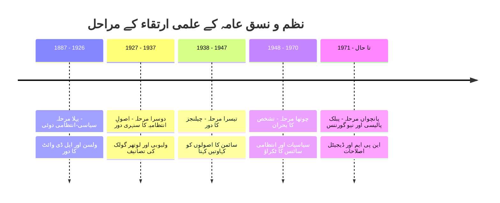

# یونٹ 1: نظم و نسق عامہ — معنی، تعریف، نوعیت، وسعت اور اہمیت (Unit 1: Public Administration — Meaning, Definition, Nature, Scope and Importance)

---

## 1.0 تمہید (Introduction)

نظم و نسق عامہ (Public Administration) جدید ترقیاتی ریاست کا ایک ناگزیر حصہ ہے۔ یہ حکومت کا وہ عملی بازو ہے جو پالیسیوں کو نافذ کر کے معاشرے کی فلاح و بہبود کو یقینی بناتا ہے۔ نظم و نسق کا تصور تاریخِ انسانی جتنا ہی قدیم ہے، لیکن بطور ایک جدید اور خودمختار علمی شعبہ (Academic Discipline) اس کا ارتقاء انیسویں صدی کے آخر میں شروع ہوا۔

### تاریخی پس منظر اور مطالعہ کا ارتقاء (Historical Background)
جیسا کہ ایل ڈی وائٹ (L.D. White) نے اپنی شہرہ آفاق تصنیف *Introduction to the Study of Public Administration* میں واضح کیا ہے کہ نظم و نسق کا نظام سماجی، سیاسی اور معاشی قوتوں کے تعامل سے جنم لیتا ہے (بحوالہ: L.D. White)۔ وائٹ کے مطابق، قدیم مصر، بابل، اور روم کے پاس بھی انتہائی ترقی یافتہ انتظامی ڈھانچے موجود تھے، لیکن وہ تمام شاہی احکامات کی تعمیل تک محدود تھے۔ یورپ میں، خصوصاً جرمنی اور آسٹریا میں 16ویں سے 18ویں صدی کے دوران "کیمرلزم" (Cameralism) نے جنم لیا جس کا مقصد سرکاری خزانوں کو منظم کرنا اور انتظامی کارکردگی کو بڑھانا تھا (بحوالہ: S.L. Goel)۔

جدید علمی تناظر میں، امریکی صدر **ووڈرو ولسن (Woodrow Wilson)** نے 1887ء میں اپنے مقالے *The Study of Administration* کے ذریعے ایک سائنسی اور پیشہ ورانہ نظم و نسق کی بنیاد رکھی جس سے سیاست اور انتظامیہ کا فرق واضح ہوا (بحوالہ: Rumki Basu)۔

### ہندوستان میں نظم و نسق عامہ کی تعلیم کا آغاز (Beginning of Public Administration in India)
ہندوستان میں نظم و نسق عامہ کی تدریسی تاریخ کو بیان کرتے ہوئے ڈاکٹر عبدالقیوم (Abdul Qayyum) نے اپنی کتاب *Nazm-o Nasq-e-Ammah* میں لکھا ہے کہ ہندوستان میں یہ مضمون ابتدائی طور پر سیاسیات (Political Science) کا ایک حصہ مانا جاتا تھا (بحوالہ: عبدالقیوم)۔
* **مدراس یونیورسٹی (1930ء کی دہائی):** سب سے پہلے اس مضمون کے تحت ڈپلومہ پروگرامز شروع کیے گئے۔
* **لکھنؤ یونیورسٹی (1937ء):** سیاسیات کے نصاب کے اندر نظم و نسق عامہ کا ایک علیحدہ پرچہ شامل کیا گیا (بحوالہ: Avasthi and Maheshwari)۔
* **ناگپور یونیورسٹی (1949ء):** ہندوستان کا پہلا باقاعدہ اور آزاد شعبہ برائے نظم و نسق عامہ قائم کیا گیا، جس کی قیادت **ڈاکٹر ایم پی شرما (Dr. M.P. Sharma)** نے کی، جنہیں ہندوستان میں اس شعبے کا پہلا پروفیسر اور بانی مانا جاتا ہے (بحوالہ: M.P. Sharma & B.L. Sadana)۔
* **انڈین انسٹی ٹیوٹ آف پبلک ایڈمنسٹریشن (IIPA - 1954ء):** پال ایچ ایپل بائی (Paul H. Appleby) کی پیش کردہ رپورٹس کی بنیاد پر نئی دہلی میں اس تربیتی اور تحقیقی ادارے کا قیام عمل میں لایا گیا (بحوالہ: عبدالقیوم)۔

---

## 1.1 مقاصد (Objectives)

اس تفصیلی یونٹ کے مطالعے کے بعد طلباء درج ذیل علمی مقاصد حاصل کر سکیں گے:
* نظم و نسق عامہ کے لغوی اور علمی مفہوم کو سمجھنا اور بنیادی علمی تعریفوں کا فہم حاصل کرنا (بحوالہ: Saroj Kumar Jena)۔
* عوامی (Public) اور نجی (Private) نظم و نسق کے مابین فرق، ان کے درمیان مماثلتوں اور تقابلی فریم ورک کا گہرا تجزیہ کرنا (بحوالہ: Avasthi and Maheshwari)۔
* نظم و نسق عامہ کی نوعیت (Nature) کے حوالے سے مربوط، انتظامی، سیاسی اور ماحولیاتی نظریات کی بحث کو سمجھنا (بحوالہ: M.P. Sharma)۔
* اس مضمون کی وسعت (Scope) بشمول POSDCORB اور فلاحی نظریے کی افادیت اور اس پر کی گئی تنقید کا جائزہ لینا (بحوالہ: Rumki Basu)۔
* جدید سماجی نظام اور خاص طور پر ہندوستان میں ای-گورننس اور آفات کے انتظام کے تناظر میں اس مضمون کی عملی اہمیت کو واضح کرنا (بحوالہ: S.L. Goel)۔

---

## 1.2 معنی و تعریف (Meaning and Definition)

لفظ "نظم و نسق" (Administration) لاطینی الفاظ **"Ad"** اور **"Ministrare"** سے مشتق ہے، جس کا لغوی معنی "لوگوں کی خدمت یا ان کی دیکھ بھال کرنا" ہے (بحوالہ: Avasthi and Maheshwari)۔ جب اس کے ساتھ لفظ "عامہ" (Public) کا اضافہ کیا جاتا ہے، تو اس سے مراد وہ سرگرمیاں بن جاتی ہیں جو عوامی پالیسیوں کے نفاذ اور ریاستی قوانین کی عملداری کے لیے کی جائیں (بحوالہ: عبدالقیوم)۔

### 10 بڑے مفکرین کی تعریفوں کا گہرا تجسس اور تنقید (Critical Analysis of Definitions)

#### 1. ووڈرو ولسن (Woodrow Wilson)
> "نظم و نسق عامہ قانون کی تفصیلی اور باقاعدہ تعمیل کا نام ہے۔ قانون کی تعمیل کا ہر خاص عمل ایک انتظامی عمل ہے۔" (بحوالہ: Rumki Basu)

* **سادہ وضاحت:** مقننہ کی طرف سے منظور کردہ قوانین کو میدانِ عمل میں لانا ہی انتظامیہ کا واحد کام ہے۔
* **تنقیدی جائزہ:** رومکی باسو (Rumki Basu) نے اس پر تنقید کرتے ہوئے لکھا ہے کہ ولسن کا نظریہ انتظامیہ کو محض قانون کا ایک میکانکی نفاذ کنندہ بنا دیتا ہے، جبکہ جدید انتظامیہ خود بھی پالیسی سازی کا اہم حصہ بن چکی ہے (بحوالہ: روملی باسو)۔
* **عصرِ حاضر میں مثال:** ہندوستان میں موٹر وہیکلز ایکٹ کے تحت ٹریفک پولیس کی جانب سے سڑک پر چالان کاٹنے کا عمل اس کی روایتی مثال ہے۔

#### 2. ایل ڈی وائٹ (L. D. White)
> "نظم و نسق عامہ ان تمام کارروائیوں پر مشتمل ہے جن کا مقصد عوامی پالیسی کو نافذ کرنا یا اس کی تعمیل کرنا ہوتا ہے۔" (بحوالہ: L.D. White)

* **سادہ وضاحت:** وائٹ نے ہر اس سرگرمی کو نظم و نسق عامہ کا حصہ مانا ہے جو عوامی پالیسی کے اہداف کو حاصل کرنے کے لیے کی جاتی ہے۔
* **تفصیلی تجزیہ:** ایل ڈی وائٹ کی اپنی کتاب میں دی گئی وضاحت کے مطابق، یہ تعریف انتہائی جامع ہے کیونکہ یہ صرف قانون کے دائرے تک محدود نہیں ہے بلکہ یہ مادی وسائل اور انسانی تعاون کے ذریعے سماجی مقاصد کے حصول کو بھی اپنے اندر سموئے ہوئے ہے (بحوالہ: L.D. White)۔
* **عصرِ حاضر میں مثال:** بیوروکریسی کی طرف سے غریب خاندانوں تک سستا اناج پہنچانے کے لیے راشن ڈپووں کی نگرانی کرنا۔

#### 3. پرسی کوئین (Percy McQueen)
> "نظم و نسق عامہ مرکزی، صوبائی اور مقامی حکومتوں کے کاموں کا نام ہے۔" (بحوالہ: Avasthi and Maheshwari)

* **سادہ وضاحت:** حکومت کے تینوں درجات کی روزمرہ کی انتظامی سرگرمیاں اس میں شامل ہیں۔
* **تنقیدی جائزہ:** اوستھی اینڈ مہیشوری کے مطابق یہ تعریف بہت زیادہ عمومی ہے اور اس میں فنی باریکیاں یعنی 'انتظامیہ' اور 'سیاست' کے درمیان فرق واضح نہیں کیا گیا (بحوالہ: Avasthi and Maheshwari)۔
* **عصرِ حاضر میں مثال:** بلدیاتی اداروں (Municipal Corporations) کی جانب سے شہروں میں پانی اور صفائی کا انتظام کرنا۔

#### 4. لوتھر گولک (Luther Gulick)
> "نظم و نسق عامہ انتظامیہ کے علم کا وہ حصہ ہے جس کا تعلق حکومت سے ہے اور اس کا تعلق بنیادی طور پر انتظامی شاخ سے ہے جہاں حکومت کا کام انجام دیا جاتا ہے۔" (بحوالہ: Saroj Kumar Jena)

* **سادہ وضاحت:** گولک نظم و نسق عامہ کو صرف حکومت کی مجریہ (Executive Branch) کی کارروائیوں تک محدود رکھتے ہیں۔
* **تنقیدی جائزہ:** سروج کمار جینا (Saroj Kumar Jena) کے مطابق گولک کی یہ تشریح مقننہ (Legislature) اور عدلیہ (Judiciary) کے اندرونی انتظامی ڈھانچے اور ان کے عوام پر اثرات کو مکمل طور پر نظرانداز کرتی ہے (بحوالہ: Saroj Kumar Jena)۔
* **عصرِ حاضر میں مثال:** کابینہ سیکریٹریٹ (Cabinet Secretariat) کی طرف سے مختلف وزارتوں کی کارکردگی کا جائزہ۔

#### 5. ہربرٹ سائمن (Herbert Simon)
> "عام اصطلاح میں، نظم و نسق عامہ سے مراد قومی، صوبائی اور مقامی حکومتوں کی انتظامی شاخوں کی سرگرمیاں ہیں۔" (بحوالہ: Pfiffner and Presthus)

* **سادہ وضاحت:** سائمن کا بنیادی فلسفہ یہ ہے کہ انتظامیہ کا دل فیصلہ سازی (Decision-making) ہے۔ ان کے نزدیک مینیجرز کے فیصلے ہی تنظیم کو متحرک کرتے ہیں (بحوالہ: Pfiffner and Presthus)۔
* **تنقیدی جائزہ:** فِفنر اور پریسسٹھس (Pfiffner and Presthus) نے واضح کیا کہ سائمن کے رویاتی نظریے نے فیصلوں کے منطقی اور عقلی پہلوؤں پر اتنا زیادہ زور دیا کہ عوامی خدمت کی اخلاقی جہتیں پیچھے رہ گئیں (بحوالہ: Pfiffner and Presthus)۔
* **عصرِ حاضر میں مثال:** ڈیزاسٹر مینجمنٹ اتھارٹی کی طرف سے زلزلے کے بعد مخصوص علاقوں میں فوج طلب کرنے کا فیصلہ۔

#### 6. ڈوائٹ والڈو (Dwight Waldo)
> "نظم و نسق عامہ ریاست کے معاملات پر لاگو آرٹ اور سائنس کا نام ہے۔" (بحوالہ: S.L. Goel)

* **سادہ وضاحت:** والڈو کا ماننا ہے کہ یہ مضمون سائنسی اصولوں (Science) کے ساتھ ساتھ انسانی رشتوں کو سنبھالنے کے فن (Art) کا نام بھی ہے۔
* **تنقیدی جائزہ:** ایس ایل گوئل (S.L. Goel) کی بحث کے مطابق والڈو کی تعریف اسے محض ایک پیشہ ورانہ سرگرمی بتاتی ہے، جس کی وجہ سے اس کے مخصوص علمی تشخص کو قائم کرنا فلسفیانہ طور پر مشکل ہو جاتا ہے (بحوالہ: S.L. Goel)۔
* **عصرِ حاضر میں مثال:** اسمارٹ سٹی پروجیکٹس میں جدید ٹیکنالوجی (سائنس) اور مقامی ثقافت کے تحفظ (آرٹ) کا امتزاج۔

#### 7. جان ایم گاؤس (John M. Gaus)
> "نظم و نسق عامہ کا تعلق لوگوں، زمین، وسائل اور ان کے باہمی تعلقات سے ہے تاکہ انسانی تعاون کو ممکن بنایا جا سکے۔" (بحوالہ: Saroj Kumar Jena)

* **سادہ وضاحت:** گاؤس نے ماحولیاتی نظریہ (Ecological Approach) پیش کیا جس کے تحت نظم و نسق کو اس کے سماجی اور قدرتی ماحول کے پس منظر میں دیکھا جاتا ہے۔
* **تنقیدی جائزہ:** سروج کمار جینا کے مطابق، یہ تعریف فلسفیانہ حد تک تو اچھی ہے لیکن یہ عملی انتظامی عمل اور اندرونی تنظیمی ڈھانچوں کی درجہ بندی پر خاموش ہے (بحوالہ: Saroj Kumar Jena)۔
* **عصرِ حاضر میں مثال:** قبائلی علاقوں میں جنگلات اور اراضی کی تقسیم کے وقت وہاں کے روایتی کلچر کو مدنظر رکھ کر پالیسی بنانا۔

#### 8. پال ایچ ایپل بائی (Paul H. Appleby)
> "نظم و نسق عامہ صرف پالیسیوں کو نافذ کرنا نہیں ہے بلکہ یہ پالیسی سازی کا ایک حصہ بھی ہے کیونکہ یہ مسلسل پالیسی کو نئے سرے سے وضع کرتا ہے۔" (بحوالہ: M.P. Sharma & B.L. Sadana)

* **سادہ وضاحت:** بیوروکریسی محض ایک مشین نہیں بلکہ سیاسی قیادت کے شانہ بشانہ عوامی پالیسیوں کے ڈیزائن میں حصہ لیتی ہے۔
* **تنقیدی جائزہ:** ایم پی شرما نے اس پر بحث کی ہے کہ ایپل بائی کا نظریہ سیاسی-انتظامی دوئی کو ختم کر دیتا ہے جس سے افسر شاہی کے حد سے زیادہ سیاسی ہونے اور غیر جانبداری کے اصول کو ٹھیس پہنچنے کا خطرہ رہتا ہے (بحوالہ: M.P. Sharma & B.L. Sadana)۔
* **عصرِ حاضر میں مثال:** ہندوستان میں نیتی آیوگ کی میٹنگز میں سول سرونٹس اور پالیسی سازوں کا مشترکہ طور پر پانچ سالہ قومی منصوبوں کا مسودہ بنانا۔

#### 9. فِفنر اور پریستھس (Pfiffner and Presthus)
> "نظم و نسق عامہ میں عوامی پالیسیوں کو نافذ کرنے کے لیے انسانی اور مادی وسائل کی تنظیم اور ان کی رہنمائی شامل ہے۔" (بحوالہ: Pfiffner and Presthus)

* **سادہ وضاحت:** دستیاب مادی اور انسانی وسائل کو منظم کر کے عوامی فلاح کے اہداف حاصل کرنا ہی نظم و نسق ہے۔
* **عصرِ حاضر میں مثال:** ریلوے کی توسیع کے لیے فنڈز، زمین اور انجینئرز کی ٹیم کو یکجا کرنا۔

#### 10. مارشل ڈیموک (Marshall Dimock)
> "نظم و نسق عامہ کا تعلق حکومت کے 'کیا' (What) اور 'کیسے' (How) سے ہے۔ 'کیا' سے مراد تکنیکی علم ہے اور 'کیسے' سے مراد انتظام کی وہ تکنیک ہے جس سے مقصد حاصل ہو۔" (بحوالہ: Avasthi and Maheshwari)

* **سادہ وضاحت:** 'کیا' سے مراد متعلقہ شعبہ (مثلاً صحت) اور 'کیسے' سے مراد اس شعبے کو منظم کرنے کا عمل ہے۔
* **عصرِ حاضر میں مثال:** حکومت کا صحت کی خدمات فراہم کرنا (کیا) اور اس کے لیے ڈیجیٹل پورٹلز یا ہسپتالوں کے نیٹ ورک کا استعمال کرنا (کیسے)۔

---

### سیاسی-انتظامی دوئی (Politico-Administrative Dichotomy)
اس نظریے کی جڑیں ووڈرو ولسن کے مقالے اور **فرینک گڈناؤ (Frank Goodnow)** کی تصنیف *Politics and Administration* (1900) میں ملتی ہیں۔ گڈناؤ کے مطابق، حکومت کے دو واضح اور الگ کام ہیں:
1. **سیاست (Politics):** اس کا تعلق ریاست کی مرضی یا پالیسی کی تشکیل سے ہے (مقننہ کا دائرہ کار)۔
2. **نظم و نسق (Administration):** اس کا تعلق اس مرضی یا پالیسی کے غیر جانبدارانہ نفاذ سے ہے (مجریہ اور افسر شاہی کا دائرہ کار)۔

ایم پی شرما اور ایس ایل گوئل کی کتب کی بحث کی بنیاد پر، ابتدائی بیوروکریٹک ڈھانچے نے اس دوئی پر بہت زور دیا تاکہ سرکاری ملازمین کو روزمرہ کے سیاسی دباؤ سے بچایا جا سکے (بحوالہ: M.P. Sharma; S.L. Goel)۔ لیکن بعد میں پبلک پالیسی نظریات نے اس بات کو ثابت کیا کہ یہ دوئی ناممکن اور غیر حقیقی ہے، کیونکہ انتظامیہ خود بھی قانون سازی کے تکنیکی پہلوؤں کو مرتب کرتی ہے (بحوالہ: Rumki Basu)۔

---

## 1.2.1 اور 1.2.2 نظم و نسق اور نظم و نسق عامہ کے فرق (Difference between Administration and Public Administration)

جیسا کہ اوستھی اینڈ مہیشوری نے اپنی کتاب میں واضح کیا ہے کہ نظم و نسق (Administration) ایک چھتری اصطلاح ہے جس کا مطلب کسی بھی مشترکہ مقصد کے حصول کے لیے کی جانے والی اجتماعی کوشش ہے۔ یہ نجی فرم، اسکول، کلب، یا حکومت، سب پر لاگو ہوتی ہے۔ جبکہ نظم و نسق عامہ اس وسیع دائرے کا وہ مخصوص سرکاری حصہ ہے جس کا مقصد صرف عوامی بہبود ہوتا ہے (بحوالہ: Avasthi and Maheshwari)۔

اسی فریم ورک کے تحت، عوامی (مظم و نسق عامہ) اور نجی (اخیگن) نظم و نسق کے مابین 10 نکاتی تقابلی جدول نیچے پیش کیا گیا ہے:

### عوامی اور نجی نظم و نسق کے مابین 10 نکاتی تقابلی جدول (بحوالہ: Avasthi and Maheshwari)

| خصوصیت (Feature) | مظم و نسق عامہ (Public Administration) | نجی نظم و نسق (Private Administration) |
| :--- | :--- | :--- |
| **1. بنیادی مقصد (Primary Motive)** | عوامی بہبود اور سماجی خدمت (Service Orientation)۔ | ذاتی یا تنظیمی منافع کا حصول (Profit Motive)۔ |
| **2. جوابدہی (Accountability)** | عوام، عدلیہ، پارلیمنٹ اور میڈیا کے سامنے ہمہ وقت جوابدہ۔ | صرف بورڈ آف ڈائریکٹرز اور محدود سرمایہ کاروں کو جوابدہ۔ |
| **3. یکسانیت (Uniformity)** | قانون کے سامنے سب برابر ہیں؛ شہریوں کے ساتھ یکساں سلوک۔ | لچکدار سلوک؛ امیر گاہک کو ترجیحی سہولیات دی جا سکتی ہیں۔ |
| **4. قانونی کنٹرول (Legal Framework)** | آئین اور مقننہ کے بنائے ہوئے قوانین کے تحت سخت عملداری۔ | تجارتی ضوابط اور داخلی معاہدوں کے تحت کام کرنے کی آزادی۔ |
| **5. رازداری بمقابلہ شفافیت** | حقِ معلومات (RTI) کے باعث کام کاج انتہائی شفاف ہوتا ہے۔ | کارپوریٹ مقابلے کی وجہ سے تجارتی رازوں کو خفیہ رکھا جاتا ہے۔ |
| **6. مالیاتی کنٹرول (Financial Control)** | خزانے اور اخراجات پر مقننہ (پارلیمنٹ) کا مکمل غلبہ ہوتا ہے۔ | بجٹ اور فنڈز کا انتظام داخلی مینیجرز خود کرتے ہیں۔ |
| **7. اجارہ داری (Monopoly)** | دفاع، امن و امان اور بعض بنیادی خدمات میں ریاستی اجارہ داری۔ | مسابقتی بازار (Competitive Market) کا سامنا کرنا پڑتا ہے۔ |
| **8. نوکری کا تحفظ (Job Security)** | نوکری کا تحفظ زیادہ ہوتا ہے، جو کہ قواعد کے تحت فراہم کیا جاتا ہے۔ | کارکردگی پر منحصر ہوتا ہے؛ کارکردگی خراب تو برطرفی ممکن ہے۔ |
| **9. دائرہ کار اور وسعت** | دائرہ کار قومی اور عالمی سطح پر زندگی کے ہر موڑ پر اثر انداز ہوتا ہے۔ | صرف مخصوص مصنوعات، سروسز اور صارفین تک محدود۔ |
| **10. عوامی تعلقات (Public Relations)** | مقصد عوام کا اعتماد حاصل کرنا اور سیاسی مقبولیت برقرار رکھنا ہے۔ | مقصد برانڈ کی تشہیر کرنا اور فروخت میں اضافہ کرنا ہے۔ |

---

### 1.2.3 عوامی اور نجی نظم و نسق میں مماثلتیں (Similarities between Public and Private Administration)
سر جوشیا اسٹیمپ (Sir Josiah Stamp) اور ہنری فایول کے مطابق، پبلک اور پرائیویٹ ایڈمنسٹریشن میں فرق کے باوجود ان میں گہری مماثلتیں بھی پائی جاتی ہیں (بحوالہ: Avasthi and Maheshwari):
1. **انتظامی مہارتیں (Administrative Skills):** پلاننگ، فائل مینجمنٹ، ڈیٹا کا استعمال اور دفتر چلانے کے بنیادی طریقے دونوں میں یکساں ہیں۔
2. **درجہ بندی کا ڈھانچہ (Hierarchy):** نجی کمپنیوں میں بھی سرکاری محکموں کی طرح منیجر، اسسٹنٹ مینیجر، اور جونیئر اسٹاف کا درجہ بندی کا نظام ہوتا ہے۔
3. **ملازمین کی کارکردگی (Human Management):** دونوں میں ملازمین کی کارکردگی بڑھانے، انہیں ترغیب دینے (Motivation) اور کام لینے کے طریقے مشترک ہیں۔
4. **عوامی تعلقات (Public Relations):** دونوں کو کام کی بقا کے لیے پبلک رول اور سماجی قبولیت کی ضرورت ہوتی ہے۔
5. **جدید ٹیکنالوجی کا استعمال:** دونوں شعبے کمپیوٹر، آئی ٹی سسٹم اور کلاؤڈ کمپیوٹنگ کا استعمال کرتے ہیں۔

---

## 1.3 نوعیت (Nature of Public Administration)

نظم و نسق عامہ کی نوعیت کا تعین کرنے کے لیے علمی مباحثوں میں درج ذیل نظریات سامنے آئے ہیں (بحوالہ: M.P. Sharma & B.L. Sadana):

### 1. مربوط نظریہ (Integral View)
اس نظریے کے مطابق نظم و نسق عامہ میں اعلیٰ افسران سے لے کر کلرک، چپراسی اور چوکیدار تک کی تمام سرگرمیاں شامل ہیں کیونکہ یہ سب مل کر ہی عوامی مقصد حاصل کرتے ہیں۔
* **حامی مفکرین:** ایل ڈی وائٹ (L. D. White)، مارشل ڈیموک (Marshall Dimock) (بحوالہ: L.D. White)۔

### 2. انتظامی نظریہ (Managerial View)
اس نظریے کے مطابق، نظم و نسق عامہ کا تعلق صرف ان سرگرمیوں سے ہے جو انتظام، نگرانی، کنٹرول اور کوآرڈینیشن سے متعلق ہیں (اعلیٰ مینیجرز کے کام)۔
* **حامی مفکرین:** لوتھر گولک (Luther Gulick)، ہنری فایول (Henri Fayol) (بحوالہ: Pfiffner and Presthus)۔

### 3. پولیٹیکل نظریہ (Political View)
جیسا کہ ایم پی شرما کی کتاب میں زیرِ بحث آتا ہے، یہ نظریہ کہتا ہے کہ انتظامیہ محض غیر جانبدار تکنیکی عمل نہیں ہے، بلکہ یہ سیاسی طاقت، سماجی مفادات اور سیاسی پالیسی سازی کے عمل کا ایک اہم جزو ہے (بحوالہ: M.P. Sharma & B.L. Sadana)۔ اس میں انتظامی فیصلوں کو سیاسی مقاصد کی روشنی میں پرکھا جاتا ہے۔

### 4. ماحولیاتی نظریہ (Ecological View)
یہ نظریہ کہتا ہے کہ انتظامیہ کوئی بند کمرہ نہیں ہے، بلکہ یہ بیرونی ماحول (سماجی، ثقافتی، سیاسی اور معاشی قوتوں) سے گہرا اثر لیتی ہے اور ان پر اثر انداز بھی ہوتی ہے۔
* **حامی مفکرین:** فریڈ ڈبلیو رِگز (Fred W. Riggs)، جان ایم گاؤس (بحوالہ: Saroj Kumar Jena)۔

### تقابلی درجہ بندی: مربوط نظریہ بمقابلہ انتظامی نظریہ (بحوالہ: Pfiffner and Presthus)

| تقابل کی بنیاد | مربوط نظریہ (Integral View) | انتظامی نظریہ (Managerial View) |
| :--- | :--- | :--- |
| **تعریف کی حد** | تنظیم کے تمام ملازمین (ہاتھ سے کام کرنے والوں سے مینیجر تک) کی سرگرمیاں۔ | صرف اعلیٰ ترین مینیجرز کی سرگرمیاں جو تنظیم کی سمت طے کرتی ہیں۔ |
| **اصول** | "کام کی انجام دہی" پر توجہ (Execution of Work)۔ | "انتظامی تکنیک" پر توجہ (Techniques of Management)۔ |
| **حامی مفکرین** | ایل ڈی وائٹ، ڈیموک (بحوالہ: L.D. White)۔ | لوتھر گولک، ہنری فایول، سائمن (بحوالہ: Pfiffner and Presthus)۔ |
| **مثال** | صفائی والے کا سڑک صاف کرنا اور کمشنر کا آرڈر پاس کرنا دونوں ہی انتظام ہیں۔ | صرف کمشنر کا آرڈر پاس کرنا اور بجٹ بنانا ہی انتظام ہے۔ |

### نوعیت کے سوال پر رومکی باسو اور ایم پی شرما کی رائے
* **رومکی باسو کے مطابق:** ترقی پذیر ممالک میں سماجی تبدیلی کو لاگو کرنے کے لیے مربوط نظریہ زیادہ عملی ہے، کیونکہ نچلے درجے کا عملہ اگر بیدار نہ ہو تو پالیسی کا نفاذ ممکن نہیں رہتا (بحوالہ: روملی باسو)۔
* **ایم پی شرما کے مطابق:** انہوں نے لکھا ہے کہ جیسے جیسے انتظامیہ جدید اور سائنسی ہو رہی ہے، انتظامی نظریے (Managerial View) کی اہمیت بڑھتی جا رہی ہے کیونکہ آج کے پیچیدہ دور میں انتظام کاروں کو زیادہ مضبوط فیصلے کرنے پڑتے ہیں (بحوالہ: M.P. Sharma & B.L. Sadana)۔

---

## 1.4 وسعت (Scope of Public Administration)

نظم و نسق عامہ کی علمی حدود اور دائرہ کار (Scope) کو سمجھنے کے لیے چار اہم نظریات پائے جاتے ہیں۔ ان نظریات کی تنقید اور عملی مثالیں درج ذیل ہیں:

### 1. تنگ نظریہ (Narrow View)
* **تفصیلی تنقید:** یہ نظریہ صرف حکومت کی ایگزیکٹو شاخ پر توجہ دیتا ہے۔ لوتھر گولک کے اس نظریے کی تنقید کرتے ہوئے ایل ڈی وائٹ نے واضح کیا کہ جدید مقننہ کا کام بھی انتظامی حدود کے اندر گہرا داخل ہو چکا ہے، لہذا صرف ایگزیکٹو تک محدود رہنا اس علم کے دائرے کو نامکمل چھوڑ دیتا ہے (بحوالہ: L.D. White)۔

### 2. وسیع نظریہ (Broad View)
* **تفصیلی تنقید:** یہ حکومت کی یا ریاست کی تمام شاخوں (مقننہ، مجریہ، عدلیہ) کو شامل کرتا ہے۔ اس کی خامیاں بیان کرتے ہوئے اوستھی اینڈ مہیشوری لکھتے ہیں کہ اگر ہر سرکاری سرگرمی ہی نظم و نسق عامہ بن جائے گی تو پھر سیاسیات اور نظم و نسق عامہ کے مابین کوئی واضح علمی حد باقی نہیں رہے گی (بحوالہ: Avasthi and Maheshwari)۔

### 3. POSDCORB نظریہ
لوتھر گولک نے اس فارمولے کے ذریعے سات اہم امور کی فہرست دی تھی۔
* **تفصیلی تنقید:** لیوس میرئم (Lewis Meriam) نے اس پر تنقید کرتے ہوئے اسے "خالی قینچی" (Scissors without blades) قرار دیا۔ میرئم کے مطابق، صرف تکنیک کا جاننا (مثلاً بجٹ بنانا یا عملہ بھرتی کرنا) کافی نہیں ہے، بلکہ اس محکمے کے مخصوص موضوعاتی مواد (Subject Matter) جیسے زراعت، تعلیم، یا صحت کے علم کا ہونا بھی ضروری ہے (بحوالہ: Rumki Basu)۔

### 4. فلاحی نظریہ (Welfare View)
* **تفصیلی تنقید:** یہ عوام کی ترقی پر زور دیتا ہے، لیکن ایم پی شرما کے مطابق، فلاحی تصور اگر بے لگام ہو جائے تو یہ ریاست پر بے پناہ مالیاتی بوجھ ڈالتا ہے جس کی وجہ سے انتظامی کارکردگی سست ہو جاتی ہے (بحوالہ: M.P. Sharma & B.L. Sadana)۔

---

### POSDCORB کے ہر جزو کی ایک عملی بھارتی مثال (Indian Context Examples)

1. **Planning (منصوبہ بندی):** نیتی آیوگ کی جانب سے 15 سالہ وژن ڈاکومنٹ اور 3 سالہ نیشنل ایکشن ایجنڈا بنانا۔
2. **Organizing (تنظیم سازی):** وزارتِ دفاع کا مختلف دفاعی شاخوں (بری فوج، بحریہ، اور فضائیہ) کے ڈھانچے کو مربوط کرنا۔
3. **Staffing (عملہ):** UPSC کی جانب سے سول سروسز کے امتحان کا انعقاد کروانا اور موزوں امیدواروں کی بھرتی۔
4. **Directing (ہدایت کاری):** کسی ضلع میں امن و امان بحال کرنے کے لیے ڈسٹرکٹ مجسٹریٹ (DM) کی جانب سے پولیس فورس کو احکامات جاری کرنا۔
5. **Coordinating (تال میل):** کووڈ-19 کے دور میں مرکزی اور ریاستی حکومتوں کے درمیان ویکسینیشن تقسیم کے تال میل کے لیے بننے والی کمیٹیاں۔
6. **Reporting (رپورٹنگ):** سی اے جی (CAG) کی سالانہ رپورٹ جس میں تمام وزارتوں کی کارکردگی کا ڈیٹا صدر کے سامنے پیش کیا جاتا ہے۔
7. **Budgeting (بجٹ سازی):** ہر سال فروری میں پارلیمنٹ میں وزیر خزانہ کا عام بجٹ پیش کرنا۔

---

### نائیگرو اینڈ نائیگرو کا 7 نکاتی وسعت کا فریم ورک (Nigro and Nigro Framework)
سروج کمار جینا (Saroj Kumar Jena) کی کتاب میں دی گئی تشریح کے مطابق، فلکس اے نائیگرو اور لائیڈ جی نائیگرو نے نظم و نسق عامہ کی وسعت کی حدود درج ذیل سات اصولوں پر مبنی رکھی ہیں (بحوالہ: Saroj Kumar Jena):
1. **گروہی کوشش (Group Effort):** یہ ایک عوامی ماحول میں کی جانے والی باہمی گروہی کوشش ہے۔
2. **تینوں شاخوں کا احاطہ (Covers Three Branches):** یہ مقننہ، مجریہ اور عدلیہ اور ان کے آپسی تعلقات کا احاطہ کرتا ہے۔
3. **سیاسی عمل کا حصہ (Part of Political Process):** یہ عوامی پالیسیوں کے بننے اور نفاذ میں گہرا کردار ادا کرنے کی وجہ سے سیاسی نظام کا اٹوٹ انگ ہے۔
4. **نجی انتظام سے الگ (Distinct from Private):** یہ نجی انتظامیہ سے مختلف ہے اگرچہ انتظامی امور کی تکنیکیں مشترک ہو سکتی ہیں۔
5. **شہری سوسائٹی سے تعلق (Association with Civic Groups):** اس کا واسطہ بڑی بڑی غیر سرکاری تنظیموں اور مقامی عوام سے رہتا ہے۔
6. **فلاحی فراہمی (Service orientation):** اس کا بنیادی مقصد سماج کو تمام بنیادی خدمات کی بلا تعطل فراہمی ہے۔
7. **انسانی اور مادی وسائل کا تال میل (Human & Material Coordination):** یہ صرف کاغذی عمل نہیں بلکہ انسانی رویوں اور مادی وسائل کی بہترین کوآرڈینیشن ہے۔

---

## 1.5 اہمیت (Importance of Public Administration)

جدید ریاستوں میں پبلک ایڈمنسٹریشن کی اہمیت کو سراہتے ہوئے ایس ایل گوئل (S.L. Goel) نے لکھا ہے کہ بغیر ایک مضبوط انتظامیہ کے کوئی بھی فلاحی یا جمہوری ڈھانچہ قائم نہیں رہ سکتا (بحوالہ: S.L. Goel)۔

### کلیدی پہلو اور بھارتی پالیسیوں کے عملی حوالے (Indian Policy References)

#### 1. سماجی تحفظ اور صحت کی فراہمی (Socio-Economic Development)
* *عملی مثال (بحوالہ: عبدالقیوم):* پسماندہ طبقوں کو صحت کی بنیادی خدمات فراہم کرنا تاکہ ان کی سماجی اور معاشی حالت بہتر ہو۔
* *متعلقہ پالیسی:* **آیوشمان بھارت اسکیم (Ayushman Bharat Scheme)** جو بیوروکریسی کے ذریعے نچلی سطح پر نافذ کی گئی ہے۔

#### 2. زراعت اور دیہی علاقوں کی ترقی
* *عملی مثال:* کسانوں کو براہِ راست ان کے بینک کھاتوں میں نقد مدد پہنچانا۔
* *متعلقہ پالیسی:* **پی ایم کسان سمّان ندھی (PM-KISAN)** جس میں پٹواریوں اور پنچایتوں کا انتظامی کردار کلیدی ہے۔

#### 3. امن و امان کا قیام اور لاء اینڈ آرڈر کا تحفظ
* *عملی مثال:* ملک کے حساس اضلاع میں فرقہ وارانہ کشیدگی یا جرائم کی روک تھام کے لیے پولیس فورس کا بروقت استعمال۔
* *متعلقہ پالیسی:* **وزارتِ داخلہ کی طرف سے چلائی جانے والی سمارٹ پولیسنگ اسکیم**۔

---

### جدید رجحانات اور اہمیت کے نئے نکات (بحوالہ: S.L. Goel)

1. **پائیدار ترقی کے اہداف اور انتظامیہ (SDGs and Administration):** اقوامِ متحدہ کے 17 پائیدار ترقی کے اہداف کو حاصل کرنے کے لیے بلدیاتی اور ضلعی انتظامیہ کو براہِ راست ذمہ داریاں سونپی گئی ہیں تاکہ صاف پانی، صفائی اور ماحولیاتی تحفظ کو یقینی بنایا جا سکے (بحوالہ: S.L. Goel)۔
2. **ای-گورننس اور ڈیجیٹل مظم و نسق (E-Governance & Digital Administration):** جدید انتظامیہ کو زیادہ شفاف اور تیز رفتار بنانے کے لیے ڈیجیٹل سسٹم متعارف کرایا گیا ہے۔ 
   * *مثال:* **ڈیجیٹل انڈیا (Digital India)**، **یو پی آئی (UPI)**، اور **ڈیجی لاکر (DigiLocker)** جس سے عوامی خدمات کی ڈلیوری میں رشوت خوری اور لال فیتہ شاہی کا خاتمہ ممکن ہوا ہے (بحوالہ: S.L. Goel)۔
3. **آفات کا انتظام (Disaster Management):** زلزلے، طوفان یا وبائی امراض کے دوران فوری ردعمل دینا انتظامیہ کی اہمیت کو ثابت کرتا ہے۔ ہندوستان میں **نیشنل ڈیزاسٹر ریسپانس فورس (NDRF)** اور ضلعی ڈیزاسٹر پلانز اس کی واضح مثالیں ہیں (بحوالہ: S.L. Goel)۔
4. **شفافیت اور احتساب (Transparency and Accountability):** **حقِ معلومات قانون (RTI Act, 2005)** کے ذریعے اب انتظامیہ شہریوں کے سامنے پوری طرح جوابدہ ہو چکی ہے، جس نے سرکاری رازوں کے کلچر کو ختم کر کے شفافیت کو رواج دیا ہے (بحوالہ: S.L. Goel)۔

---

## 1.6 اکتسابی نتائج (Learning Outcomes)

اس یونٹ کو پڑھنے کے بعد، طلباء:
1. ایل ڈی وائٹ اور سروج کمار جینا کی پیش کردہ ارتقائی تاریخ کی روشنی میں اس مضمون کے ارتقاء کو سمجھ سکیں گے (بحوالہ: L.D. White; Saroj Kumar Jena)۔
2. اوستھی اینڈ مہیشوری کے 10 نکاتی تقابلی فریم ورک کی مدد سے پبلک اور پرائیویٹ نظم و نسق کا مدلل تجزیہ کر سکیں گے (بحوالہ: Avasthi and Maheshwari)۔
3. پولیٹیکل، مربوط اور انتظامی نوعیت کے دلائل کی مدد سے انتظامیہ کے سیاسی کردار کی توثیق کر سکیں گے (بحوالہ: M.P. Sharma)۔
4. نائیگرو اینڈ نائیگرو کے 7 نکات اور POSDCORB کی تنقید کو سائنسی انداز میں پیش کرنے کے قابل ہوں گے (بحوالہ: Rumki Basu)۔
5. ڈیزاسٹر مینجمنٹ، ای-گورننس اور SDGs کی مثالوں کے ذریعے ہندوستان میں اس مضمون کی موجودہ ضرورت اور اہمیت کو ثابت کر سکیں گے (بحوالہ: S.L. Goel)۔
6. یو جی سی نیٹ (UGC NET) کے پرچوں میں پوچھے جانے والے پیچیدہ فکری سوالات کو درست طریقے سے حل کرنے کی اہلیت حاصل کریں گے۔

---

## 1.7 کلیدی الفاظ (Key Words / Glossary)

* **نظم و نسق (Administration):** مشترکہ اور طے شدہ مقاصد کو حاصل کرنے کے لیے انسانی کوششوں کو منظم کرنا (بحوالہ: Avasthi and Maheshwari)۔
* **نظم و نسق عامہ (Public Administration):** وہ انتظامی عمل جس کا تعلق براہِ راست سرکاری پالیسیوں کے نفاذ سے ہو (بحوالہ: L.D. White)۔
* **سیاسی-انتظامی دوئی (Politico-Administrative Dichotomy):** سیاست اور انتظامیہ کو دو علیحدہ شعبے ماننے کا علمی نظریہ (بحوالہ: M.P. Sharma)۔
* **نیو پبلک مینجمنٹ (New Public Management):** سرکاری محکموں کی کارکردگی بڑھانے کے لیے نجی شعبے کی تکنیکوں اور نجکاری کے اصولوں کو اپنانا (بحوالہ: Rumki Basu)۔
* **گڈ گورننس (Good Governance):** شفاف، جوابدہ، شراکتی اور قانون کے اصولوں پر مبنی طرزِ حکومت (بحوالہ: S.L. Goel)۔
* **احتساب (Accountability):** سرکاری حکام کی اپنے فیصلوں کے لیے عوام اور پارلیمنٹ کے سامنے جوابدہی (بحوالہ: S.L. Goel)۔
* **شفافیت (Transparency):** سرکاری فائلوں اور معلومات تک شہریوں کی کھلی رسائی (RTI) (بحوالہ: S.L. Goel)۔
* **وکندریقرت (Decentralization):** مرکز سے اختیارات کی نچلی سطح (جیسے پنچایتی راج) پر منتقلی (بحوالہ: عبدالقیوم)۔
* **عوامی خدمت کی فراہمی (Public Service Delivery):** شہریوں تک بنیادی سہولیات کی تیز رفتار اور شفاف فراہمی (بحوالہ: S.L. Goel)۔
* **نیو پبلک سروس (New Public Service):** یہ تصور کہ بیوروکریسی کا بنیادی فرض شہریوں کی خدمت کرنا اور جمہوری حقوق کی حفاظت کرنا ہے (بحوالہ: Rumki Basu)۔

---

## 1.8 ماڈل امتحانی سوالات (Model Examination Questions)

### حصہ الف: طویل سوالات (Essay Type Questions)
1. نظم و نسق عامہ کی تعریف بیان کیجیے اور اس کی نوعیت کے مربوط (Integral) اور انتظامی (Managerial) نظریات کا تنقیدی جائزہ پیش کیجیے۔
2. عوامی اور نجی نظم و نسق کے مابین فرق اور مماثلتوں پر اوستھی اینڈ مہیشوری کے نقطہ نظر کی روشنی میں تفصیلی مضمون لکھیے۔

### حصہ ب: مختصر سوالات (Short Answer Type Questions)
1. لوتھر گولک کے پیش کردہ POSDCORB فارمولے کی وضاحت کریں اور اس پر ہونے والی تنقید پر بحث کیجیے۔
2. نائیگرو اینڈ نائیگرو کی جانب سے پیش کردہ نظم و نسق عامہ کی وسعت کے 7 اصول واضح کیجیے۔
3. پائیدار ترقی کے اہداف (SDGs) کے حصول میں نظم و نسق عامہ کے کردار کی وضاحت کریں۔

### حصہ ج: نہایت مختصر سوالات (Objective / Very Short Answer Questions)
1. ووڈرو ولسن نے اپنا مشہور مضمون *The Study of Administration* کس سال اور کس جریدے میں شائع کیا؟
2. ہندوستان میں نظم و نسق عامہ کا بانی اور پہلا پروفیسر کسے مانا جاتا ہے؟
3. پبلک ایڈمنسٹریشن کی وسعت کو "خالی قینچی" کہنے والے مفکر کا نام کیا ہے؟
4. حقِ معلومات قانون (RTI Act) کو ہندوستان میں کس سال منظوری ملی؟

---

## 1.9 تجویز کردہ کتب (Suggested Readings / Books)

1. **L.D. White** – *Introduction to the Study of Public Administration* (Macmillan Company).
2. **J.M. Pfiffner and R.V. Presthus** – *Public Administration* (Ronald Press).
3. **Rumki Basu** – *Public Administration: Concepts and Theories* (Sterling Publishers).
4. **Avasthi and Maheshwari** – *Public Administration* (Lakshmi Narain Agarwal Publishing).
5. **M.P. Sharma and B.L. Sadana** – *Public Administration in Theory and Practice* (Kitab Mahal).
6. **Saroj Kumar Jena** – *Fundamentals of Public Administration* (Anvi Books).
7. **S.L. Goel** – *Public Administration: Theory and Practice* (Deep & Deep Publications).
8. **Abdul Qayyum** – *Nazm-o Nasq-e-Ammah* (National Book Foundation, Urdu Translate).

---

## 1.10 مظم و نسق عامہ کا ارتقاء (Evolution of Public Administration)

ایل ڈی وائٹ (L.D. White) اور سروج کمار جینا (Saroj Kumar Jena) کی پیش کردہ تاریخی درجہ بندی کے مطابق، نظم و نسق عامہ بطور ایک علمی شعبہ پانچ بڑے تاریخی مراحل سے گزرا ہے (بحوالہ: L.D. White; Saroj Kumar Jena):

### 1.10.1 کلاسیکی دور (Classical Era: 1887-1930)
* **پہلا مرحلہ (1887-1926) - سیاسی-انتظامی دوئی:** اس مرحلے کا آغاز ووڈرو ولسن کے 1887 کے مقالے سے ہوا۔ اس دور کی سب سے بڑی کامیابی ایل ڈی وائٹ کی 1926ء میں لکھی گئی کتاب *Introduction to the Study of Public Administration* تھی، جس نے اس مضمون کو دنیا بھر کی یونیورسٹیوں کے نصاب کا حصہ بنایا (بحوالہ: L.D. White)۔ اس دور کا فلسفہ یہ تھا کہ بیوروکریسی غیر جانبدار ہو کر صرف قوانین کا نفاذ کرے۔ اس میں فریڈیرک ٹیلر (F.W. Taylor) کے سائنسی انتظام کے اصولوں نے بھی گہرا اثر ڈالا (بحوالہ: Saroj Kumar Jena)۔
* **دوسرا مرحلہ (1927-1937) - اصولوں کا دور:** اس دور میں یہ مانا گیا کہ کارکردگی بڑھانے کے لیے کچھ آفاقی انتظامی اصول ضروری ہیں۔ ڈبلیو ایف ولیوبی کی کتاب *Principles of Public Administration* (1927) اور گولک کی *Papers on the Science of Administration* (1937) اس کی عکاس ہیں (بحوالہ: Saroj Kumar Jena)۔ اس دور میں ہنری فایول کے 14 اصول اور لوتھر گولک کا POSDCORB بہت مقبول رہا۔

### 1.10.2 رویاتی دور اور چیلنجز کا دور (Behavioral and Challenges Era: 1930-1970)
* **تیسرا مرحلہ (1938-1947) - چیلنجز کا دور:** اس مرحلے میں کلاسیکی اصولوں پر شدید وار کیے گئے۔ ہربرٹ سائمن نے 1947 میں اپنی کتاب *Administrative Behavior* کے ذریعے یہ ثابت کیا کہ یہ اصول سائنسی نہیں بلکہ "کہاوتیں" (Proverbs) ہیں (بحوالہ: Pfiffner and Presthus)۔ رابرٹ ڈائل (Robert Dahl) نے اپنے مقالے *The Science of Public Administration: Three Problems* میں یہ واضح کیا کہ بیوروکریسی میں انسانی رویوں، سماجی ماحول اور اخلاقی اقدار کو نکال کر کوئی سائنسی مطالعہ ممکن ہی نہیں ہے (بحوالہ: Rumki Basu)۔
* **چوتھا مرحلہ (1948-1970) - تشخص کا بحران (Crisis of Identity):** اصول مسترد ہونے کے بعد یہ شعبہ تشخص کھو بیٹھا۔ اس تشویشناک دور میں موازنہ کار عوامی نظم و نسق (Comparative Public Administration - CPA) اور ترقیاتی نظم و نسق (Development Administration) کی تحریکیں جنم لینے لگیں، جن کی صدارت فریڈ رِگز (Fred Riggs) نے کی (بحوالہ: Saroj Kumar Jena)۔

### 1.10.3 نیا پبلک ایڈمنسٹریشن (New Public Administration - NPA)
* **منی بروک کانفرنس (1968ء):** ڈوائٹ والڈو کی صدارت میں منعقدہ پہلی منی بروک کانفرنس نے نظم و نسق کو روایتی بیوروکریسی سے نکال کر سماجی مساوات (Social Equity)، تبدیلی (Change)، اور عوامی مطابقت (Relevance) کے تصورات سے ہمکنار کیا (بحوالہ: Rumki Basu)۔

### 1.10.4 نیو پبلک مینجمنٹ (New Public Management: 1980-1990s)
1980 کی دہائی میں تھیچر اور ریگن کی حکومتوں نے بیوروکریسی کو کاروباری خطوط پر استوار کیا۔ اس رجحان کے تحت نجی شعبے کی کارکردگی اور بجٹ پر قابو پانے کے اصولوں کو متعارف کرایا گیا جس میں 3Es (Economy - بچت، Efficiency - کارکردگی، Effectiveness - اثر پذیری) پر زور دیا گیا (بحوالہ: Rumki Basu)۔

### 1.10.5 گورننس اور نیو پبلک سروس (Governance & NPS: 2000 کے بعد)
اکیسویں صدی میں شراکتی جمہوریت (Participatory Democracy) کے تحت حکومت کے علاوہ پرائیویٹ سیکٹر اور این جی اوز کو شامل کر کے "گورننس" کا نیٹ ورک قائم کیا گیا ہے (بحوالہ: S.L. Goel)۔

---

## 1.11 بھارت میں مظم و نسق عامہ (Public Administration in India)

ڈاکٹر عبدالقیوم اور ایم پی شرما کی کتب کے ابواب کی بنیاد پر، بھارت کا انتظامی ڈھانچہ وفاقی نظام پر قائم ہے جس پر برطانوی نوآبادیاتی راج کے گہرے اثرات پائے جاتے ہیں (بحوالہ: M.P. Sharma; عبدالقیوم)۔

### 1.11.1 آئینی بنیاد (Constitutional Foundation)
بھارتی آئین انتظامیہ کے کام کاج کو قانون کے دائرے میں رکھنے کے لیے واضح بنیادیں فراہم کرتا ہے:
* **آرٹیکل 53:** یونین کی تمام انتظامی طاقت صدرِ جمہوریہ کے پاس ہوگی جو وہ وزیر اعظم اور ان کی کابینہ کے مشورے سے استعمال کرے گا۔
* **آرٹیکل 73:** مرکز کے انتظامی اختیارات ان تمام معاملات تک ہوں گے جن پر پارلیمنٹ کو قانون بنانے کی اجازت ہے۔
* **آرٹیکل 77:** حکومتِ ہند کی تمام انتظامی سرگرمیاں صدر کے نام پر چلائی جائیں گی، اور کام کی تقسیم کے لیے رولز بنائے جائیں گے (بحوالہ: M.P. Sharma & B.L. Sadana)۔

### 1.11.2 سول سروسز کا ڈھانچہ (Structure of Civil Services)
بھارت کی سول سروسز کا تقابلی فریم ورک درج ذیل تین درجات پر مشتمل ہے (بحوالہ: M.P. Sharma & B.L. Sadana):
1. **آل انڈیا سروسز (All India Services - AIS):** آئین کے آرٹیکل 312 کے تحت قائم، جیسے IAS اور IPS۔ ان کی بھرتی مرکز کرتا ہے لیکن یہ مختلف صوبوں (ریاستوں) میں خدمات انجام دیتے ہیں۔
2. **مرکزی سروسز (Central Services):** جو صرف یونین حکومت کے تحت آتی ہیں، جیسے IRS (انکم ٹیکس) اور IFS (خارجہ سروس)۔
3. **ریاستی سروسز (State Services):** جو صرف متعلقہ ریاستی حکومت کے تحت کام کرتی ہیں، جیسے PCS افسران، بی ڈی او (BDO) اور تحصیلدار۔

### 1.11.3 کلیدی انتظامی عہدے (Key Administrative Posts)
1. **کابینہ سیکریٹری (Cabinet Secretary):** یہ بھارت کی سول سروسز کا سب سے بڑا سربراہ اور کابینہ سیکریٹریٹ کا چیف ہوتا ہے۔ وہ وزرائے کرام اور وزیر اعظم کے اہم مشیر کے طور پر تمام وزارتوں کی سرگرمیوں کو مربوط کرتا ہے (بحوالہ: Avasthi and Maheshwari)۔
2. **چیف سیکریٹری (Chief Secretary):** ریاستی سطح پر بیوروکریسی کا سربراہ ہوتا ہے۔ وہ ریاست کے وزیر اعلیٰ کا چیف ایڈوائزر ہوتا ہے اور تمام ریاستی محکموں کے درمیان ہم آہنگی پیدا کرتا ہے (بحوالہ: M.P. Sharma & B.L. Sadana)۔

### 1.11.4 انتظامی احتساب اور شفافیت کے اوزار (Accountability Tools)
* **شہری چارٹر (Citizen's Charter):** یہ ایک ایسا دستاویز ہے جو یہ عہد کرتا ہے کہ سرکاری ادارہ اپنے شہریوں کو کتنے دنوں میں، کس معیار کی سروس فراہم کرے گا (بحوالہ: S.L. Goel)۔
* **لوک پال اور لوک آیوکت (Lokpal & Lokayukta):** اعلیٰ عہدوں پر کرپشن کی جانچ کے لیے قائم کردہ خودمختار ادارے جن کا مقصد عوامی شکایات کا ازالہ کرنا ہے (بحوالہ: عبدالقیوم)۔

### 1.11.5 انتظامی اصلاحات کمیشن (Administrative Reforms Commission - ARC)
بھارتی انتظامیہ کو مزید موثر اور جوابدہ بنانے کے لیے دو کمیشن قائم کیے گئے:
* **پہلا ARC (1966ء):** جس کی سربراہی مرارجی دیسائی (بعد میں کے ہنومنتیا) نے کی۔ اس نے بیوروکریسی کے اندر خصوصی مہارت (Specialization) پیدا کرنے اور لوک پال کی تشکیل کی وکالت کی تھی (بحوالہ: M.P. Sharma & B.L. Sadana)۔
* **دوسرا ARC (2005ء):** جس کی سربراہی **ویراپا موئلی (Veerappa Moily)** نے کی۔ اس نے 15 تفصیلی رپورٹوں کے ذریعے بیوروکریسی میں اخلاقی اقدار (Ethics in Governance)، ای-گورننس کے استعمال، اور ضلعی انتظام میں اصلاحات کی سفارشات پیش کیں (بحوالہ: S.L. Goel)۔

### 1.11.6 موجودہ چیلنجز (Current Challenges)
* **لال فیتہ شاہی (Red Tapism):** قواعد کی سختی کے باعث فیصلوں میں ضرورت سے زیادہ تاخیر ہونا (بحوالہ: M.P. Sharma & B.L. Sadana)۔
* **بدعنوانی (Corruption):** انتظامیہ کے نچلے اور درمیانے درجے پر رشوت کا چلن۔
* **سیاسی مداخلت (Political Interference):** دیانتدار افسران کے بار بار غیر قانونی تبادلے ہونا جس سے ان کا حوصلہ متاثر ہوتا ہے (بحوالہ: عبدالقیوم)۔

---

## 1.12 امتحانی نکتہ نظر: حل شدہ سوالات اور اہم نکات (Exam Perspective: Solved Questions & Key Points)

### 10 مکمل حل شدہ تجزیاتی سوالات (UGC NET Level)

#### سوال 1: ووڈرو ولسن کے پیش کردہ سیاسی-انتظامی دوئی (Dichotomy) کا بنیادی مقصد کیا تھا؟ اور یہ تصور موجودہ دور میں کتنا مطابقت رکھتا ہے؟
* **جواب کا خاکہ:**
  1. ولسن کے 1887ء کے مضمون کا حوالہ۔
  2. ولسن کا بنیادی مقصد: انتظامیہ کو سیاسی اثر و رسوخ اور سرپرستی نظام (Spoils System) سے پاک کرنا۔
  3. جدید دور میں اس کی غیر عملی نوعیت کا اعتراف (پال ایپل بائی کا حوالہ)۔
  4. نتیجہ۔
* **تفصیلی جواب:**
  ووڈرو ولسن کا بنیادی مقصد امریکی انتظامی نظام کو سیاسی مداخلت سے بچانا اور کارکردگی کو کاروباری خطوط پر استوار کرنا تھا۔ ولسن کا کہنا تھا کہ "نظم و نسق کا میدان سیاست کا میدان نہیں ہے" (بحوالہ: Rumki Basu)۔ انہوں نے چاہا کہ سول سرونٹس غیر جانبدارانہ انداز میں کارکردگی دکھائیں۔
  تاہم، جدید دور میں یہ تصور یکسر بدل چکا ہے۔ اب یہ مانا جاتا ہے کہ بیوروکریسی کا کام محض نفاذ نہیں ہے بلکہ وہ مقننہ کے لیے بلوں کے تکنیکی مسودے بھی تیار کرتی ہے (تفویض کردہ قانون سازی)۔ اس لیے politics اور انتظام کو ایک دوسرے سے مکمل الگ کرنا ناممکن ہے، جیسا کہ پال ایپل بائی نے بھی واضح کیا ہے (بحوالہ: M.P. Sharma & B.L. Sadana)۔
* **اہم نکتہ:** ولسن کا نظریہ انتظامیہ کو "سیاست سے پاک" دیکھنا چاہتا تھا، لیکن جدید انتظامیہ خود پالیسی ڈیزائن کا حصہ ہے۔

#### سوال 2: لوتھر گولک کے POSDCORB فارمولے پر لیوس میرئم کی تنقید کی علمی بنیاد کیا ہے؟
* **جواب کا خاکہ:**
  1. POSDCORB کے معنی اور لوتھر گولک کا سائنسی دعویٰ۔
  2. لیوس میرئم کی تنقید اور ان کا مشہور "قینچی کا اصول"۔
  3. موضوعاتی علم (Subject Matter) بمقابلہ انتظامی تکنیک۔
* **تفصیلی جواب:**
  لوتھر گولک نے دلیل دی کہ ہر تنظیم، چاہے وہ ہسپتال ہو یا فوج، اسے چلانے کے لیے POSDCORB (پلاننگ، آرگنائزنگ، اسٹافنگ، وغیرہ) کی تکنیک کافی ہے (بحوالہ: Saroj Kumar Jena)۔
  اس پر تنقید کرتے ہوئے لیوس میرئم نے لکھا کہ یہ فارمولا انتظامیہ کو صرف میکانکی تکنیک سمجھتا ہے اور اس کے مخصوص مواد کو نظرانداز کرتا ہے۔ میرئم کے مطابق، انتظامیہ قینچی کی طرح ہے جس کا ایک پھل انتظامی تکنیک (POSDCORB) ہے اور دوسرا پھل اس شعبے کا تکنیکی موضوعاتی علم (جیسے زراعت کے محکمے کے لیے زراعتی سائنس کا علم ہونا)۔ ایک کے بغیر دوسرا پھل بے کار ہے (بحوالہ: Rumki Basu)۔
* **اہم نکتہ:** صرف بجٹ بنانے یا عملہ بھرتی کرنے کی تکنیک جاننے سے کوئی اچھا ایڈمنسٹریٹر نہیں بن سکتا جب تک کہ اسے اس محکمے کے مخصوص کام کی عمیق واقفیت نہ ہو۔

#### سوال 3: عوامی نظم و نسق (Public) اور نجی نظم و نسق (Private) میں فرق کے حوالے سے ہنری فایول اور ایل ڈی وائٹ کے نظریات کا تقابل کیجیے۔
* **جواب کا خاکہ:**
  1. ہنری فایول کا نظریہ: دونوں میں کوئی بنیادی فرق نہیں ہے (انتظامی اصول ہر جگہ یکساں ہیں)۔
  2. ایل ڈی وائٹ کا نظریہ: دونوں کے عملی ماحول، مقصد اور جوابدہی میں گہرا فرق ہے۔
  3. اوستھی اینڈ مہیشوری کا تجزیہ۔
* **تفصیلی جواب:**
  ہنری فایول اور لوتھر گولک جیسے مینیجریل مفکرین کا ماننا تھا کہ انتظامیہ کا علم ایک سائنسی علم ہے، اس لیے نجی کمپنی کے مینیجر اور سرکاری افسر کی تکنیکیں ایک جیسی ہوتی ہیں (بحوالہ: Avasthi and Maheshwari)۔
  اس کے برعکس، ایل ڈی وائٹ اور پول ایپل بائی کا خیال ہے کہ عوامی نظم و نسق کا دائرہ انتہائی پیچیدہ اور عوامی فلاح پر مبنی ہوتا ہے، جبکہ نجی کا واحد محور ذاتی منافع ہے۔ سرکاری افسر کو ہر قدم پر آئین کی حدود اور عوامی جوابدہی کا سامنا کرنا پڑتا ہے، جس سے نجی شعبہ بالکل آزاد ہے (بحوالہ: L.D. White)۔
* **اہم نکتہ:** تکنیکی سطح پر مماثلت کے باوجود، عوامی بہبود اور پارلیمانی جوابدہی پبلک ایڈمنسٹریشن کو نجی شعبے سے ممتاز کرتی ہے۔

#### سوال 4: ڈوائٹ والڈو کی پیش کردہ "آرٹ اور سائنس" کی بحث کی روشنی میں نظم و نسق عامہ کی نوعیت بیان کریں۔
* **جواب کا خاکہ:**
  1. ڈوائٹ والڈو کی کتاب *The Administrative State* کا حوالہ۔
  2. نظم و نسق بطور سائنس: عقلی فیصلے اور قوانین کا نفاذ۔
  3. نظم و نسق بطور آرٹ: انسانی جذبات اور قیادت کا انتظام۔
* **تفصیلی جواب:**
  ڈوائٹ والڈو نے کلاسیکی دور کے ان دعوؤں کو مسترد کر دیا کہ یہ مضمون فزکس کی طرح کی ایک خالص سائنس ہے۔ والڈو کے مطابق، چونکہ بیوروکریسی کا تعلق انسانوں اور سماج سے ہے، اس لیے اس میں تجرباتی اور ریاضیاتی فارمولے پوری طرح فٹ نہیں ہو سکتے (بحوالہ: S.L. Goel)۔
  یہ ایک سائنسی علم ضرور ہے کیونکہ یہ معلومات کے جمع کرنے اور تجزیہ کرنے کے سائنسی طریقے اپناتا ہے، لیکن یہ ایک فن (Art) بھی ہے کیونکہ کسی بحران کے وقت ایک کلکٹر یا پولیس افسر کو اپنی قائدانہ صلاحیت اور انسانی نفسیات کے فہم کی بنیاد پر فیصلے لینے پڑتے ہیں جو کسی کتاب میں نہیں لکھے ہوتے (بحوالہ: Pfiffner and Presthus)۔
* **اہم نکتہ:** نظم و نسق عامہ سائنسی تکنیکوں کا استعمال کرتے ہوئے انسانی خدمت انجام دینے کا ایک بہترین فن ہے۔

#### سوال 5: ہندوستان جیسی ترقی پذیر ریاست میں نظم و نسق عامہ کی اہمیت کو ثابت کریں۔
* **جواب کا خاکہ:**
  1. ہندوستان کی فلاحی ریاست کا تصور اور آئینی ہدایات۔
  2. بیوروکریسی بطور سماجی تبدیلی کا بنیادی آلہ۔
  3. پائیدار ترقی کے اہداف اور ای-گورننس کی اہمیت۔
* **تفصیلی جواب:**
  ہندوستان کے آئین کی تمہید اور رہنما اصولوں (DPSP) میں سماجی اور معاشی انصاف کا عہد کیا گیا ہے۔ اس عہد کو پورا کرنے کی پوری ذمہ داری انتظامی مشینری پر عائد ہوتی ہے۔ پسماندہ علاقوں میں اسکولوں کی تعمیر، غذائیت کی اسکیموں کا نفاذ، اور زراعت کی ترقی بیوروکریٹس کے بغیر ممکن نہیں ہے، جیسا کہ ڈاکٹر عبدالقیوم نے بھی واضح کیا ہے (بحوالہ: عبدالقیوم)۔
  اس کے علاوہ، حالیہ دور میں ڈیجیٹل انڈیا کے تحت سروسز کی تیز رفتار ڈلیوری اور موسمیاتی تبدیلیوں کے اثرات سے نمٹنے کے لیے ڈیزاسٹر مینجمنٹ کی اہمیت کئی گنا بڑھ گئی ہے (بحوالہ: S.L. Goel)۔
* **اہم نکتہ:** ترقی پذیر ممالک میں نظم و نسق عامہ صرف امن و امان کا رکھوالا نہیں ہے بلکہ یہ سماجی اور اقتصادی تبدیلی کا اصل انجن ہے۔

#### سوال 6: فریڈ رِگز (Fred Riggs) کے پیش کردہ پرازمیک سوسائٹی ماڈل (Prismatic Society Model) اور اس کی تین خصوصیات کیا ہیں؟
* **جواب کا خاکہ:**
  1. پرازمیک سوسائٹی کا تصور (Agraria-Industria کا وسطی مرحلہ)۔
  2. تین بنیادی خصوصیات: ہیٹروجینٹی (Heterogeneity)، فارملزم (Formalism)، اور اوورلیپنگ (Overlapping)۔
  3. بھارتی تناظر میں اس کا تجزیہ۔
* **تفصیلی جواب:**
  فریڈ رِگز نے ترقی پذیر معاشروں کے انتظامی نظام کو سمجھنے کے لیے پرازمیک ماڈل پیش کیا (بحوالہ: Saroj Kumar Jena)۔
  رِگز کے مطابق پرازمیک سوسائٹی میں تین اہم خصوصیات ہوتی ہیں:
  1. *ہیٹروجینٹی (عدم یکسانیت):* ایک ہی وقت میں انتہائی جدید طرز زندگی اور روایتی قبائلی کلچر کا وجود پایا جاتا ہے۔
  2. *فارملزم (ظاہری شکل):* سرکاری قوانین کاغذ پر تو بہت اچھے ہوتے ہیں، مگر حقیقت میں ان کا نفاذ نہیں ہو پاتا۔
  3. *اوورلیپنگ (تجاوز کاری):* جدید انتظامی ڈھانچے جیسے پارلیمنٹ یا افسر شاہی موجود ہوتے ہیں مگر اصل فیصلے ذات پات، مذہب اور خاندان کے اثر سے متاثر ہو کر کیے جاتے ہیں۔
* **اہم نکتہ:** ترقی پذیر ممالک میں صرف مغربی اصولوں کا نفاذ ناکام رہتا ہے کیونکہ وہاں کا سماجی ماحول پیچیدہ اور پرازمیک ہوتا ہے۔

#### سوال 7: نیو پبلک مینجمنٹ (NPM) کی پانچ اہم خصوصیات تحریر کیجیے اور بتائیے کہ اس نے روایتی بیوروکریسی کو کس طرح بدلا؟
* **جواب کا خاکہ:**
  1. نیو پبلک مینجمنٹ کا پس منظر اور نعرہ (3Es)۔
  2. پانچ خصوصیات: نجکاری، مسابقت، کارکردگی کے اہداف، مارکیٹ کے اصول، اور کسٹمر اورینٹیشن۔
  3. روایتی بیوروکریسی پر اس کا اثر۔
* **تفصیلی جواب:**
  نیو پبلک مینجمنٹ (NPM) روایتی لال فیتہ شاہی سے نجات پانے کا ایک بڑا اقدام تھا (بحوالہ: Rumki Basu)۔
  اس کی اہم خصوصیات درج ذیل ہیں:
  1. *بچت اور افادیت (3Es):* کام کو سستا اور اثر دار بنانا۔
  2. *مارکیٹائزیشن:* سرکاری خدمات میں نجی کمپنیوں کے مابین مقابلہ پیدا کرنا۔
  3. *کسٹمر سروس:* شہریوں کو صرف رعایا یا ووٹر کے بجائے "کسٹمر" ماننا۔
  4. *وکندریقرت:* مینیجرز کو فیصلے کرنے کی آزادی دینا۔
  5. *نتائج پر توجہ:* صرف قوانین پر عمل کرنے کے بجائے کارکردگی اور نتائج (Output) پر نظر رکھنا۔
* **اہم نکتہ:** NPM نے انتظامیہ کو قواعد پر چلنے والی مشین سے کاروباری طرز پر کارکردگی دکھانے والا ماڈل بنا دیا۔

#### سوال 8: رابرٹ ڈائل (Robert Dahl) نے پبلک ایڈمنسٹریشن کو "سائنس" تسلیم کرنے کے حوالے سے کن تین رکاوٹوں پر بات کی تھی؟
* **جواب کا خاکہ:**
  1. رابرٹ ڈائل کا 1947ء کا مقالہ۔
  2. تین رکاوٹیں: اقدار کی شمولیت، انسانی رویے کی پیچیدگی، اور جغرافیائی و ثقافتی تغیر۔
* **تفصیلی جواب:**
  رابرٹ ڈائل نے اپنے مقالے میں یہ چیلنج دیا کہ نظم و نسق عامہ کبھی بھی فزکس کی طرح کی سائنس نہیں بن سکتا (بحوالہ: Rumki Basu)۔
  انہوں نے درج ذیل تین وجوہات پیش کیں:
  1. *اقدار کی موجودگی (Moral Values):* انتظامی فیصلے کبھی بھی غیر جانبدار نہیں ہو سکتے؛ ان میں اخلاقی اقدار اور سیاسی نظریات شامل ہوتے ہیں۔
  2. *انسانی رویہ (Human Behavior):* انسان کوئی بے جان مادہ نہیں ہے جس پر یقینی نتائج والے قوانین لاگو کیے جا سکیں۔
  3. *سماجی ماحول (Cultural Context):* جو انتظامی اصول امریکہ میں کامیاب ہے، ضروری نہیں کہ وہ ہندوستان یا مصر میں بھی کام کرے، کیونکہ ہر معاشرے کا کلچر الگ ہوتا ہے۔
* **اہم نکتہ:** سائنسی اصولوں کا دعویٰ کرنے سے پہلے ہمیں اخلاق، انسانی نفسیات اور علاقائی کلچر کو سمجھنا ہوگا۔

#### سوال 9: ہندوستان میں "گڈ گورننس" (Good Governance) کے فروغ میں دوسرے انتظامی اصلاحات کمیشن (2nd ARC) کا کیا کردار رہا ہے؟
* **جواب کا خاکہ:**
  1. دوسرے ARC کا تعارف (2005، ویراپا موئلی)۔
  2. اہم سفارشات (اخلاقیات، شفافیت، لوکل باڈیز کی مضبوطی)۔
  3. گڈ گورننس پر اثر۔
* **تفصیلی جواب:**
  دوسرے ARC نے بھارت کے فرسودہ انتظامی نظام کو بدلنے کے لیے 15 جامع رپورٹیں پیش کیں (بحوالہ: S.L. Goel)۔
  کمیشن کا زور اس بات پر تھا کہ گورننس کو "عوام مرکز" (Citizen-Centric) ہونا چاہیے۔ اس نے ای-گورننس کو نچلی سطح تک لاگو کرنے، ضلعی افسران کے احتساب کے لیے رولز بنانے، اور پنچایتی راج اداروں کو بااختیار بنانے کی سفارش کی۔ اس کی رپورٹ "Ethics in Governance" نے سرکاری ملازمین کے ضابطہ اخلاق کو تبدیل کرنے میں کلیدی رول ادا کیا۔
* **اہم نکتہ:** دوسرے ARC کی سفارشات بھارت میں ای-گورننس اور شفاف عوامی نظام کی بنیاد ہیں۔

#### سوال 10: نیو پبلک سروس (New Public Service - NPS) کس طرح نیو پبلک مینجمنٹ (NPM) کا متبادل پیش کرتی ہے؟
* **جواب کا خاکہ:**
  1. ڈین ہارٹ اور ڈین ہارٹ کا نظریہ (NPS)۔
  2. بنیادی اصول: شہریوں کی خدمت کرنا، گاہکوں کی نہیں (Serve Citizens, Not Customers)۔
  3. جمہوری اقدار پر زور۔
* **تفصیلی جواب:**
  نیو پبلک سروس (NPS) نے نیو پبلک مینجمنٹ کی حد سے زیادہ کاروباری اور منافع خور سوچ کی مخالفت کی (بحوالہ: Rumki Basu)۔
  NPS کے مطابق، شہریوں کو گاہک ماننے سے جمہوریت کمزور ہوتی ہے۔ بیوروکریسی کا کام صرف مارکیٹ چلانا نہیں ہے، بلکہ شہریوں کے جمہوری حقوق کا تحفظ کرنا ہے۔ بیوروکریٹس کو عوام پر حکومت کرنے کے بجائے ان کے مسائل کا سدِ باب کرنے کے لیے شراکتی گورننس (Democratic Governance) کو رواج دینا چاہیے۔
* **اہم نکتہ:** NPS کہتی ہے کہ عوامی مفاد صرف نجی مفاد کے مجموعے کا نام نہیں ہے بلکہ یہ مشترکہ اقدار کا مظہر ہے۔

---

### عام غلطیاں جو طلباء امتحانات میں کرتے ہیں (Common Student Mistakes)
1. **نظم و نسق اور نظم و نسق عامہ میں فرق نہ کرنا:** طلباء دونوں اصطلاحات کو متبادل کے طور پر استعمال کرتے ہیں، جو کہ غلط ہے۔
2. **سیاسی-انتظامی دوئی کو مستقل تصور کرنا:** یہ سمجھنا کہ یہ اصول آج بھی مکمل لاگو ہے، جبکہ اب یہ تصور کمزور پڑ چکا ہے۔
3. **POSDCORB کے مخفف کی غلط ہجے لکھنا:** بعض اوقات طلباء حروف کو آگے پیچھے کر دیتے ہیں (مثلاً Co کو الگ سمجھنا جبکہ یہ Coordinating ہے)۔
4. **مفکرین کے اقوال کو خلط ملط کرنا:** ووڈرو ولسن اور ایل ڈی وائٹ کی تعریفوں کو ایک دوسرے کے نام سے منسوب کر دینا۔
5. **جدید ترقیات کو نظرانداز کرنا:** اہمیت لکھتے وقت صرف پرانی مثالیں دینا اور ای-گورننس یا SDGs کا ذکر نہ کرنا۔
6. **اردو اصطلاحات کے ساتھ انگریزی اصطلاحات نہ لکھنا:** صرف اردو لکھنے سے بعض اوقات ممتحن کو اصطلاح سمجھنے میں دقت ہوتی ہے۔
7. **پبلک اور پرائیویٹ ایڈمنسٹریشن کے فرق کو حد سے زیادہ بڑھا چڑھا کر لکھنا:** یہ بھول جانا کہ دونوں میں بہت سی تکنیکیں (جیسے فائلنگ، کمپیوٹرائزیشن) مشترک ہیں۔
8. **نائیگرو اینڈ نائیگرو کے فریم ورک کو نظرانداز کرنا:** وسعت لکھتے وقت صرف گولک پر توجہ دینا۔
9. **سول سروسز کے آئینی آرٹیکلز کی غلط حوالہ جات دینا:** آرٹیکل 312 (آل انڈیا سروسز) کی جگہ کوئی اور آرٹیکل لکھ دینا۔
10. **تاریخی مراحل کے سال درست نہ لکھنا:** ارتقاء کے پانچ مراحل کی تاریخوں میں غلطی کرنا۔

---

### اہم تعریفوں کا خلاصہ جدول (Summary of Thinkers & Definitions)

| مصنف کا نام (Author) | کتاب کا نام (Reference Book) | کلیدی نکتہ (Key Concept) | تعریف کا خلاصہ |
| :--- | :--- | :--- | :--- |
| **L.D. White** | *Introduction to the Study of Public Administration* | عوامی پالیسی کی تعمیل | ان تمام کاموں کا مجموعہ جن کا مقصد عوامی پالیسی کو نافذ کرنا ہے (بحوالہ: L.D. White)۔ |
| **Pfiffner & Presthus** | *Public Administration* | مادی و انسانی وسائل کا انتظام | عوامی پالیسی کو پورا کرنے کے لیے انسانی اور مادی وسائل کو کوآرڈینیٹ کرنا (بحوالہ: Pfiffner & Presthus)۔ |
| **Rumki Basu** | *Public Administration: Concepts & Theories* | سماجی مساوات اور نفاذ | ولسن اور دیگر کے نظریات کی روشنی میں سائنسی اور اخلاقی نفاذ کا نام (بحوالہ: روملی باسو)۔ |
| **Avasthi & Maheshwari** | *Public Administration* | لاطینی مآخذ اور سروس موٹیو | لاطینی الفاظ کی روشنی میں لوگوں کی خدمت اور دیکھ بھال کا سرکاری نظام (بحوالہ: Avasthi & Maheshwari)۔ |
| **M.P. Sharma** | *Public Administration in Theory and Practice* | حکومت کی مجریہ کا کام | بنیادی طور پر حکومت کی مجرئیہ (Executive) شاخ کی سرگرمیوں کا نام (بحوالہ: M.P. Sharma)۔ |
| **Saroj Kumar Jena** | *Fundamentals of Public Administration* | نائیگرو فریم ورک | 7 نکات کی بنیاد پر انسانی اور مادی وسائل کا باہمی اشتراک (بحوالہ: Saroj Kumar Jena)۔ |
| **S.L. Goel** | *Public Administration: Theory and Practice* | ای-گورننس اور فلاح | جدید ڈیجیٹل اور ترقیاتی اہداف کو نافذ کرنے کا آرٹ اور سائنس (بحوالہ: S.L. Goel)۔ |
| **Abdul Qayyum** | *Nazm-o Nasq-e-Ammah* | عوامی خدمت اور وکندریقرت | پنچایتی راج اور عوامی بہبود کا نچلی سطح پر نفاذ (بحوالہ: عبدالقیوم)۔ |

---

### یاد رکھنے کی تراکیب (Memory Tricks in Urdu)

1. **تاریخی مراحل کے سال اور ان کا فلسفہ یاد رکھنے کی آسان لائن:**
   * *"ولسن کی **دوئی** نے **اصول** بنائے، مگر سائمن نے **چیلنج** کر کے **بحران** پیدا کیا، جس کا حل **پالیسی** سے نکلا۔"*
     * دوئی = سیاسی انتظامی دوئی (1887-1926)
     * اصول = اصولوں کا دور (1927-1937)
     * چیلنج = چیلنجز کا دور (1938-1947)
     * بحران = تشخص کا بحران (1948-1970)
     * پالیسی = پبلک پالیسی دور (1971 سے اب تک)

2. **نجی اور عوامی نظم و نسق کے 3 سب سے بڑے فرق یاد رکھنے کی ٹرک (P-A-U):**
   * **P** = **P**rofit (نجی کا مقصد صرف منافع ہے، عوامی کا خدمت)۔
   * **A** = **A**ccountability (عوامی کی جوابدہی پارلیمنٹ کو ہے، نجی کی صرف مالکان کو)۔
   * **U** = **U**niformity (عوامی سب شہریوں سے یکساں برتاؤ کرتی ہے، نجی ترجیح دے سکتی ہے)۔
