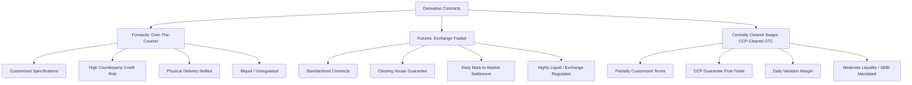

# Derivatives - Futures

## 1. Structural Comparison: Futures vs. Forwards

While both forwards and futures are commitments to buy or sell an asset at a predetermined price at a specified future date, they operate in structurally distinct trading environments.



### Contrast Table: Forwards vs. Futures vs. Centrally Cleared Swaps

| Characteristic | Forward Contracts | Futures Contracts | Centrally Cleared Swaps |
| :--- | :--- | :--- | :--- |
| **Trading Venue** | Over-the-Counter (OTC) | Organized Exchanges (NSE, BSE, MCX) | OTC negotiated, then cleared via CCP (e.g., CCIL in India) |
| **Contract Specifications** | Custom-tailored (size, date, price, quality) | Highly standardized (lot size, expiry, tick size) | Partially customized; standard terms mandated by SEBI/RBI |
| **Counterparty Credit Risk** | High; borne directly by contracting parties | Minimal; guaranteed by Clearing Corporation | Minimal post-clearing; CCP absorbs default risk |
| **Pricing and Quotes** | Private negotiations; not publicly disseminated | Publicly quoted on continuous limit order books | Confirmed bilaterally, reported to trade repositories |
| **Settlement Mechanics** | Occurs solely at maturity (single payment) | Daily mark-to-market cash settlement | Daily variation margin; periodic reset |
| **Liquidity & Reversibility** | Low; exit requires bilateral agreement | High; easily squared off via opposite trade | Moderate; novation required to exit |
| **Collateral Requirements** | None or negotiated security deposits | Mandatory initial and maintenance margins | Initial margin + daily variation margin via CCP |
| **Regulatory Oversight** | Minimal (bilateral, private) | SEBI — fully regulated | SEBI + RBI (for forex/rate swaps); mandatory central clearing per SEBI circular |

### SEBI's Regulatory Stance on OTC vs. Exchange-Traded Derivatives

As per SEBI guidelines, all standardized OTC derivative contracts (especially interest rate swaps and currency derivatives above threshold notional values) must be mandatorily reported to trade repositories (TR) and centrally cleared through authorized CCPs like **CCIL (Clearing Corporation of India Ltd)**. This was introduced to bring transparency and reduce systemic risk in the Indian derivatives market — a lesson learnt globally from the 2008 financial crisis where unregulated OTC credit derivatives caused cascading defaults.

Exchange-traded derivatives (ETDs) like Nifty Futures and stock futures on NSE are fully regulated by SEBI under the **SEBI (Stock Brokers) Regulations** and the **Futures & Options segment rules**, with daily surveillance, position limits, and mandatory margins enforced by the NSE Clearing Ltd. (formerly NSCCL).

### Real-World Example: NSE USDINR Currency Futures vs. Bank Forward Contract

Suppose an Indian IT company expects to receive USD 1,00,000 in 3 months and wants to hedge against rupee appreciation.

**Option A — Bank Forward Contract (OTC)**
- The company negotiates with its banker at a fixed rate of ₹83.50 per USD for 3-month delivery.
- The contract is custom-sized (exactly USD 1,00,000), private, and illiquid.
- If the company wants to cancel, it must renegotiate with the same bank.

**Option B — NSE USDINR Currency Futures**
- Contract size: USD 1,000 per lot. The company sells 100 lots at ₹83.60/USD.
- Daily MTM settlement occurs. The company must maintain margins.
- Exit is easy: buy back 100 lots on any trading day before expiry.
- Fully regulated by SEBI; transparent pricing on exchange.

**Key Difference:** The bank forward gives perfect hedge sizing but locks the company in. The NSE futures offer flexibility, transparency, and daily P&L visibility — but require margin management.

---

## 2. Mathematical Foundations of Futures Pricing

The theoretical pricing of futures relies on the **No-Arbitrage Principle**. The cost of carrying the underlying asset from the spot date to the expiry date must equal the futures price; otherwise, a riskless arbitrage opportunity is created.

### 2.1 The Cost of Carry Model (Simple Interest)

**Intuition:** Think of it this way — if you borrow money today to buy a stock and hold it for 3 months, your total cost at the end of 3 months is the stock price plus the interest you paid. For there to be no free profit, the futures price must equal exactly this total cost. If futures are cheaper, you'd buy futures instead of borrowing to buy; if futures are costlier, you'd sell futures and borrow to buy the stock. Either way, arbitrage brings the price back to this equation.

Let:
- $S_0$ = Spot price of the underlying asset
- $r$ = Borrowing interest rate (expressed as a decimal, p.a.)
- $T$ = Time to maturity in years (or $t/12$ months, or $t/365$ days)

$$\text{Theoretical Futures Price } (F_0) = S_0 \times \left(1 + r \times T\right)$$

If the asset yields a discrete cash income (e.g., dividend $D$) paid during the life of the contract at time $t_d$:
$$F_0 = S_0 \times \left(1 + r \times T\right) - D \times \left(1 + r \times (T - t_d)\right)$$

Alternatively, in present-value terms:
$$F_0 = (S_0 - \text{PV}(D)) \times \left(1 + r \times T\right)$$

Where $\text{PV}(D) = \frac{D}{1 + r \times t_d}$ (discounted at the risk-free rate).

> **📌 Solved Example 2.1:**
> **Given:** Reliance Industries spot price = ₹2,900. Risk-free rate = 6.5% p.a. Futures expiry in 2 months. Reliance declares a dividend of ₹10 per share payable 1 month from now.
> **Find:** Theoretical futures price.
> **Solution:**
> T = 2/12 = 0.1667 years; t_d = 1/12 = 0.0833 years
> PV(D) = 10 / (1 + 0.065 × 0.0833) = 10 / 1.005416 = ₹9.946
> F0 = (2900 - 9.946) × (1 + 0.065 × 0.1667)
> F0 = 2890.054 × 1.010835
> **Answer: F0 = ₹2,921.35**
> **⚠️ Exam Trap:** Students forget to deduct the PV of dividend from S0 BEFORE applying the carry factor. Deducting it after gives the wrong answer.

---

### 2.2 Continuous Compounding Formulation

**Intuition:** In the real world of institutional trading desks and bond markets, interest rates are quoted on a continuous compounding basis — just like how a bank account compounding every millisecond would grow by $e^{rT}$ times your principal. Futures pricing in such environments uses the same exponential factor. The result is slightly higher than simple interest for the same rate, because compounding never stops.

For a non-dividend-paying stock:
$$F_0 = S_0 \times e^{r \times T}$$

#### Derivation (Step-by-Step Arbitrage P&L Table):

Suppose $S_0 = ₹3,800$ (TCS), $r = 6.5\%$ p.a. continuously compounded, $T = 3/12 = 0.25$ years.

Fair Value: $F_{\text{fair}} = 3800 \times e^{0.065 \times 0.25} = 3800 \times e^{0.01625} = 3800 \times 1.01638 = ₹3,862.25$

Suppose market futures price $F_{\text{mkt}} = ₹3,900$ (overvalued).

| Step | Action | Cash Flow at t=0 | Cash Flow at t=T |
| :--- | :--- | :--- | :--- |
| 1 | Borrow ₹3,800 at 6.5% continuous | +₹3,800 | -₹3,800 × e^(0.065×0.25) = -₹3,862.25 |
| 2 | Buy TCS spot at ₹3,800 | -₹3,800 | Stock in hand |
| 3 | Sell TCS futures at ₹3,900 | 0 | +₹3,900 (deliver stock, receive futures price) |
| **Net** | **Riskless Profit** | **₹0** | **₹3,900 − ₹3,862.25 = +₹37.75 per share** |

Through arbitrage pressure: futures price is sold down until $F_0 = ₹3,862.25$

$$F_0 = S_0 \times e^{r \times T}$$

> **📌 Solved Example 2.2:**
> **Given:** TCS spot = ₹3,800. r = 6.5% continuous. T = 3 months.
> **Find:** Fair futures price.
> **Solution:** F0 = 3800 × e^(0.065 × 0.25) = 3800 × 1.01638 = **₹3,862.25**
> **Answer: ₹3,862.25**
> **⚠️ Exam Trap:** Confusing simple interest formula with continuous compounding. Simple gives 3800 × (1 + 0.065×0.25) = 3800 × 1.01625 = ₹3,861.75. The difference is small but ICAI may specify which to use — always check the question.

---

### 2.3 Pricing with Discrete Dividends under Continuous Compounding

**Intuition:** The person holding the physical stock gets the dividend. The person holding the futures contract does not. So from the futures buyer's perspective, the spot stock is worth less than its market price — because they're not going to receive that dividend. We reduce the effective spot price by the present value of the dividend before computing the futures price.

If a stock pays a discrete dividend $D$ at time $t_d$ (where $0 < t_d < T$):
$$F_0 = \left(S_0 - D \times e^{-r \times t_d}\right) \times e^{r \times T}$$

> **📌 Solved Example 2.3:**
> **Given:** Reliance spot = ₹2,900. Dividend = ₹10 in 1 month. r = 6.5% continuous. Futures expiry = 3 months.
> **Find:** Theoretical futures price (continuous compounding).
> **Solution:**
> t_d = 1/12; T = 3/12 = 0.25
> PV(D) = 10 × e^(-0.065 × 1/12) = 10 × e^(-0.005417) = 10 × 0.99459 = ₹9.946
> F0 = (2900 - 9.946) × e^(0.065 × 0.25) = 2890.054 × 1.01638 = **₹2,937.34**
> **Answer: ₹2,937.34**
> **⚠️ Exam Trap:** Students sometimes add dividend instead of subtracting it — thinking dividend makes the stock "worth more." Remember: the futures holder misses the dividend, so futures must be priced lower to compensate.

---

### 2.4 Pricing Index Futures with Continuous Dividend Yield ($d$)

**Intuition:** A stock index like Nifty 50 has 50 companies — each paying dividends at different times throughout the year. Modelling each dividend individually is impractical. Instead, we treat all those dividends as a smooth continuous "drip" of income, expressed as an annual yield. This drip reduces the cost of carry because the stock holder earns income while holding — so the futures price must be lower than what it would be without dividends.

$$F_0 = S_0 \times e^{(r - d) \times T}$$

Where:
- $r$ = Continuously compounded risk-free rate p.a.
- $d$ = Continuously compounded dividend yield p.a.

If simple compounding is used in exams:
$$F_0 = S_0 \times \left(1 + (r - d) \times \frac{t}{12}\right)$$

> **📌 Solved Example 2.4:**
> **Given:** Nifty 50 spot = 24,000. r = 6.5% p.a. continuously compounded. Dividend yield d = 1.2% p.a. Futures expiry = 2 months.
> **Find:** Fair value of Nifty futures.
> **Solution (continuous):**
> T = 2/12 = 0.1667
> F0 = 24000 × e^((0.065 - 0.012) × 0.1667) = 24000 × e^(0.053 × 0.1667) = 24000 × e^(0.008833) = 24000 × 1.00887 = **24,212.9**
> **Answer: Nifty futures fair value ≈ 24,213**
> **⚠️ Exam Trap:** Using r alone without subtracting d. The dividend yield reduces the effective cost of carry. A common error is to ignore d and arrive at 24,263 — inflating the theoretical price.

---

## 3. Market Terminology: Contango vs. Backwardation

The relationship between the spot price ($S_0$) and the futures price ($F_0$) varies based on market conditions, inventory levels, and demand.

```
Spot Price (S) < Futures Price (F)  =================>  Contango (Positive Carry)
Spot Price (S) > Futures Price (F)  =================>  Backwardation (Negative Carry)
```

### 3.1 Contango

- **Condition:** $F_0 > S_0$ (Futures price is higher than spot price).
- **Drivers:** High carrying costs (storage, insurance, finance costs) and absence of immediate supply shortages. Common in financial assets and metal commodities.
- **Economic Meaning:** The market is willing to pay a premium to avoid holding and storing the physical asset today, preferring to receive it in the future.

**Real Indian Example — Gold Futures on MCX (Contango):**

Gold is a classic contango market. Suppose:
- MCX Gold spot = ₹72,000 per 10g
- Storage + insurance cost ≈ 0.3% per month
- Finance cost (r) = 6.5% p.a. = 0.54% per month

Expected 3-month futures price = 72,000 × (1 + (0.0054 + 0.003) × 3) = 72,000 × 1.0252 = **₹73,814**

MCX 3-month Gold futures trade around ₹73,500–74,000 — confirming contango. Jewelry manufacturers and traders who need gold later are happy to pay this premium to avoid storage risk today.

**Nifty Index Futures — Near vs. Far Month:**

| Contract | Price |
| :--- | :--- |
| Nifty Spot | 24,000 |
| Near-month futures (1 month) | 24,106 |
| Mid-month futures (2 months) | 24,213 |
| Far-month futures (3 months) | 24,320 |

This upward-sloping futures curve = **Contango**. Each successive month is higher because the carry cost (interest) outweighs the dividend yield.

---

### 3.2 Backwardation

- **Condition:** $F_0 < S_0$ (Futures price is lower than spot price).
- **Drivers:** High demand for immediate physical possession (high **Convenience Yield**) or expectations of a future supply increase/demand fall.
- **Economic Meaning:** The benefits of holding the physical asset today (e.g., keeping a factory running during a raw material shortage) exceed the financial costs of carry.

### 3.3 Theoretical Framework: Keynes vs. Storage Cost Theory

| Theory | Proponent | Core Argument | Implication |
| :--- | :--- | :--- | :--- |
| **Normal Backwardation** | John Maynard Keynes | Hedgers (typically producers/sellers) dominate futures markets. They need to short futures to lock in prices. To attract speculators to take the long side, futures must be priced below the expected spot price — giving speculators an expected profit. | Futures prices systematically below expected future spot: $F_0 < E(S_T)$ |
| **Storage Cost Theory (Cost of Carry)** | Kaldor, Working | The futures price simply equals the spot price plus the net cost of storage (finance + physical storage − convenience yield). No systematic bias exists. | $F_0 = S_0 + \text{Net Carry Cost}$ |

**In Indian Markets:** Equity index futures largely follow Storage Cost theory (no physical storage). Commodity futures (crude oil, agricultural commodities) often exhibit Normal Backwardation during supply crunches — a key ICAI exam topic.

---

## 4. Margin Architecture & Risk Mitigation

To eliminate counterparty default risk, exchanges use a clearing house that acts as the counterparty to every trade and mandates daily margin payments.

```
       [ Client A ]                [ Client B ]
            │                           │
         Margin                      Margin
            ▼                           ▼
       [ Broker A ]                [ Broker B ]
            │                           │
      Clearing Margin             Clearing Margin
            ▼                           ▼
       ┌─────────────────────────────────┐
       │   Exchange Clearing House (CCP)  │
       │  (Guarantees settlement daily)  │
       └─────────────────────────────────┘
```

### 4.1 Value-at-Risk (VaR) Margin Design

The **Initial Margin** is the deposit required to open a futures position. The clearing corporation computes this using the Value-at-Risk (VaR) methodology, typically calibrated to cover potential daily losses with 99.7% confidence.

$$\text{Initial Margin \%} \approx \mu + 3\sigma$$

Where $\mu$ = mean of absolute daily returns, $\sigma$ = daily volatility.

By collecting this margin, the clearing house ensures that if a trader defaults on any single day, the deposited funds are sufficient to cover the liquidation loss in 99.7% of market conditions (3 standard deviations under a normal distribution).

### 4.2 SPAN Margin (Standard Portfolio Analysis of Risk)

SEBI-mandated exchanges in India use **SPAN (Standard Portfolio Analysis of Risk)** developed by the CME Group, adopted by NSE. Rather than margin each position in isolation, SPAN:

1. Calculates 16 risk scenarios by varying price and volatility
2. Identifies the worst-case loss across all scenarios
3. Applies the worst-case loss as the Initial Margin requirement

This makes SPAN more efficient for hedged portfolios — if you are long Nifty futures and short Call options on Nifty, SPAN recognizes the offset and charges lower combined margin than two separate margins.

**Example:** Long 1 Nifty Futures lot (50 units, Nifty at 24,000 = ₹12,00,000 notional). SPAN margin ≈ 12% of notional = **₹1,44,000** initial margin.

### 4.3 Maintenance Margin

The **Maintenance Margin** is the minimum equity level that must be maintained in the margin account to keep a position open. It is usually set at 75–80% of the initial margin.

$$\text{Maintenance Margin} = \theta \times \text{Initial Margin} \quad (\theta \approx 0.75)$$

Example: Initial Margin = ₹1,44,000 → Maintenance Margin = 0.75 × 1,44,000 = **₹1,08,000**

### 4.4 Client-Level vs. Clearing Member-Level Margin

| Level | Who Pays | To Whom | Purpose |
| :--- | :--- | :--- | :--- |
| **Client Margin** | Individual trader (you) | To your broker | Covers your position risk |
| **Trading Member Margin** | Broker/Trading Member | To Clearing Member | Aggregated across all clients |
| **Clearing Member Margin** | Clearing Member (bank/large broker) | To NSE Clearing Ltd. | Covers systemic risk; includes additional default fund contribution |

If a client defaults → broker absorbs. If broker defaults → Clearing Member absorbs. If Clearing Member defaults → NSE Clearing's Settlement Guarantee Fund (SGF) absorbs. This layered architecture eliminates systemic risk.

### 4.5 Variation Margin & Daily Mark-to-Market (MTM) — 5-Day Walkthrough

**Setup:** Trader buys 1 lot of Nifty Futures (50 units) at 24,000. Initial Margin = ₹1,44,000. Maintenance Margin = ₹1,08,000.

**MTM formulas:**
$$\text{MTM P\&L (Long)} = (S_t - S_{t-1}) \times \text{Lot Size} \times \text{Contracts}$$
$$\text{Balance}_t = \text{Balance}_{t-1} + \text{MTM P\&L}_t$$

| Day | Settlement Price | Price Change | MTM P&L (₹) | Margin Balance (₹) | Margin Call? | Action |
| :---: | :---: | :---: | :---: | :---: | :---: | :--- |
| 0 (Entry) | 24,000 | — | — | 1,44,000 | No | Deposit initial margin |
| 1 | 23,800 | −200 | −200×50 = −10,000 | 1,34,000 | No | Balance > Maintenance |
| 2 | 23,600 | −200 | −10,000 | 1,24,000 | No | Balance > Maintenance |
| 3 | 23,400 | −200 | −10,000 | 1,14,000 | No | Balance > Maintenance |
| 4 | 23,100 | −300 | −15,000 | 99,000 | **YES** | Deposit ₹45,000 to restore to ₹1,44,000 |
| 5 | 23,500 | +400 | +20,000 | 1,64,000 | No | Withdraw excess ₹20,000 if desired |

> **⚠️ Exam Trap:** On a margin call, the client must restore the balance to the **Initial Margin** level — NOT to the Maintenance Margin level. A common exam error is topping up only to the maintenance level.

---

## 5. Arbitrage Mechanics & Market Frictions

When the actual market futures price ($F_{\text{mkt}}$) deviates from the theoretical fair price ($F_{\text{theoretical}}$), arbitrageurs step in to exploit the mispricing.

### 5.1 Cash & Carry Arbitrage (When $F_{\text{mkt}} > F_{\text{theoretical}}$)

If futures are overvalued, the arbitrageur buys the physical asset and sells the futures.

- **Step 1 ($t=0$):** Borrow money at interest rate $r$ to buy the spot asset at $S_0$. Sell the futures contract at $F_{\text{mkt}}$.
- **Step 2 ($t=T$):** Deliver the asset to settle the futures contract, receiving $F_{\text{mkt}}$. Repay the borrowed funds: $S_0 e^{rT}$.
- **Riskless Profit:** $F_{\text{mkt}} - S_0 e^{rT} > 0$.

---

### 5.2 Reverse Cash & Carry Arbitrage (When $F_{\text{mkt}} < F_{\text{theoretical}}$)

If futures are undervalued, the arbitrageur sells the physical asset and buys the futures.

- **Step 1 ($t=0$):** Short sell the asset at $S_0$ via SLB desk. Invest the short sale proceeds at $r$. Buy futures at $F_{\text{mkt}}$.
- **Step 2 ($t=T$):** Collect matured investment: $S_0 e^{rT}$. Settle futures by buying asset at $F_{\text{mkt}}$. Return stock to lender.
- **Riskless Profit:** $S_0 e^{rT} - F_{\text{mkt}} - \text{SLB costs} - \text{Dividend pass-throughs} > 0$.

---

### 5.3 Why Arbitrage is Harder in India — The STT Asymmetry

In India, the **Securities Transaction Tax (STT)** creates an asymmetry that makes cash-and-carry arbitrage more expensive than reverse cash-and-carry:

| Transaction | STT Rate |
| :--- | :--- |
| Buy equity delivery (spot) | 0.1% on buy side |
| Sell equity delivery (spot) | 0.1% on sell side |
| Buy equity futures | NIL |
| Sell equity futures (squared off) | 0.01% on sell side |
| Sell equity futures (delivery settled) | 0.125% on sell side |

**Impact on Cash & Carry:** The arbitrageur buys in the spot market (pays STT 0.1%) and sells futures — the spot purchase STT adds directly to cost, widening the upper bound. This is why the Upper Arbitrage Bound in India is higher than in most international markets.

**Impact on Reverse Cash & Carry:** The arbitrageur short-sells in the spot market (SLB required, STT 0.1% on the sell) and buys futures — double transaction costs narrow the profit corridor significantly.

### 5.4 The Arbitrage-Free Corridor — Solved Numerical

$$\text{Upper Bound} = (S_0 + C_{\text{spot}}) \cdot e^{r_{\text{borrow}} T} + C_{\text{fut}} + C_{\text{expiry}}$$
$$\text{Lower Bound} = (S_0 - C_{\text{spot}}) \cdot e^{r_{\text{lend}} T} - C_{\text{SLB}} - C_{\text{fut}} - C_{\text{expiry}} - \text{PV}(D)$$

> **📌 Solved Example 5.4 — Arbitrage Corridor:**
> **Given:** TCS spot = ₹3,800. r_borrow = 7%, r_lend = 6%. T = 1 month (1/12). No dividend. Transaction costs:
> - Brokerage: 0.02% each leg (buy spot + sell futures = 2 legs)
> - STT on spot buy: 0.1%
> - GST on brokerage: 18%
> - Exchange fees: 0.00325% per leg
>
> **Find:** Upper and Lower arbitrage bounds.
>
> **Solution:**
>
> **Cost per unit (spot leg):**
> - Brokerage = 0.02% × 3800 = ₹0.76
> - GST on brokerage = 18% × 0.76 = ₹0.137
> - STT (spot buy) = 0.1% × 3800 = ₹3.80
> - Exchange fee = 0.00325% × 3800 = ₹0.1235
> - Total spot cost C_spot = 0.76 + 0.137 + 3.80 + 0.1235 = **₹4.82 per share**
>
> **Cost per unit (futures leg):**
> - Brokerage = 0.02% × 3800 = ₹0.76
> - GST = ₹0.137
> - STT (futures sell) = 0.01% × 3800 = ₹0.38
> - Exchange fee = ₹0.1235
> - Total futures cost C_fut = **₹1.40 per share**
>
> **Upper Bound:**
> = (3800 + 4.82) × e^(0.07 × 1/12) + 1.40
> = 3804.82 × 1.005831 + 1.40
> = 3826.99 + 1.40 = **₹3,828.39**
>
> **Lower Bound (SLB cost assumed 0.5% p.a. = ₹1.58):**
> = (3800 − 4.82) × e^(0.06 × 1/12) − 1.58 − 1.40
> = 3795.18 × 1.005 − 1.58 − 1.40
> = 3814.16 − 2.98 = **₹3,811.18**
>
> **Answer: Arbitrage-free corridor = ₹3,811.18 to ₹3,828.39**
> Futures must trade OUTSIDE this band for profitable arbitrage.
> **⚠️ Exam Trap:** Forgetting GST on brokerage — ICAI problems that mention brokerage always implicitly require GST at 18%.

---

## 6. Hedging Strategies Using Futures

Hedging uses futures to reduce or eliminate price risk on an existing or anticipated exposure. Unlike speculation, the hedger has a position in the underlying asset and uses futures to offset adverse price movements.

### 6.1 Long Hedge

A **Long Hedge** is used when you fear prices will RISE and you need to buy the asset in the future. You buy futures today to lock in the purchase price.

**Who uses it:** Importers, manufacturers expecting to buy raw materials, fund managers planning to deploy cash.

> **📌 Solved Example 6.1 — Importer Long Hedge:**
> **Given:** An Indian importer needs to buy USD 10,00,000 in 3 months. Current spot = ₹83.50/USD. NSE USDINR 3-month futures = ₹84.00/USD (lot size = USD 1,000; 1,000 lots needed).
> **Find:** Effective rate paid if after 3 months spot = ₹85.50/USD.
> **Solution:**
>
> | | Spot Market | Futures Market |
> | :--- | :--- | :--- |
> | Today | Will buy USD later | Buy 1,000 lots at ₹84.00 |
> | After 3 months | Buy USD at ₹85.50 | Sell 1,000 lots at ₹85.50 |
> | P&L | Paid ₹85.50 (loss vs. original rate) | Gain = (85.50 − 84.00) × 10,00,000 = ₹15,00,000 |
>
> Effective rate = ₹85.50 − ₹1.50 (futures gain per USD) = **₹84.00/USD**
>
> **Answer:** Long hedge locked in ₹84.00/USD regardless of market movement.
> **⚠️ Exam Trap:** Long hedge protects against price rises but sacrifices upside if prices fall.

---

### 6.2 Short Hedge

A **Short Hedge** is used when you fear prices will FALL and you already hold the asset (or will sell it). You sell futures today to lock in the sale price.

**Who uses it:** Equity portfolio managers, commodity producers, exporters.

> **📌 Solved Example 6.2 — Portfolio Manager Short Hedge:**
> **Given:** A mutual fund holds a Nifty-linked portfolio worth ₹5 crore. Nifty spot = 24,000. Fund manager fears a 5% correction in 1 month. Nifty lot size = 50 units. 1-month futures = 24,106.
> **Find:** How many lots to sell? What is the outcome if Nifty falls to 22,800 (−5%)?
>
> **Solution:**
> Lots needed = Portfolio Value / (Futures Price × Lot Size)
> = 5,00,00,000 / (24,106 × 50) = 5,00,00,000 / 12,05,300 ≈ **41.5 → sell 42 lots**
>
> | | Portfolio | Futures |
> | :--- | :--- | :--- |
> | Today | Worth ₹5 crore | Sell 42 lots at 24,106 |
> | After 1 month (Nifty 22,800) | Worth ₹4.75 crore (−5%) | Buy 42 lots at 22,800 |
> | P&L | −₹25,00,000 | Gain = (24,106−22,800) × 50 × 42 = ₹27,42,600 |
> | **Net** | **+₹2,42,600 overall** | |
>
> **Answer:** Short hedge nearly perfectly offset the portfolio loss.
> **⚠️ Exam Trap:** Use FUTURES price (not spot price) in the denominator when calculating number of lots.

---

### 6.3 Optimal Hedge Ratio

When the asset being hedged is not identical to the futures underlying (e.g., hedging a bond portfolio with Nifty futures), a perfect 1:1 hedge is suboptimal. The **Optimal Hedge Ratio** accounts for the correlation and relative volatility between the spot asset and the futures.

$$h^* = \rho \times \frac{\sigma_S}{\sigma_F}$$

Where:
- $\rho$ = Correlation coefficient between changes in spot price ($\Delta S$) and futures price ($\Delta F$)
- $\sigma_S$ = Standard deviation of $\Delta S$
- $\sigma_F$ = Standard deviation of $\Delta F$

**Optimal number of contracts:**
$$N^* = h^* \times \frac{Q_A}{Q_F}$$

Where $Q_A$ = quantity of asset being hedged, $Q_F$ = quantity per futures contract.

> **📌 Solved Example 6.3:**
> **Given:** An airline wants to hedge 1,00,000 barrels of jet fuel using crude oil futures (MCX). Lot size = 100 barrels. σ_S = 2.5% per month, σ_F = 3.0% per month, ρ = 0.85.
> **Find:** Optimal number of futures contracts.
> **Solution:**
> h* = 0.85 × (2.5/3.0) = 0.85 × 0.8333 = 0.7083
> N* = 0.7083 × (1,00,000/100) = 0.7083 × 1,000 = **708 contracts**
> **Answer: Buy 708 MCX crude oil futures lots.**
> **⚠️ Exam Trap:** A common error is to ignore the correlation and just use h*=1 (perfect hedge assumption). That overestimates the required hedge.

---

### 6.4 Beta Hedging — Neutralizing Portfolio Risk with Index Futures

Beta ($\beta$) measures a portfolio's sensitivity to market movements. To change a portfolio's beta using futures:

$$N = \frac{(\beta_{\text{target}} - \beta_{\text{portfolio}}) \times V_{\text{portfolio}}}{F_{\text{index}} \times \text{Lot Size}}$$

- If $N > 0$: **Buy** futures (increase beta / add market exposure)
- If $N < 0$: **Sell** futures (reduce beta / hedge market risk)

> **📌 Solved Example 6.4 — Full Beta Hedge:**
> **Given:** Portfolio value = ₹1,00,00,000 (₹1 crore). Portfolio β = 1.4. Target β = 0 (full hedge). Nifty futures price = 24,000. Lot size = 50 units.
> **Find:** Number of Nifty futures contracts to sell.
> **Solution:**
> N = (0 − 1.4) × 1,00,00,000 / (24,000 × 50)
> N = (−1.4 × 1,00,00,000) / 12,00,000
> N = −1,40,00,000 / 12,00,000
> N = **−11.67 → Sell 12 lots** (rounded)
>
> **Interpretation:** Selling 12 Nifty futures lots offsets the systematic risk of the ₹1 crore portfolio. Any market-wide fall will now be compensated by futures gains.
>
> **Answer: Sell 12 Nifty Futures lots.**
> **⚠️ Exam Trap:** Use the FUTURES price in the denominator, not the spot Nifty level. Also, negative N means sell — don't flip the sign and buy.

---

## 7. Indian Regulatory Framework (SEBI / NSE / BSE)

Understanding the regulatory structure is essential for ICAI exams — practical questions on lot sizes, expiry, and position limits appear regularly.

### 7.1 Contract Expiry Conventions

- **Expiry Day:** Last **Thursday** of every month. If the last Thursday is a trading holiday, the contract expires on the preceding **Wednesday**.
- **Three Series Active Simultaneously:** Near-month (current month), Mid-month (next month), Far-month (month after next).
- On expiry, the expiring contract is settled at the final settlement price (typically the average of the underlying index/stock during the last 30 minutes of trading).
- A new far-month contract is introduced the following trading day.

```
Example (July 2025 expiry):
Near-Month: July 31, 2025 (last Thursday)
Mid-Month:  August 28, 2025
Far-Month:  September 25, 2025
```

### 7.2 Standard Lot Sizes (as per SEBI guidelines)

| Underlying | Lot Size | Approximate Notional (at current prices) |
| :--- | :--- | :--- |
| Nifty 50 | 50 units | ₹12,00,000 at Nifty 24,000 |
| Bank Nifty | 15 units | ₹52,500 at BNF 35,000 |
| Nifty Midcap Select | 75 units | ~₹9,00,000 |
| Individual Stocks | Varies (75 to 5,000 units) | Minimum ~₹5–10 lakh notional |

> Note: SEBI revises lot sizes periodically to keep minimum notional contract value within ₹5–10 lakh range.

### 7.3 Position Limits

SEBI specifies three levels of position limits to prevent market manipulation and excessive concentration:

| Level | Limit | Purpose |
| :--- | :--- | :--- |
| **Client/Individual** | Lower of 1% of free-float market cap or ₹300 crore per stock | Prevent single-entity manipulation |
| **Trading Member** | 15% of total open interest or ₹500 crore (index), whichever is higher | Broker-level risk |
| **Market-Wide (MWPL)** | 20% of total shares in the non-promoter, non-FII free-float | Systemic risk limit |

When open interest in a stock futures/options contract exceeds 95% of MWPL, the stock enters a **ban period** — no fresh positions allowed, only squaring off.

### 7.4 Circuit Breakers on Index Futures

SEBI mandates market-wide circuit breakers based on the Nifty 50 or Sensex movement:

| Trigger Level | Time of Trigger | Halt Duration |
| :--- | :--- | :--- |
| 10% movement | Before 1:00 PM | 45 minutes |
| 10% movement | 1:00 PM – 2:30 PM | 15 minutes |
| 10% movement | After 2:30 PM | No halt |
| 15% movement | Before 1:00 PM | 1 hour 45 minutes |
| 15% movement | After 1:00 PM | Remainder of day |
| 20% movement | Any time | Remainder of day |

Circuit breakers apply to both the equity cash segment and the F&O segment simultaneously. This prevents panic futures selling from amplifying spot market crashes.

### 7.5 SEBI Eligibility Criteria for Stock Futures

As per SEBI guidelines, a stock must meet ALL of the following before futures trading is permitted:

1. **Market Capitalisation:** Median quarterly market cap ≥ ₹500 crore over the preceding 6 months
2. **Liquidity:** Median quarterly trading volume in cash segment ≥ ₹10 crore per day
3. **Free-float:** At least 20% of total shares must be freely tradable
4. **Non-promoter holding:** Sufficient non-promoter holding to prevent manipulation
5. **Volatility:** Stock should not have been in the T2T (Trade-to-Trade) or BE series for excessive volatility

Stocks that no longer meet these criteria are removed from the F&O segment after due notice.

---

## 8. Exam Edge: Solved Problems & Traps

### 8.1 Five Fully Solved ICAI-Style Numericals

---

> **📌 Problem 1 — Fair Value with Discrete Dividend**
> **Given:** Infosys spot price = ₹1,800. Dividend of ₹20 payable in 45 days. Risk-free rate = 6% p.a. (simple interest). Futures expiry in 90 days.
> **Find:** Theoretical futures price.
> **Solution:**
> T = 90/365; t_d = 45/365
> PV(D) = 20 / (1 + 0.06 × 45/365) = 20 / 1.00740 = ₹19.852
> F0 = (1800 − 19.852) × (1 + 0.06 × 90/365)
> = 1780.148 × 1.01479
> = **₹1,806.49**
> **Answer: ₹1,806.49**
> **⚠️ Exam Trap:** Using 45/12 or 90/12 instead of /365. When the problem gives days, always convert using /365 (not /12).

---

> **📌 Problem 2 — MTM Margin Call Calculation**
> **Given:** Trader buys 2 lots of Nifty futures at 23,500. Lot size = 50. Initial Margin = ₹1,20,000 per lot (total ₹2,40,000). Maintenance Margin = 75%. After Day 1: Nifty settles at 22,900.
> **Find:** (a) MTM loss, (b) Margin balance, (c) Margin call amount if any.
> **Solution:**
> (a) MTM Loss = (22,900 − 23,500) × 50 × 2 = −600 × 100 = **−₹60,000**
> (b) Balance = 2,40,000 − 60,000 = **₹1,80,000**
> (c) Maintenance Margin = 75% × 2,40,000 = ₹1,80,000
> Balance = Maintenance Margin exactly → **No margin call triggered** (call triggers only if balance FALLS BELOW maintenance, not equals)
> **Answer: No margin call. Balance = ₹1,80,000.**
> **⚠️ Exam Trap:** Margin call triggers when Balance < Maintenance Margin (strictly less than). If equal, no call is triggered.

---

> **📌 Problem 3 — Cash-and-Carry Arbitrage Profit**
> **Given:** HDFC Bank spot = ₹1,600. 2-month futures = ₹1,635. r = 6% p.a. simple interest. No dividends. No transaction costs.
> **Find:** Is there an arbitrage opportunity? Calculate profit.
> **Solution:**
> Fair Value = 1600 × (1 + 0.06 × 2/12) = 1600 × 1.01 = **₹1,616**
> Market futures price = ₹1,635 > ₹1,616 → Futures OVERVALUED
> Cash & Carry Arbitrage:
> - Borrow ₹1,600 at 6%, buy spot
> - Sell futures at ₹1,635
> - At expiry: deliver stock, receive ₹1,635, repay ₹1,616
> - **Profit = 1,635 − 1,616 = ₹19 per share**
> **Answer: Arbitrage profit = ₹19 per share.**

---

> **📌 Problem 4 — Beta Hedging: Number of Contracts**
> **Given:** Portfolio value = ₹2,00,00,000. Portfolio β = 1.6. Investor wants to reduce β to 0.8. Nifty futures = 24,200. Lot size = 50 units.
> **Find:** Number of Nifty futures contracts to sell.
> **Solution:**
> N = (β_target − β_portfolio) × V_portfolio / (F × Lot Size)
> N = (0.8 − 1.6) × 2,00,00,000 / (24,200 × 50)
> N = (−0.8 × 2,00,00,000) / 12,10,000
> N = −1,60,00,000 / 12,10,000
> N = **−13.22 → Sell 13 lots**
> **Answer: Sell 13 Nifty Futures lots.**
> **⚠️ Exam Trap:** Partial beta reduction (not to zero) — many students mistakenly use β=1.6 in full when the target is 0.8.

---

> **📌 Problem 5 — Index Futures with Continuous Dividend Yield**
> **Given:** Nifty spot = 24,000. r = 7% p.a. continuously compounded. Dividend yield d = 1.5% p.a. Futures expiry = 3 months.
> **Find:** Fair futures price.
> **Solution:**
> F0 = 24,000 × e^((0.07 − 0.015) × 3/12)
> = 24,000 × e^(0.055 × 0.25)
> = 24,000 × e^(0.01375)
> = 24,000 × 1.01385
> = **₹24,332.3**
> **Answer: Nifty futures fair value ≈ 24,332**
> **⚠️ Exam Trap:** Using r=7% without subtracting d=1.5%. Net carry rate = r−d = 5.5%, not 7%.

---

### 8.2 Top 10 Common Exam Mistakes

1. **Using simple interest when continuous compounding is specified** (or vice versa) — always read the question carefully.
2. **Forgetting to deduct PV of dividend** from spot price before applying carry factor.
3. **Using spot Nifty level instead of futures price** in the beta hedging denominator.
4. **Rounding number of contracts down** when the question asks for full hedge (round to nearest, or round up for complete protection).
5. **Ignoring GST on brokerage** in transaction cost calculations — add 18% to brokerage always.
6. **Margin call top-up to maintenance level** instead of restoring to initial margin level.
7. **Confusing contango and backwardation** — remember: Contango = Futures > Spot = "C > S" = Carry Cost dominant.
8. **In beta hedging, applying wrong sign** — negative N means SELL futures, positive N means BUY futures.
9. **Not annualizing the rate** when time is given in months/days — T = months/12 or days/365.
10. **Ignoring STT asymmetry** in Indian arbitrage problems — spot purchase bears 0.1% STT while futures bear only 0.01%.

---

### 8.3 Formula Cheat Sheet

| Formula | Use Case |
| :--- | :--- |
| $F_0 = S_0(1 + rT)$ | Simple interest, no dividend |
| $F_0 = (S_0 - PV(D))(1 + rT)$ | Simple interest, discrete dividend |
| $F_0 = S_0 e^{rT}$ | Continuous compounding, no dividend |
| $F_0 = (S_0 - De^{-rt_d})e^{rT}$ | Continuous compounding, discrete dividend |
| $F_0 = S_0 e^{(r-d)T}$ | Continuous compounding, continuous dividend yield |
| $F_0 = S_0(1 + (r-d) \times t/12)$ | Simple interest, index futures with dividend yield |
| $\text{IM\%} = \mu + 3\sigma$ | Initial margin (VaR at 99.7%) |
| $\text{MM} = \theta \times \text{IM}$ | Maintenance margin |
| $\text{MTM (Long)} = (S_t - S_{t-1}) \times n \times \text{Lot}$ | Daily mark-to-market, long position |
| $h^* = \rho \times \sigma_S/\sigma_F$ | Optimal hedge ratio |
| $N^* = h^* \times Q_A/Q_F$ | Optimal number of contracts (cross-hedge) |
| $N = (\beta_T - \beta_P) \times V_P / (F \times \text{Lot})$ | Beta hedging contracts |

---

### 8.4 Memory Tricks

**Contango vs. Backwardation:**
- **C**ontango = **C**arry cost dominates = Futures **C**ostlier than Spot
- **B**ackwardation = **B**enefits of holding now dominate = Futures **B**elow Spot
- Quick visual: Contango = upward sloping futures curve; Backwardation = downward sloping

**Cost of Carry intuition:**
- Simple: "I paid interest for the time I held it"
- Continuous: "My debt compounded every second"

**Margin call rule:**
- Think of a fuel tank: Initial Margin = Full Tank. Maintenance Margin = Reserve level. When you hit Reserve → refill to FULL (not just to reserve).

**Beta hedging sign:**
- β_target < β_portfolio → N is negative → **SELL** futures (reduce exposure)
- β_target > β_portfolio → N is positive → **BUY** futures (increase exposure)

