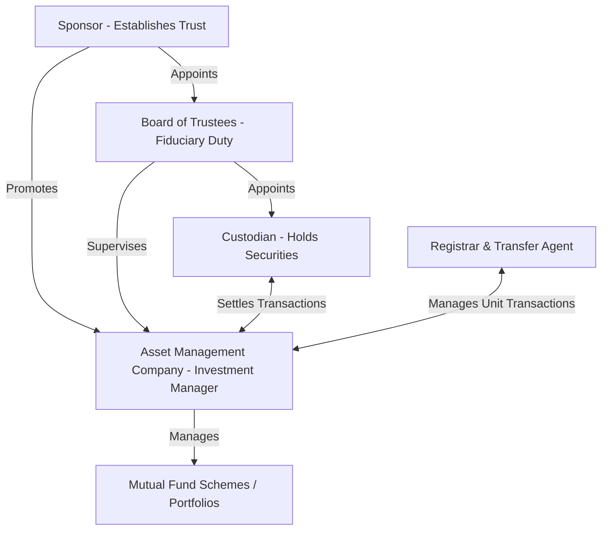
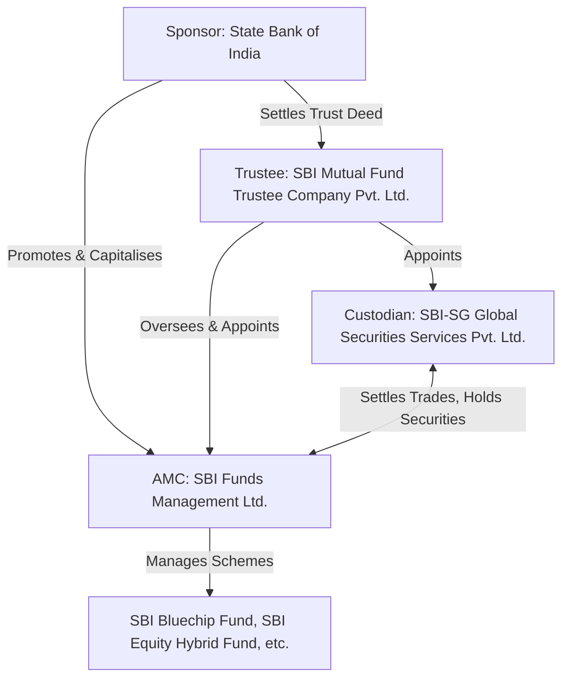

# Mutual Funds

## 1. Structural and Regulatory Architecture of Mutual Funds

Mutual funds are structured as trusts under the Indian Trusts Act, 1882. The structural integrity and operational separation of assets are governed by the Securities and Exchange Board of India (Mutual Funds) Regulations, 1996. This structure is designed to mitigate conflicts of interest and protect retail investors.



### 1.1 The Sponsor
- Role: The sponsor acts as the promoter of the mutual fund, similar
  to the promoter of a company. The sponsor establishes the trust
  under the Indian Trusts Act and registers the mutual fund with SEBI.
- Eligibility Criteria (SEBI Norms):
  - Sound track record and general reputation of fairness and integrity
  - Carrying on business in financial services for not less than 5 years
  - Positive net worth in all immediately preceding 5 years
  - Net worth in immediately preceding year > capital contribution to AMC
  - Profits in at least 3 out of preceding 5 years including 5th year
  - Must contribute at least 40% of net worth of the AMC

### 1.2 The Board of Trustees
- Role: Hold property of mutual fund in trust for unit holders
- Key Responsibilities:
  - Appoint AMC and approve investment management agreement
  - Ensure AMC acts per SEBI regulations
  - Submit six-monthly reports to SEBI
  - Two-thirds must be independent (not associated with sponsor)

### 1.3 The Asset Management Company (AMC)
- Role: Acts as investment manager of the mutual fund
- Key Constraints:
  - Minimum net worth of Rs.50 crores
  - Cannot act as trustee of any other mutual fund
  - Cannot undertake other business except portfolio management,
    advisory services, and managing AIFs

### 1.4 The Custodian
- Role: Holds physical and electronic securities in safe custody
- Key Duties: Clearing and settling trades, collecting dividends,
  handling corporate actions; must be independent of sponsor and AMC

### 1.5 The Registrar and Transfer Agent (RTA)
- Role: Processes investor applications, issues/redeems units,
  maintains register of unit holders, processes dividend payouts

### 1.6 SEBI (Mutual Funds) Regulations, 1996 — Key Provisions Summary

The 1996 Regulations are the parent regulatory framework governing the entire lifecycle of a mutual fund in India — from registration to winding up. For exam purposes, the following provisions are most frequently tested:

| Provision Area | Key Requirement |
| :--- | :--- |
| Registration | Every mutual fund must be registered with SEBI before launching any scheme; registration is in the name of the Trust |
| Constitution | Fund must be constituted as a Trust under the Indian Trusts Act, 1882, via a Trust Deed executed by the Sponsor in favour of Trustees |
| Trustee Independence | At least two-thirds of trustees must be independent persons, not associated with the Sponsor in any manner |
| AMC Net Worth | Minimum net worth of Rs.50 crore, to be maintained at all times |
| Investment Restrictions | No scheme can invest more than 10% of NAV in equity/equity-related instruments of a single company (5% for sector/index funds, subject to specific carve-outs); no fund can hold more than 10% of any company's paid-up capital carrying voting rights |
| NFO Disclosure | Scheme Information Document (SID) and Statement of Additional Information (SAI) must be filed with SEBI and made publicly available before NFO launch |
| Valuation | Investments must be valued in accordance with SEBI-prescribed valuation norms (mark-to-market for traded securities) |
| Borrowing Limit | A scheme cannot borrow more than 20% of net assets, and only for meeting temporary liquidity needs for repurchase/redemption, for a period not exceeding 6 months |
| Disclosure | AMC must disclose half-yearly unaudited financial results and portfolio statements |
| Winding Up | A scheme must be wound up if 75% of unit holders (by value) vote in favour, or if SEBI directs winding up in investor interest |

> **⚠️ Exam Trap:** Students often confuse the **10% single-company investment cap** with the **10% voting-rights/paid-up-capital cap** — these are two *different* restrictions operating simultaneously. The first limits exposure as a percentage of the *scheme's* NAV; the second limits the fund's influence as a percentage of the *investee company's* capital.

### 1.7 Illustrative Real-World Structure: SBI Mutual Fund

To consolidate the trust-AMC-custodian relationship, consider the SBI Mutual Fund structure:



- **Sponsor:** State Bank of India (a public sector bank with the requisite financial services track record and net worth).
- **Trustee:** SBI Mutual Fund Trustee Company Private Limited — a separate corporate entity (not the bank itself) holding fund assets in trust for unit holders, with the mandated proportion of independent directors.
- **AMC:** SBI Funds Management Limited — a joint venture between SBI and Amundi (a global asset manager) — which acts as the investment manager, executing day-to-day portfolio decisions across SBI's scheme suite.
- **Custodian:** SBI-SG Global Securities Services Private Limited — a joint venture between SBI and Société Générale — which independently holds securities and settles trades, structurally separated from the AMC to prevent self-custody risk.

This illustrates the regulatory principle of **functional separation**: the entity that *manages* money (AMC) is never the entity that *holds* the underlying securities (Custodian) or the entity exercising fiduciary *oversight* (Trustee), even when all three trace back to a common sponsor group.

### 1.8 Total Expense Ratio (TER) — Detailed Breakdown

The TER is the annual cost charged to investors, expressed as a percentage of the scheme's daily average net assets, and is the single biggest determinant of an investor's net (post-cost) return relative to the gross return generated by the fund manager.

**Components of TER:**

| Component | Description | Typical Cap (illustrative, slab-dependent) |
| :--- | :--- | :--- |
| Investment Management & Advisory Fee | Compensation to the AMC for portfolio management | Slab-based; declines as AUM rises |
| Trustee Fee | Fee paid to the Board of Trustees for fiduciary oversight | Small fraction of TER, typically a few bps |
| Custodian Fee | Fee for safekeeping of securities and settlement | Included within overall TER cap |
| Registrar & Transfer Agent (RTA) Fee | Fee for processing applications, redemptions, statements | Included within overall TER cap |
| Audit Fee | Statutory audit of scheme accounts | Included within overall TER cap |
| Marketing & Selling Expenses (incl. Distributor Commission) | Brokerage/commission paid to distributors | Subject to additional sub-caps |
| Additional TER for B-30 Inflows | Incentive for penetration beyond Top-30 cities | Additional bps permitted (subject to clawback conditions) |
| GST on Investment Management Fees | Statutory levy | Permitted as an add-on outside the base slab in certain structures |

**Illustrative Tiered TER Structure (Equity Schemes), as per SEBI slab norms:**

| AUM Slab | Maximum TER (Equity Schemes) | Maximum TER (Debt Schemes) |
| :--- | :--- | :--- |
| First Rs.500 crore | Highest permissible slab rate | Highest permissible slab rate (typically ~25 bps lower than equity) |
| Next Rs.250 crore | Slightly lower than first slab | Slightly lower than first slab |
| Next Rs.1,250 crore | Lower still | Lower still |
| Next Rs.3,000 crore | Progressively reduced | Progressively reduced |
| Next Rs.5,000 crore | Progressively reduced | Progressively reduced |
| Next Rs.40,000 crore | Reduced by 0.05% for every increase of Rs.5,000 crore of AUM or part thereof | Reduced by 0.05% for every increase of Rs.5,000 crore of AUM or part thereof |
| Balance AUM beyond Rs.50,000 crore | Lowest slab rate | Lowest slab rate |

> As per SEBI guidelines, exact current slab percentages and bps figures should be verified against the latest SEBI circular/regulation in force at the time of the exam, since these have been revised more than once in recent years. The **structural principle** — TER declines as AUM rises, on a slab-by-slab (not cliff-edge) basis — is the examinable concept and is what ICAI numericals test.

> **📌 Exam-Relevant Mechanism Note:** The slab-wise reduction is applied **incrementally**, not as a single blended rate for the whole AUM. This means a fund with, say, Rs.6,000 crore AUM does *not* pay the Rs.6,000 crore slab rate on its entire corpus — it pays the first-slab rate on the first Rs.500 crore, the next slab rate on the next Rs.250 crore, and so on, similar in logic to income-tax slab computation.

> **⚠️ Exam Trap:** Many students wrongly apply the *highest applicable slab rate* to the *entire* AUM instead of computing a slab-wise weighted average. Always compute TER the way you would compute tax under slab rates — portion by portion.

### 1.9 AMFI — Association of Mutual Funds in India

**Role and Importance:**
- AMFI is the **self-regulatory and industry body** for the Indian mutual fund industry, formed in 1995, with all SEBI-registered AMCs as members.
- It is **not a regulator** in the legal sense (SEBI retains statutory regulatory power) but performs critical industry-coordination, standardisation, and investor-awareness functions delegated/recognised by SEBI.

**Key Functions of AMFI:**
1. **Investor Awareness:** Runs nationwide investor education campaigns (e.g., "Mutual Funds Sahi Hai").
2. **Certification & Registration of Distributors:** Administers the NISM-AMFI certification framework and issues the **AMFI Registration Number (ARN)** to individuals/entities wishing to distribute mutual fund products.
3. **Standardisation:** Develops uniform industry practices for NAV computation, valuation norms, disclosure formats, and best practices across AMCs.
4. **Code of Conduct:** Frames a code of conduct for AMCs and distributors, including disclosure of commissions to investors.
5. **Data Repository:** Publishes industry AUM, scheme performance, and SIP flow data used for market-wide analysis.

**ARN (AMFI Registration Number):**
- Any individual or entity acting as a mutual fund distributor **must hold a valid ARN**; selling/recommending mutual fund schemes without an ARN is a violation of SEBI/AMFI norms.
- ARN holders must pass the **NISM Series V-A: Mutual Fund Distributors Certification Examination**.
- ARN must be renewed periodically (subject to continuing education requirements) and is displayed on all distributor communication and investor account statements, identifying who is entitled to trail commission on a given investor's folio.

> **⚠️ Exam Trap:** Do not confuse **AMFI** (industry self-regulatory body) with **SEBI** (statutory regulator) in conceptual/theory questions — examiners frequently test whether a student can correctly attribute a specific function (e.g., "who issues the ARN?" → AMFI, not SEBI) to the right body.

### 1.10 New Fund Offer (NFO) Process — Step-by-Step

```
┌─────────────────────────────────────────────────────────────────┐
│                     NEW FUND OFFER (NFO) LIFECYCLE               │
└─────────────────────────────────────────────────────────────────┘

  STEP 1: Scheme Conceptualisation
  ┌───────────────────────────────┐
  │ AMC designs scheme: investment │
  │ objective, asset allocation,   │
  │ benchmark, fund manager        │
  └───────────────┬───────────────┘
                  ▼
  STEP 2: Trustee Approval
  ┌───────────────────────────────┐
  │ Board of Trustees reviews and  │
  │ approves the scheme structure  │
  └───────────────┬───────────────┘
                  ▼
  STEP 3: Filing with SEBI
  ┌───────────────────────────────┐
  │ Draft SID + SAI filed with     │
  │ SEBI; SEBI reviews within a    │
  │ prescribed observation period  │
  └───────────────┬───────────────┘
                  ▼
  STEP 4: SEBI Observations / Final Approval
  ┌───────────────────────────────┐
  │ SEBI issues observations (if   │
  │ any); AMC incorporates changes;│
  │ Final approval granted         │
  └───────────────┬───────────────┘
                  ▼
  STEP 5: NFO Launch (Subscription Window Opens)
  ┌───────────────────────────────┐
  │ Units offered to public,       │
  │ typically at face value        │
  │ (e.g., Rs.10/unit for new      │
  │ schemes); window stays open    │
  │ for a limited period           │
  │ (commonly up to 15 days for    │
  │ open-ended schemes, longer for │
  │ close-ended schemes, subject   │
  │ to SEBI norms in force)        │
  └───────────────┬───────────────┘
                  ▼
  STEP 6: Subscription Window Closes
  ┌───────────────────────────────┐
  │ No further applications        │
  │ accepted at NFO price          │
  └───────────────┬───────────────┘
                  ▼
  STEP 7: Allotment of Units
  ┌───────────────────────────────┐
  │ Units allotted to applicants   │
  │ within the prescribed          │
  │ allotment timeline (commonly   │
  │ within 5 business days of      │
  │ NFO closure, per SEBI norms)   │
  └───────────────┬───────────────┘
                  ▼
  STEP 8: Reopening for Continuous Sale (Open-Ended Only)
  ┌───────────────────────────────┐
  │ Scheme reopens for ongoing     │
  │ purchase/redemption at         │
  │ prevailing daily NAV, within   │
  │ a prescribed window from       │
  │ allotment (commonly within 5   │
  │ business days)                 │
  └─────────────────────────────────┘
```

> As per SEBI guidelines, the precise day-counts for window duration and allotment timelines are subject to periodic revision — students should treat the **sequence of steps** (conceptualisation → trustee approval → SEBI filing → observation → launch → closure → allotment → reopening) as the core examinable framework, and verify exact day-counts against the latest applicable regulation.

> **📌 Solved Example:**
> **Given:** An AMC files an SID for a new open-ended equity scheme with SEBI on April 1. SEBI raises observations and the AMC re-files an updated SID on April 20, after which SEBI grants final approval on April 25. The NFO is launched on May 1 and the subscription window remains open for 12 days.
> **Find:** (a) The NFO closure date, and (b) the earliest date by which the scheme should reopen for continuous sale/repurchase, assuming a 5-business-day allotment window followed by a 5-business-day reopening window (illustrative timelines; exact limits should be confirmed against current SEBI norms).
> **Solution:**
> Step 1 — NFO opens May 1, stays open for 12 days → NFO closes **May 12**.
> Step 2 — Allotment must be completed within 5 business days of closure → allotment by approximately **May 17–19** (adjusting for weekends/holidays).
> Step 3 — Scheme must reopen for continuous sale within 5 business days of allotment → reopening by approximately **May 24–26**.
> **Answer:** NFO closes May 12; scheme reopens for ongoing purchase/sale around May 24–26 (subject to actual business-day adjustments and the exact regulatory limits in force).
> **⚠️ Exam Trap:** Students often forget that **allotment timeline** and **reopening timeline** are two *separate* windows, each measured from a different start point (closure date vs. allotment date) — adding them sequentially rather than treating them as cumulative is essential to avoid date-calculation errors.


## 2. In-Depth Mechanics of Dividend Equalization

### 2.1 The Rationale for Dividend Equalization
In an open-ended mutual fund scheme, transactions occur daily at the
prevailing NAV. As the fund earns income throughout its financial year,
this income accumulates within the fund's net assets, causing the NAV
to rise. Without adjustments, mid-year transactions would dilute the
income share of long-term investors. Dividend Equalization separates
the transaction price into:
1. Capital Component: Underlying value of the fund's investment portfolio
2. Income Component (Dividend Equalization Reserve): Accumulated net
   income per unit up to the date of the transaction

### 2.2 Mathematical Formulations

DER_1 = I_1 / N_0

Issue Price = NAV_0 + Entry Load + DER_1
Accounting: To Unit Capital: N_new x NAV_0
            To DER: N_new x DER_1

Repurchase Price = NAV_0 - Exit Load + DER_2
Accounting: Debit Unit Capital: N_red x NAV_0
            Debit DER: N_red x DER_2

### 2.3 Full Numerical Worked Example: Dividend Equalization Across Three Months

This example traces a fund through three months, with one purchase transaction, one redemption transaction, and a final dividend distribution, showing how the Capital Pool and the Dividend Equalization Reserve (DER) Pool move independently while NAV (capital-only) stays clean.

**Starting Position:**
- Units outstanding: 10,000
- NAV per unit: ₹20 (capital-only NAV; DER is tracked as a *separate* pool)
- Capital Pool = 10,000 × ₹20 = **₹2,00,000**
- DER Pool = **₹0** (no income earned yet)

> **📌 Solved Example:**
> **Given:** Fund starts with 10,000 units at NAV ₹20. Income and transactions occur over 3 months as described below.
> **Find:** DER per unit at each stage, issue/repurchase prices, and the final dividend distribution per unit.
> **Solution:**
>
> **Month 1 — Income Earned:**
> Income for Month 1 = ₹5,000, earned on 10,000 units outstanding.
> $$DER_1 = \frac{\text{Income}_1}{N_0} = \frac{5{,}000}{10{,}000} = ₹0.50 \text{ per unit}$$
> DER Pool after Month 1 = ₹5,000. Capital Pool unchanged at ₹2,00,000. NAV (capital-only) unchanged at ₹20.
>
> **End of Month 1 — New Investor Buys 2,000 Units:**
> Issue Price = NAV + DER per unit = ₹20.00 + ₹0.50 = **₹20.50**
> Amount paid by new investor = 2,000 × ₹20.50 = ₹41,000
> Accounting split:
> - To Unit Capital: 2,000 × ₹20.00 = ₹40,000
> - To DER Pool: 2,000 × ₹0.50 = ₹1,000
>
> Updated position: Units = 12,000; Capital Pool = ₹2,00,000 + ₹40,000 = ₹2,40,000; DER Pool = ₹5,000 + ₹1,000 = ₹6,000; NAV (capital-only) = ₹2,40,000 / 12,000 = **₹20** (unchanged — this is the key insight, explained in 2.4 below).
>
> **Month 2 — Income Earned:**
> Income for Month 2 = ₹6,000, earned on 12,000 units now outstanding.
> $$DER_{2,\text{incremental}} = \frac{6{,}000}{12{,}000} = ₹0.50 \text{ per unit}$$
> DER Pool after Month 2 = ₹6,000 + ₹6,000 = ₹12,000.
> Cumulative DER per unit = ₹12,000 / 12,000 = **₹1.00 per unit**.
>
> **End of Month 2 — Existing Investor Redeems 1,000 Units:**
> Repurchase Price = NAV + DER per unit (ignoring exit load) = ₹20.00 + ₹1.00 = **₹21.00**
> Amount paid to redeeming investor = 1,000 × ₹21.00 = ₹21,000
> Accounting split:
> - Debit Unit Capital: 1,000 × ₹20.00 = ₹20,000
> - Debit DER Pool: 1,000 × ₹1.00 = ₹1,000
>
> Updated position: Units = 12,000 − 1,000 = 11,000; Capital Pool = ₹2,40,000 − ₹20,000 = ₹2,20,000; DER Pool = ₹12,000 − ₹1,000 = ₹11,000; NAV (capital-only) = ₹2,20,000 / 11,000 = **₹20** (still unchanged).
>
> **Month 3 — Income Earned and Dividend Distributed:**
> Income for Month 3 = ₹4,000, earned on 11,000 units now outstanding.
> $$DER_{3,\text{incremental}} = \frac{4{,}000}{11{,}000} ≈ ₹0.3636 \text{ per unit}$$
> DER Pool before distribution = ₹11,000 + ₹4,000 = ₹15,000.
> The fund now **distributes the entire DER Pool as dividend** to the 11,000 units outstanding at that date:
> $$\text{Dividend per unit} = \frac{15{,}000}{11{,}000} ≈ ₹1.3636 \text{ per unit}$$
> After distribution, DER Pool resets to **₹0**, and NAV (capital-only) remains **₹20**, since the dividend is paid entirely out of the income pool and never touches the Capital Pool.
>
> **Answer:**
> | Stage | DER/unit (cumulative) | Capital Pool | DER Pool | Units O/S |
> |:---|---:|---:|---:|---:|
> | Start | ₹0.00 | ₹2,00,000 | ₹0 | 10,000 |
> | End Month 1 (post-purchase) | ₹0.50 | ₹2,40,000 | ₹6,000 | 12,000 |
> | End Month 2 (post-redemption) | ₹1.00 | ₹2,20,000 | ₹11,000 | 11,000 |
> | End Month 3 (post-dividend) | ₹0.00 (reset) | ₹2,20,000 | ₹0 | 11,000 |
>
> Final dividend distributed = **₹1.3636 per unit** to all 11,000 units outstanding at the date of distribution.
> **⚠️ Exam Trap:** A very common error is to compute Month 2's DER as ₹6,000 ÷ 10,000 (using the *original* unit count) instead of ₹6,000 ÷ 12,000 (using units outstanding *during* Month 2, which already include the new investor's 2,000 units). Always recompute the per-unit income figure using the unit base that was *actually outstanding* while that month's income accrued — not the original base.

### 2.4 Why Dividend Equalization Prevents "Dividend Washing"

**The Problem It Solves — "Dividend Washing" (or "Dividend Stripping"):**

Without Dividend Equalization, a fund would only track a single blended NAV that includes accumulated income. Consider what would happen **without** the DER mechanism, using the same numbers above:

- At the end of Month 1, if income is simply added into a single NAV (rather than tracked separately), the blended NAV would rise to (₹2,00,000 + ₹5,000) / 10,000 = ₹20.50.
- A new investor buying 2,000 units at the end of Month 1 would pay ₹20.50/unit — same total cash inflow as in the DER example. *So far, no difference.*
- **The problem emerges at dividend distribution.** Suppose the fund declares a dividend per unit based on **total accumulated income ÷ units outstanding at the record date**, without ever having tracked *whose* income contribution it was. By the time the Month 3 dividend is declared, the new investor (who joined at the end of Month 1, after Month 1's income had *already* been earned by the original 10,000 unit holders) would receive **the same per-unit dividend** as original investors — despite having contributed capital for only 2 of the 3 income-generating months, and despite having effectively *not* funded the income generated in Month 1.
- This is dividend washing: an investor buys units just before a dividend distribution, receives a dividend that is economically a *return of their own recently-paid-in capital* (disguised as investment income), and may even gain a tax-arbitrage advantage (dividends taxed differently from capital gains) — diluting the rightful income entitlement of investors who were invested for the full income-generating period.

**How Dividend Equalization Prevents This:**

By splitting every transaction price into a **Capital component** (NAV) and an **Income component** (DER), the mechanism ensures:
1. A new investor **pays in** their proportionate share of accumulated income at the time of purchase (₹0.50/unit in the example) — this is added to the DER Pool, not the Capital Pool.
2. When dividend is eventually distributed, the DER Pool — having been pre-funded by every investor's entry price — fairly represents the income earned *during the period each investor was actually invested*.
3. A redeeming investor similarly **takes out** their proportionate share of accumulated income (₹1.00/unit) at redemption, again keeping the Capital Pool undisturbed.

**Impact on NAV at Each Step:**

The single most important pedagogical point is that **NAV (capital-only) never moves due to DER transactions** — it stayed exactly at ₹20 throughout the worked example above, even as 2,000 units were issued and 1,000 units were redeemed and ₹15,000 of income was earned and distributed. This is because every DER-related cash flow (purchase premium, redemption premium, dividend payout) nets against the **DER Pool**, never the **Capital Pool**. Only genuine capital gains/losses on the underlying portfolio would move the capital-only NAV — income flows and unit creation/redemption at fair DER pricing do not.

---

## 3. Mutual Fund Performance Measurement Framework

> **Common data used across this section (unless stated otherwise):** Risk-free rate (Rf) = 6.5%, Market return (Rm) = 14%, Market standard deviation (σm) = 12%. Three illustrative funds — **Fund A**, **Fund B**, **Fund C** — are used consistently across every ratio below so that you can directly compare how each measure ranks the *same* three funds differently.

| Fund | Return (Rp) | Beta (βp) | Std. Dev. (σp) |
| :--- | ---: | ---: | ---: |
| A | 16.0% | 1.20 | 15.0% |
| B | 14.5% | 0.90 | 20.0% |
| C | 13.0% | 0.80 | 10.0% |

### 3.1 Sharpe Ratio

**Formula:**
$$\text{Sharpe Ratio} = \frac{R_p - R_f}{\sigma_p}$$

**Intuition:** The Sharpe Ratio measures excess return (return above the risk-free rate) earned **per unit of total risk** taken, where total risk is captured by standard deviation — which includes *both* systematic (market-driven) and unsystematic (fund-specific) risk. Geometrically, it is the **slope of the line** joining the risk-free asset to the fund on a risk-return graph, and is directly comparable to the slope of the Capital Market Line (CML).

> **📌 Solved Example:**
> **Given:** Rf = 6.5%. Fund A: Rp=16%, σp=15%. Fund B: Rp=14.5%, σp=20%. Fund C: Rp=13%, σp=10%.
> **Find:** Sharpe Ratio for each fund and rank them.
> **Solution:**
> $$\text{Sharpe}_A = \frac{16 - 6.5}{15} = \frac{9.5}{15} = 0.6333$$
> $$\text{Sharpe}_B = \frac{14.5 - 6.5}{20} = \frac{8}{20} = 0.4000$$
> $$\text{Sharpe}_C = \frac{13 - 6.5}{10} = \frac{6.5}{10} = 0.6500$$
> **Answer:** Ranking by Sharpe (highest first): **C (0.6500) > A (0.6333) > B (0.4000)**.
> **⚠️ Exam Trap:** Students sometimes divide by variance (σ²) instead of standard deviation (σ). Sharpe Ratio always uses **standard deviation**, not variance, in the denominator.

**When to use:** Best suited when the fund represents an investor's **entire (sole) investment** — i.e., when total risk, not just market risk, matters because there is no further diversification happening at the investor's portfolio level.

**Limitation:** Penalizes funds for *all* volatility, including upside volatility, and can be misleading when comparing funds with very different levels of diversification, since a concentrated fund's high σ may overstate its true "riskiness" relative to a diversified peer with the same beta.

### 3.2 Treynor Ratio

**Formula:**
$$\text{Treynor Ratio} = \frac{R_p - R_f}{\beta_p}$$

where
$$\beta_p = \frac{\text{Cov}(R_p, R_m)}{\sigma_m^2}$$

**Intuition:** The Treynor Ratio measures excess return **per unit of systematic (market) risk only**, ignoring unsystematic risk entirely. It represents the **slope of the line** from the risk-free rate to the fund on a Beta-return graph, directly comparable to the Security Market Line (SML).

> **📌 Solved Example:**
> **Given:** Rf = 6.5%. Fund A: Rp=16%, β=1.20. Fund B: Rp=14.5%, β=0.90. Fund C: Rp=13%, β=0.80.
> **Find:** Treynor Ratio for each fund and rank them.
> **Solution:**
> $$\text{Treynor}_A = \frac{16-6.5}{1.20} = \frac{9.5}{1.20} = 7.9167$$
> $$\text{Treynor}_B = \frac{14.5-6.5}{0.90} = \frac{8}{0.90} = 8.8889$$
> $$\text{Treynor}_C = \frac{13-6.5}{0.80} = \frac{6.5}{0.80} = 8.1250$$
> **Answer:** Ranking by Treynor (highest first): **B (8.8889) > C (8.1250) > A (7.9167)**.
> **⚠️ Exam Trap:** Note how this ranking is **completely different** from the Sharpe ranking above (which placed B *last*) — this is not a calculation error; it happens because Fund B has a low beta but a very high total standard deviation, meaning it carries a lot of *unsystematic* risk that Treynor simply does not penalize. See Section 3.5 for why.

**When to use:** Most appropriate when evaluating a fund as **one holding within a larger, well-diversified portfolio**, where unsystematic risk is assumed to be diversified away at the overall portfolio level, leaving only systematic (beta) risk economically relevant.

**Limitation:** Can produce misleadingly favourable rankings for poorly-diversified funds that happen to carry a low beta, because it completely ignores the unsystematic risk an investor would actually bear if this were their *only* holding.

### 3.3 Jensen's Alpha

**Formula:**
$$\alpha_p = R_p - [R_f + \beta_p(R_m - R_f)]$$

**Intuition:** Jensen's Alpha measures the **abnormal return** — the return earned over and above what CAPM would predict as "fair" compensation for the systematic risk (beta) taken. A positive alpha suggests the manager added value through skill (stock selection/market timing) beyond what their risk-taking alone would justify.

> **📌 Solved Example:**
> **Given:** Rf=6.5%, Rm=14%. Fund A: Rp=16%, β=1.20. Fund B: Rp=14.5%, β=0.90. Fund C: Rp=13%, β=0.80.
> **Find:** Jensen's Alpha for each fund.
> **Solution:**
> CAPM-expected return for A = 6.5 + 1.20×(14−6.5) = 6.5 + 9.0 = 15.5%
> $$\alpha_A = 16.0 - 15.5 = +0.50\%$$
> CAPM-expected return for B = 6.5 + 0.90×(14−6.5) = 6.5 + 6.75 = 13.25%
> $$\alpha_B = 14.5 - 13.25 = +1.25\%$$
> CAPM-expected return for C = 6.5 + 0.80×(14−6.5) = 6.5 + 6.0 = 12.5%
> $$\alpha_C = 13.0 - 12.5 = +0.50\%$$
> **Answer:** Ranking by Jensen's Alpha (highest first): **B (+1.25%) > A (+0.50%) = C (+0.50%)**.
> **⚠️ Exam Trap:** Jensen's Alpha being the *highest* for Fund B does **not** mean Fund B's manager is the most skilled in a holistic sense — see the Fama decomposition in Section 3.6, which shows that much of Fund B's apparent alpha is actually compensation for bearing excess unsystematic risk, not genuine stock-picking skill.

**When to use:** Useful for assessing manager skill in a CAPM framework, and for ranking funds of *similar beta* against each other; also forms the basis for the Fama decomposition.

**Limitation:** Relies entirely on the validity of CAPM and a correctly estimated beta; a "high" alpha can be a statistical artefact of having taken concentrated, undiversified bets rather than true skill — exactly as Fund B illustrates.

### 3.4 Tracking Error (TE)

**Formula:**
$$\text{Active Return}_t = R_{p,t} - R_{b,t}$$
$$\text{TE} = \sqrt{\frac{1}{T-1}\sum_{t=1}^{T}(R_{a,t} - \bar{R}_a)^2}$$

**Intuition:** Tracking Error measures the **volatility of the active return** (fund return minus benchmark return) — i.e., how consistently the fund's return deviates from its benchmark, regardless of whether those deviations are positive or negative.

> **📌 Solved Example:**
> **Given:** A fund's active returns (fund return − benchmark return) over 5 months are: +2.0%, −1.0%, +3.5%, +1.5%, −0.5%.
> **Find:** Tracking Error.
> **Solution:**
> Mean active return = (2.0 − 1.0 + 3.5 + 1.5 − 0.5) / 5 = 5.5 / 5 = **1.10%**
> Deviations from mean: (0.90), (−2.10), (2.40), (0.40), (−1.60)
> Squared deviations: 0.81, 4.41, 5.76, 0.16, 2.56 → Sum = 13.70
> Sample variance = 13.70 / (5−1) = 13.70 / 4 = 3.425
> $$\text{TE} = \sqrt{3.425} ≈ 1.8507\%$$
> **Answer:** Tracking Error ≈ **1.85%**.
> **⚠️ Exam Trap:** Tracking Error uses the sample standard deviation formula with **(T − 1)** in the denominator (not T) — a frequent source of small but exam-penalized arithmetic errors.

**When to use:** Critical for **index funds and ETFs**, where low TE indicates good replication of the benchmark (the fund's stated objective). Also used for active funds to gauge how much "active risk" a manager is taking relative to a stated benchmark.

**Limitation:** A high TE in a passive fund signals poor index replication (a flaw), but the *same* high TE in an active fund may simply reflect a deliberate, well-compensated active strategy (not necessarily a flaw) — TE must always be interpreted alongside the fund's stated mandate.

### 3.5 Information Ratio (IR)

**Formula:**
$$IR = \frac{\bar{R}_a}{\text{TE}}$$

**Intuition:** The Information Ratio measures **active return per unit of active risk (tracking error)** — essentially, the Sharpe Ratio of a manager's *active* (benchmark-relative) bets rather than of their total portfolio. A higher IR indicates the manager is generating more consistent benchmark-beating performance for the active risk being taken.

> **📌 Solved Example:**
> **Given:** Using the Tracking Error example above — mean active return = 1.10%, TE = 1.8507%.
> **Find:** Information Ratio.
> **Solution:**
> $$IR = \frac{1.10}{1.8507} ≈ 0.5944$$
> **Answer:** Information Ratio ≈ **0.59**.
> **⚠️ Exam Trap:** Do not confuse the numerator of IR (mean **active** return, i.e., fund return minus *benchmark* return) with the numerator of the Sharpe Ratio (excess return over the **risk-free rate**). They measure conceptually different "excess" returns.

**When to use:** Particularly useful for comparing **active fund managers** pursuing the same benchmark, since it directly answers "how much consistent value-add is the manager generating, per unit of active risk taken relative to the benchmark?"

**Limitation:** Highly sensitive to the benchmark chosen — an inappropriate or mismatched benchmark can make IR meaningless; also unstable over short time periods with few observations (as in any standard-deviation-based measure with small T).

### 3.6 Modigliani-Modigliani (M²) Measure

**Formula:**
$$M^2 = (R_p - R_f) \times \frac{\sigma_m}{\sigma_p} + R_f$$

**Intuition:** M² converts the Sharpe Ratio back into a **percentage return figure** (unlike the raw Sharpe Ratio, which is a dimensionless number) by leveraging/de-leveraging the fund's portfolio (mixing it with the risk-free asset) so it has the *same total risk as the market*. This makes it directly comparable, in percentage-return terms, to the market return itself — answering "what would this fund have returned if it carried exactly as much risk as the market?"

> **📌 Solved Example:**
> **Given:** Rf=6.5%, σm=12%. Fund A: Rp=16%, σp=15%. Fund B: Rp=14.5%, σp=20%. Fund C: Rp=13%, σp=10%.
> **Find:** M² for each fund.
> **Solution:**
> $$M^2_A = (16-6.5) \times \frac{12}{15} + 6.5 = 9.5 \times 0.80 + 6.5 = 7.60 + 6.5 = 14.10\%$$
> $$M^2_B = (14.5-6.5) \times \frac{12}{20} + 6.5 = 8.0 \times 0.60 + 6.5 = 4.80 + 6.5 = 11.30\%$$
> $$M^2_C = (13-6.5) \times \frac{12}{10} + 6.5 = 6.5 \times 1.20 + 6.5 = 7.80 + 6.5 = 14.30\%$$
> **Answer:** Ranking by M² (highest first): **C (14.30%) > A (14.10%) > B (11.30%)** — and note this ranking **exactly mirrors the Sharpe Ratio ranking**, because M² is mathematically a linear transformation of Sharpe.
> **⚠️ Exam Trap:** Since M² is a monotonic transformation of the Sharpe Ratio, it will **always** produce the identical fund ranking as Sharpe — examiners sometimes ask "does M² change the ranking versus Sharpe?" and the correct theoretical answer is **no, never** (for the same Rf, σm).

**When to use:** Preferred over the raw Sharpe Ratio when communicating performance to a non-technical audience, since "the fund would have earned X% at market-equivalent risk" is more intuitive than a dimensionless ratio.

**Limitation:** Carries the same underlying limitations as the Sharpe Ratio (since it is a direct transformation of it) — it still penalizes total risk, not just systematic risk, and assumes risk-free borrowing/lending is feasible at Rf.

### 3.7 Complete Ranking Comparison Table — Where Rankings Conflict

| Fund | Sharpe (Rank) | Treynor (Rank) | Jensen's Alpha (Rank) | M² (Rank) |
| :--- | :---: | :---: | :---: | :---: |
| A | 0.6333 (2nd) | 7.9167 (3rd) | +0.50% (2nd, tied) | 14.10% (2nd) |
| B | 0.4000 (3rd) | 8.8889 (1st) | +1.25% (1st) | 11.30% (3rd) |
| C | 0.6500 (1st) | 8.1250 (2nd) | +0.50% (2nd, tied) | 14.30% (1st) |

**Why the rankings conflict:**

- **Sharpe and M² always agree with each other** (M² is a linear transform of Sharpe), ranking **C > A > B** — because both measures penalize *total* risk (σ), and Fund B's σ of 20% is disproportionately high relative to its return.
- **Treynor and Jensen's Alpha both rank Fund B first**, because both measures look *only* at systematic risk (β = 0.90, the lowest of the three) — and judged purely on beta-adjusted terms, Fund B looks excellent.
- The conflict arises because **Fund B is poorly diversified**: its low beta makes it look attractive on market-risk-only measures (Treynor, Jensen), but its high total standard deviation (driven by large unsystematic/idiosyncratic risk) makes it look unattractive on total-risk measures (Sharpe, M²).
- **Conclusion:** The "right" ratio to trust depends on whether the investor holds this fund as their *only* investment (favour Sharpe/M²) or as *one piece* of an already-diversified portfolio (favour Treynor/Jensen). This is precisely why Section 3.1's "R²" diagnostic (next subsection) is taught alongside these ratios — it tells you *which* ratio is trustworthy for a given fund.

### 3.8 Risk Decomposition, R², and When Rankings Will (or Won't) Conflict

**Formula:**
$$\sigma_p^2 = \beta_p^2\sigma_m^2 + \sigma_{ep}^2$$
$$R^2 = \frac{\beta_p^2\sigma_m^2}{\sigma_p^2}$$

This decomposes total variance into a **systematic component** (β²σm²) and an **unsystematic/residual component** (σep²). R² tells you what fraction of total risk is systematic — i.e., how well-diversified the fund is.

> **📌 Solved Example:**
> **Given:** σm = 12%. Fund A: β=1.20, σp=15%. Fund B: β=0.90, σp=20%. Fund C: β=0.80, σp=10%.
> **Find:** R² for each fund, and explain the ranking conflict observed in 3.7.
> **Solution:**
> $$R^2_A = \frac{(1.20)^2 \times 12^2}{15^2} = \frac{1.44 \times 144}{225} = \frac{207.36}{225} = 0.9216 \text{ (92.16% systematic)}$$
> $$R^2_B = \frac{(0.90)^2 \times 12^2}{20^2} = \frac{0.81 \times 144}{400} = \frac{116.64}{400} = 0.2916 \text{ (29.16% systematic)}$$
> $$R^2_C = \frac{(0.80)^2 \times 12^2}{10^2} = \frac{0.64 \times 144}{100} = \frac{92.16}{100} = 0.9216 \text{ (92.16% systematic)}$$
> **Answer:** Funds A and C are **well-diversified** (R² ≈ 92%, meaning only ~8% of their risk is unsystematic) — for these, **Sharpe and Treynor rankings will broadly agree**. Fund B is **poorly diversified** (R² ≈ 29%, meaning over 70% of its risk is unsystematic/idiosyncratic) — this is exactly why Fund B's Sharpe rank (3rd, worst) diverges sharply from its Treynor rank (1st, best): Treynor simply never "sees" that 70%+ chunk of uncompensated risk.
> **Decision rule:** If a fund is the investor's **sole holding**, use **Sharpe** (total risk matters). If the fund is **one part of a diversified portfolio** (so unsystematic risk is assumed to wash out across holdings), use **Treynor or Jensen's Alpha** (only systematic risk matters).
> **⚠️ Exam Trap:** A high R² does not mean a fund performed *well* — it only means the fund's risk is *mostly systematic* (well-diversified), which is a statement about risk composition, not about return quality.

### 3.9 Fama's Decomposition of Total Return

Eugene Fama extended Jensen's Alpha into a full breakdown of where a fund's total return actually comes from, splitting it into four components:

$$R_p = R_f + (\text{Return for Bearing Systematic Risk}) + (\text{Return for Bearing Unsystematic Risk / Diversification Deficiency}) + (\text{Net Selectivity})$$

**Step-by-step construction:**
1. **Return for Bearing Market (Systematic) Risk** = β_p × (Rm − Rf) — the CAPM-fair compensation for the *beta* actually taken.
2. **Implied Beta from Total Risk** = σ_p / σ_m — "what beta would this fund's *total* risk level correspond to, if all of it were systematic (i.e., perfectly diversified)?"
3. **Return for Bearing Unsystematic Risk (Diversification Deficiency)** = [Implied Beta × (Rm − Rf)] − [Actual β_p × (Rm − Rf)] — the *extra* return investors would demand to compensate for the fund's actual (higher) total risk level, beyond what its beta alone justifies.
4. **Net Selectivity** = Actual Return − Rf − Return for Systematic Risk − Return for Diversification Deficiency — what remains is the manager's *true* stock-picking/timing skill, stripped of both market-risk compensation and risk-taking-related compensation.

> **📌 Solved Example:**
> **Given:** Rf=6.5%, Rm=14%, σm=12%. Fund B: Rp=14.5%, β=0.90, σp=20%.
> **Find:** Fama's decomposition of Fund B's total return.
> **Solution:**
> Return for Systematic Risk = 0.90 × (14 − 6.5) = 0.90 × 7.5 = **6.75%**
> Implied Beta (from total risk) = σp/σm = 20/12 = 1.6667
> Required return at implied beta = Rf + (Implied Beta) × (Rm − Rf) = 6.5 + 1.6667 × 7.5 = 6.5 + 12.50 = 19.00%
> Return for Unsystematic Risk (Diversification Deficiency) = 19.00 − (6.5 + 6.75) = 19.00 − 13.25 = **5.75%**
> Net Selectivity = Actual Return − [Rf + Systematic Return + Diversification-Deficiency Return] = 14.5 − [6.5 + 6.75 + 5.75] = 14.5 − 19.00 = **−4.50%**
> **Verification:** 6.5 + 6.75 + 5.75 + (−4.50) = 14.50% ✓ matches actual return.
> **Answer:** Fund B's headline +1.25% Jensen's Alpha (from Section 3.3) looks attractive, but Fama's decomposition reveals that the manager actually had **negative net selectivity (−4.50%)** — true stock-picking skill was poor. The fund's *apparent* outperformance came entirely from being compensated for bearing a large amount of *uncompensated, diversifiable* risk (+5.75%), which a rational investor should not reward, since that risk could have been eliminated for free simply by diversifying.
> **⚠️ Exam Trap:** This is the single most commonly mis-stated concept in this chapter: a fund can show **positive Jensen's Alpha** yet have **negative net selectivity** under Fama's decomposition — the two are *not* the same thing. Jensen's Alpha conflates manager skill with the return earned from bearing unsystematic risk; Fama's decomposition separates them.

---

## 4. Advanced Concepts: Side-Pocketing and ETFs

### 4.1 Side-Pocketing

Trigger: Credit rating downgrade to default grade or complete illiquidity
Process: AMC isolates toxic asset into separate side-pocketed scheme
NAV split: NAV_Original = NAV_Main + NAV_SidePocket
Redemption: Locked until recovery; main portfolio stays liquid

### 4.2 Real Indian Example: The Franklin Templeton Debt Fund Crisis (2020)

**What happened:** In April 2020, Franklin Templeton India wound up six debt mutual fund schemes, citing severe liquidity challenges in the bond market triggered by the COVID-19 pandemic. These were not high-risk equity bets — they were marketed as relatively safe, short-duration debt funds — yet over ₹30,000 crore of investor money was effectively frozen overnight.

**Root cause:** In a falling interest rate environment, the fund house had been chasing higher yields by investing in lower-rated bonds that other fund houses largely avoided, in companies including stressed borrowers such as Vodafone Idea, IL&FS subsidiaries, Yes Bank, Nuvoco Vistas, and Vedanta. These high-yield papers became increasingly risky once the broader market correction set in, and the resulting illiquidity meant the funds could not sell these holdings to meet redemption demands without crystallising deep losses.

**Side-pocketing connection:** Interestingly, Franklin Templeton did **not** use side-pocketing as a remedy — it wound up the *entire* schemes outright. This is itself an important exam-relevant distinction:
- **Side-pocketing** (had it been used) would have isolated *only* the downgraded/illiquid bonds into a separate side-pocket scheme, while the **remaining liquid portion of the portfolio would have stayed open for redemption** — protecting investors who wanted to exit from being trapped by the illiquid minority of holdings.
- Instead, Franklin's decision to **wind up entire schemes** locked in *all* investors, including those whose pro-rata share of liquid, performing assets could have been promptly returned had a side-pocket mechanism segregated the problematic exposures earlier.
- This episode is widely credited with prompting SEBI to formalise and strengthen the side-pocketing framework for Indian mutual funds, precisely so that a *future* credit event would not require winding up an entire scheme merely because a small fraction of its portfolio turned toxic.

> **⚠️ Exam Trap:** A common theory-question trap is to assume Franklin Templeton "used" side-pocketing in this crisis. It did not — the case is examinable precisely as an example of **what side-pocketing is meant to prevent** (a full scheme wind-up triggered by a partial portfolio problem), not as an example of side-pocketing in action.

### 4.3 Full NAV Computation Example for Side-Pocketing

> **📌 Solved Example:**
> **Given:** A debt fund's NAV stands at ₹25 per unit. A bond constituting 12% of the portfolio's value is downgraded to default grade, triggering a SEBI-permitted side-pocket creation.
> **Find:** The NAV of the Main Portfolio and the NAV of the Side Pocket immediately after segregation, and the investor's position under different eventual recovery scenarios on the side-pocketed asset.
> **Solution:**
> Total NAV before segregation = ₹25.00
> Side Pocket NAV (toxic asset's share) = 12% × ₹25.00 = **₹3.00**
> Main Portfolio NAV (remaining liquid/performing assets) = ₹25.00 − ₹3.00 = **₹22.00**
> Check: ₹22.00 (Main) + ₹3.00 (Side Pocket) = ₹25.00 (Original) ✓
>
> Every existing unit holder now holds **two separate instruments**: units of the Main Portfolio (immediately tradeable/redeemable at ₹22 NAV, which moves daily with the performing assets) and units of the Side Pocket (locked, non-redeemable until the underlying asset is recovered/resolved).
>
> **Recovery scenarios on the Side Pocket (per unit):**
>
> | Eventual Recovery % on Toxic Asset | Amount Realised from Side Pocket (per unit) | Main Portfolio NAV (unaffected) | Total Value to Investor |
> |:---|---:|---:|---:|
> | 0% (total write-off) | ₹0.00 | ₹22.00 (plus subsequent performance) | ₹22.00 |
> | 50% recovery | ₹1.50 | ₹22.00 (plus subsequent performance) | ₹23.50 |
> | 75% recovery | ₹2.25 | ₹22.00 (plus subsequent performance) | ₹24.25 |
> | 100% recovery | ₹3.00 | ₹22.00 (plus subsequent performance) | ₹25.00 |
>
> **Answer:** Main NAV = ₹22, Side Pocket NAV = ₹3; investor's final realised value depends entirely on the side pocket's eventual recovery rate, while the Main Portfolio continues to be freely tradeable/redeemable throughout, completely insulated from the side-pocketed asset's fate.
> **⚠️ Exam Trap:** Students sometimes assume the Main Portfolio NAV will also decline if the side-pocketed asset performs badly — it will **not**; that is the entire point of segregation. Once split, the two NAVs evolve completely independently.

### 4.4 Exchange Traded Funds (ETFs) and Creation-Redemption

| Feature | Open-Ended MF | ETF | Closed-Ended Fund |
| :--- | :--- | :--- | :--- |
| Trading venue | Direct with AMC | Stock Exchange | Stock Exchange |
| Transaction Price | End-of-day NAV | Real-time market price | Real-time market price |
| Premium/Discount | None | Minimally close to NAV | Can trade at deep discounts |
| Liquidity Creator | AMC (cash payouts) | Authorized Participants | Secondary market buyers |

Creation-Redemption mechanism:
- Premium (ETF > NAV): AP buys basket → delivers to sponsor →
  receives ETF units → sells on exchange → profit + price falls to NAV
- Discount (ETF < NAV): AP buys ETF units → redeems with sponsor →
  receives basket → sells basket → profit + price rises to NAV

### 4.5 ETF Types in India — Comparison Table

| ETF Type | Underlying Exposure | Typical Use Case | Liquidity (Indian Market) | Key Risk |
| :--- | :--- | :--- | :--- | :--- |
| **Nifty/Sensex (Broad Index) ETF** | Large-cap equity index basket (e.g., Nifty 50, Sensex) | Low-cost, passive core equity exposure | High (most liquid ETF category in India) | Market/equity risk; tracks index drawdowns fully |
| **Gold ETF** | Physical gold (dematerialised) | Portfolio diversification, inflation hedge, without storage hassles of physical gold | Moderate to High | Gold price volatility; no interest/yield |
| **Liquid ETF** | Overnight money market instruments (e.g., tri-party repo) | Parking surplus cash for very short durations, even overnight, by institutions/traders | High (designed for daily liquidity needs) | Minimal; primarily counterparty/operational risk |
| **International ETF** | Overseas indices (e.g., US tech indices, global indices) via feeder structures | Geographic diversification beyond Indian markets | Lower (smaller AUM, periodic subscription caps due to RBI overseas investment limits) | Currency risk; overseas market risk; regulatory caps on fresh subscriptions |
| **Thematic/Sectoral ETF** | A specific sector or theme (e.g., banking, IT, PSU, infrastructure) | Tactical, concentrated bets on a sector/theme | Variable (depends on theme popularity) | High concentration risk; lack of diversification |

> **⚠️ Exam Trap:** International ETFs in India have, at various points, faced **subscription pauses** due to RBI's overall overseas investment limit for the mutual fund industry being reached — students should know this is a *regulatory/macro* constraint, not a flaw of the ETF structure itself.

### 4.6 iNAV (Indicative NAV)

**What it is:** iNAV is a **real-time (typically updated every 15 seconds during market hours), estimated NAV** of an ETF, computed using the live market prices of the ETF's underlying constituent securities, and disseminated by the stock exchange throughout the trading session.

**How it helps ETF investors:**
- Since an ETF's *actual* NAV is only formally computed once at the end of the day (like any mutual fund), investors trading the ETF intraday on the exchange have no real-time benchmark to judge whether the prevailing market price is fair — **iNAV fills this gap**.
- By comparing the ETF's live market price to its live iNAV, an investor (or an Authorized Participant) can immediately spot whether the ETF is trading at a **premium** (market price > iNAV) or a **discount** (market price < iNAV), and decide whether to buy, sell, or initiate arbitrage activity accordingly.
- iNAV thus functions as the intraday anchor that keeps ETF market prices tightly aligned to fair value, which is precisely what AP arbitrage activity (Section 4.7) acts upon.

### 4.7 Full Numerical Arbitrage Example for ETF Premium/Discount

> **📌 Solved Example:**
> **Given:** An ETF is trading on the exchange at a market price of ₹105, while its NAV (computed from the value of underlying constituent securities) is ₹100. The ETF's creation unit size is 50,000 units.
> **Find:** The step-by-step arbitrage profit available to an Authorized Participant (AP), and explain how this arbitrage activity corrects the premium.
> **Solution:**
> **Step 1 — Identify the mispricing:** ETF Market Price (₹105) > NAV (₹100) → ETF is trading at a **premium** of ₹5 per unit.
> **Step 2 — AP buys the underlying basket of securities** that replicates the ETF's index/portfolio, at a total cost reflecting the NAV:
> $$\text{Cost of Basket} = \text{NAV} \times \text{Creation Unit Size} = ₹100 \times 50{,}000 = ₹50{,}00{,}000$$
> **Step 3 — AP delivers this basket to the AMC/Sponsor** in exchange for newly created ETF units (this is the "creation" leg) — the AP now holds 50,000 ETF units, acquired at an effective cost of ₹100/unit.
> **Step 4 — AP sells these 50,000 ETF units on the stock exchange** at the prevailing market price of ₹105/unit:
> $$\text{Sale Proceeds} = ₹105 \times 50{,}000 = ₹52{,}50{,}000$$
> **Step 5 — Compute arbitrage profit:**
> $$\text{Arbitrage Profit} = ₹52{,}50{,}000 - ₹50{,}00{,}000 = ₹2{,}50{,}000$$
> Profit per unit = ₹2,50,000 / 50,000 = **₹5.00 per unit** (exactly equal to the original premium, before transaction costs).
> **Step 6 — Self-correcting mechanism:** As the AP and other arbitrageurs repeatedly create new units and sell them on the exchange, the increased supply of ETF units on the exchange pushes the market price *down* toward the NAV, while the AP's purchase of underlying securities (to build creation baskets) can mildly push the underlying securities' prices *up* — both effects pull the premium toward zero, after which arbitrage activity ceases to be profitable.
> **Answer:** Arbitrage profit = **₹2,50,000** (or ₹5.00 per unit) on this single creation-and-sale cycle, before accounting for transaction costs, brokerage, and any market impact from the trade itself.
> **⚠️ Exam Trap:** If the ETF were trading at a **discount** instead (market price < NAV), the arbitrage steps reverse: the AP would *buy* ETF units cheaply on the exchange, *redeem* them with the sponsor for the underlying basket, and *sell* that basket in the market at NAV-equivalent prices — students must correctly flip the direction of each leg depending on whether the mispricing is a premium or a discount; mechanically copying the premium-case steps for a discount question is a frequent error.

---

## 5. Alternative Formats and Hedge Fund Operations

### 5.1 Gold Investment Vehicles

| Feature | Physical Gold | Gold ETFs | Sovereign Gold Bonds |
| :--- | :--- | :--- | :--- |
| Nature | Physical Asset | MF Units | Sovereign Debt |
| Interest Yield | None | None (TER deducted) | 2.50% p.a. semi-annual |
| Liquidity | High (via dealers) | Very High (exchange) | Low/Moderate |
| CGT | LTCG after 3 years | Marginal slab rate | Exempt if held 8 years (original subscribers; see 5.2 for important recent change) |

### 5.2 SGB (Sovereign Gold Bond) Full Investment Lifecycle Example

> **📌 Solved Example:**
> **Given:** An investor subscribes to 10 grams of SGB at the original RBI issue price of ₹7,200/gram, earns 2.5% p.a. interest (paid semi-annually) for the full 8-year tenure, and redeems at maturity when the prevailing gold-linked redemption price is ₹9,500/gram.
> **Find:** Total investment, total interest earned, capital gain on redemption, and total return; comment on the tax treatment.
> **Solution:**
>
> **Step 1 — Initial Investment:**
> $$\text{Investment} = 10\text{g} \times ₹7{,}200/\text{g} = ₹72{,}000$$
>
> **Step 2 — Annual and Total Interest:**
> $$\text{Annual Interest} = ₹72{,}000 \times 2.5\% = ₹1{,}800 \text{ per year}$$
> Paid semi-annually → ₹900 every 6 months.
> $$\text{Total Interest over 8 years} = ₹1{,}800 \times 8 = ₹14{,}400$$
>
> **Step 3 — Redemption Value and Capital Gain:**
> $$\text{Redemption Value} = 10\text{g} \times ₹9{,}500/\text{g} = ₹95{,}000$$
> $$\text{Capital Gain} = ₹95{,}000 - ₹72{,}000 = ₹23{,}000$$
>
> **Step 4 — Total Return:**
> $$\text{Total Return} = \text{Interest} + \text{Capital Gain} = ₹14{,}400 + ₹23{,}000 = ₹37{,}400$$
>
> **Step 5 — Tax Treatment:**
> - The **2.5% interest** (₹14,400 total) is **always taxable**, added to the investor's total income and taxed under "Income from Other Sources" at the investor's applicable slab rate — this has never been exempt.
> - The **capital gain** (₹23,000) is exempt from capital gains tax **provided** the investor was an **original subscriber at issue** (not a secondary-market buyer) **and** held the bond continuously to its full 8-year maturity. This exemption has historically been the standout tax feature of SGBs.
>
> **Answer:** Total return = ₹37,400 (₹14,400 taxable interest + ₹23,000 capital gain, exempt for an original-issue investor held to maturity).
>
> > **⚠️ Important Current-Affairs Note (Recent Regulatory Change):** Following recent Union Budget changes, the **capital gains exemption on SGB redemption has been narrowed** — it is now available *only* to investors who subscribed at the original RBI issuance and held the bond continuously to full maturity (exactly the scenario in this worked example). Investors who acquired SGBs from the **secondary market**, or who exercise **premature redemption** rather than holding to full 8-year maturity, no longer automatically qualify for the capital gains exemption and may instead face LTCG/STCG tax depending on their holding period. Since exact effective dates and transitional provisions can change, students should verify the **applicable position as per the Finance Act in force for their specific exam attempt**, but should be aware that the blanket "SGB capital gains are always exempt" rule taught in older material is **no longer unconditionally true**.
>
> **⚠️ Exam Trap:** Do not assume *every* SGB redemption is tax-exempt merely because "SGBs are tax-free" — the exemption is conditional on (a) original-issue subscription and (b) holding to full maturity. A secondary-market SGB purchase, even if held for the full remaining tenure, may not qualify under the current framework.

### 5.3 Hedge Fund Fee Structure — Full 3-Year Numerical (With and Without High-Water Mark)

**Conceptual formulas:**

Management Fee = V_(t-1) x m
Incentive Fee applies if V_t' > max(Hurdle Value, HWM)
Eligible Profit = V_t' - Target
Incentive Fee = Eligible Profit x i
New HWM = Closing Net Assets

Types of Hurdle: Soft (fee on entire return once cleared) vs
Hard (fee only on return above hurdle)
High-Water Mark: Manager only earns incentive on NEW net profits

> **📌 Solved Example:**
> **Given:** An investor commits ₹100 (per unit of capital, for ease of computation) to a hedge fund. Management fee = 2% p.a. (charged on opening NAV each year). Incentive fee = 20% (hard hurdle: charged only on the portion of profit *above* the hurdle value). Hurdle rate = 8% p.a. Gross returns: Year 1 = +25%, Year 2 = −15%, Year 3 = +20%.
> **Find:** Year-by-year NAV evolution and total fees paid, computed **(a) without** a High-Water Mark provision and **(b) with** a High-Water Mark provision; compare the difference.
> **Solution:**
>
> **(a) WITHOUT High-Water Mark — incentive fee charged whenever NAV (after fees) clears that year's hurdle value, regardless of past losses:**
>
> | Year | Opening NAV | Gross Return | NAV after Gross Return | Management Fee (2% × Opening) | NAV after Mgmt Fee | Hurdle Value (Opening × 1.08) | Incentive Fee (20% of excess above hurdle) | Closing NAV |
> |---:|---:|---:|---:|---:|---:|---:|---:|---:|
> | 1 | 100.00 | +25% | 125.00 | 2.00 | 123.00 | 108.00 | 20% × (123.00−108.00) = 3.00 | 120.00 |
> | 2 | 120.00 | −15% | 102.00 | 2.40 | 99.60 | 129.60 | 0 (99.60 < 129.60, no fee) | 99.60 |
> | 3 | 99.60 | +20% | 119.52 | 1.99 | 117.53 | 107.57 | 20% × (117.53−107.57) = 1.99 | 115.54 |
>
> **Final NAV without HWM after 3 years = ₹115.54**, with incentive fees charged in Years 1 and 3 totalling ₹4.99, even though by the end of Year 3 the fund still hasn't recovered above its Year-1 peak NAV of ₹120.00.
>
> **(b) WITH High-Water Mark — incentive fee only charged if NAV (after fees) exceeds BOTH the hurdle value AND the highest-ever previous NAV (HWM):**
>
> | Year | Opening NAV | Gross Return | NAV after Gross Return | Mgmt Fee | NAV after Mgmt Fee | Prior HWM | Target = max(Hurdle, HWM) | Incentive Fee | Closing NAV | New HWM |
> |---:|---:|---:|---:|---:|---:|---:|---:|---:|---:|---:|
> | 1 | 100.00 | +25% | 125.00 | 2.00 | 123.00 | 100.00 | max(108.00, 100.00)=108.00 | 20%×(123.00−108.00)=3.00 | 120.00 | 120.00 |
> | 2 | 120.00 | −15% | 102.00 | 2.40 | 99.60 | 120.00 | max(129.60, 120.00)=129.60 | 0 (99.60 < target) | 99.60 | 120.00 (unchanged) |
> | 3 | 99.60 | +20% | 119.52 | 1.99 | 117.53 | 120.00 | max(107.57, 120.00)=120.00 | 0 (117.53 < 120.00, still below prior peak) | **117.53** | 120.00 (unchanged) |
>
> **Final NAV with HWM after 3 years = ₹117.53**, with incentive fee charged *only* in Year 1 (₹3.00 total) — **no incentive fee at all in Year 3**, because even after the Year-3 recovery, the fund's NAV (117.53) still has not climbed back above its prior peak of 120.00.
>
> **Answer / Comparison:**
> | | Without HWM | With HWM |
> |:---|---:|---:|
> | Total Incentive Fee Paid (3 yrs) | ₹4.99 | ₹3.00 |
> | Final Investor NAV | ₹115.54 | ₹117.53 |
> | Difference in Investor's Favour (with HWM) | — | **+₹1.99** |
>
> **⚠️ Exam Trap:** The single most tested concept here: **without** a High-Water Mark, a manager can earn an incentive fee in Year 3 simply for a partial recovery from a Year-2 loss — even though the investor has *still not been made whole* relative to the Year-1 peak. The High-Water Mark exists precisely to prevent the manager from being paid twice for "recovering" the same lost ground. Students must check the **closing NAV against the historical peak**, not merely against that single year's hurdle, whenever HWM is mentioned in a problem.

### 5.4 Fund of Funds (FOFs)

**Structure:** A Fund of Funds (FOF) is a mutual fund scheme that does not invest directly in equities/debt instruments, but instead invests in the units of **other mutual fund schemes** (either of the same AMC, a different domestic AMC, or even overseas funds, depending on the FOF's mandate).

**The Fee-on-Fee Problem:**
- An FOF investor effectively pays **two layers of fees**: the FOF's own expense ratio, *plus* a proportionate share of the expense ratios charged by each of the underlying schemes the FOF invests into.
- This "double-dipping" of costs can meaningfully erode net returns relative to investing directly in the underlying funds, especially over long holding periods where costs compound.
- SEBI regulations cap the *combined* TER an investor effectively bears (the FOF's own TER plus the underlying schemes' TER, in aggregate) to control this fee-stacking effect, though the exact combined cap should be verified against the regulation in force at the time of the exam.

**When FOFs Make Sense for Investors:**
1. **Access to otherwise-inaccessible strategies:** E.g., a domestic FOF investing in overseas/international funds gives retail Indian investors exposure to global markets without needing a separate overseas trading/demat arrangement.
2. **One-decision diversification:** An FOF investing across multiple asset-class-specific schemes (e.g., a single FOF that allocates between an equity scheme and a debt scheme of the same AMC) offers built-in asset allocation without the investor needing to actively rebalance multiple individual fund holdings themselves.
3. **Tax-efficient asset allocation rebalancing:** Because rebalancing happens *inside* the FOF structure (between its underlying fund holdings), the investor avoids triggering a personal capital-gains tax event each time the allocation is rebalanced — unlike if the investor held the underlying funds directly and rebalanced manually.

> **⚠️ Exam Trap:** Don't assume FOFs are *always* a poor choice merely because of the fee-on-fee problem — examiners often test the *trade-off*: lower convenience/diversification benefit vs higher cost layering. The correct exam answer usually requires weighing **both** sides, not blanket-condemning or blanket-endorsing the FOF structure.

---

## 6. Taxation Framework for Mutual Funds (India)

### 6.1 Classification
- Equity-Oriented: >= 65% in equity shares of domestic companies
- Debt-Oriented: < 35% in equity shares
- Arbitrage Funds: Classified as equity (maintain >=65% equity
  via spot+futures offsetting positions)

### 6.2 Tax Rates (Current Position — Verify Against the Finance Act Applicable to Your Exam Attempt)

> **⚠️ Important Correction/Update vs. Older Material:** The equity-fund **STCG rate was revised upward from 15% to 20%**, effective from transactions undertaken after the relevant 2024 Budget change, and this 20% STCG rate continues to apply currently. Several older study materials (including some still in circulation) continue to cite the pre-revision 15% STCG figure — this is now outdated. Always cross-check the STCG/LTCG rates against the **Finance Act applicable for your specific exam attempt**, since ICAI exams test the law as amended up to the cut-off date prescribed for that attempt.

Equity Funds (≥65% equity, STT paid on redemption):
- STCG (< 12 months): **20%** flat (Section 111A)
- LTCG (>= 12 months): Exempt up to ₹1.25 lakh per financial year (aggregated with LTCG on listed equity shares); **12.5%** on gains above that threshold (Section 112A), with no indexation benefit

Debt Funds (units acquired on/after April 1, 2023):
- All gains: Treated as **short-term**, taxed at the investor's marginal slab rate, **regardless of actual holding period** (Section 50AA-type treatment — "Specified Mutual Fund" provisions)
- No indexation benefit available

Debt Funds (units acquired **before** April 1, 2023 — grandfathered):
- LTCG (> 24 months holding): 12.5% (without indexation, post the indexation-removal amendment)
- STCG (≤ 24 months holding): Slab rate

Gold ETFs / Gold Funds:
- STCG (< 12 months for Gold ETFs; < 24 months for Gold FOFs): Slab rate
- LTCG (beyond the respective threshold): 12.5%, **without** the ₹1.25 lakh exemption (that exemption applies only to Section 112A equity-oriented gains, not to gold)

Tax planning: Arbitrage funds = debt-like, market-neutral returns + equity taxation treatment = potentially significant tax saving for high-tax-bracket investors who would otherwise pay slab-rate tax on equivalent debt-fund returns.

### 6.3 Complete Tax Comparison Table — Fund Type × Holding Period × Tax Rate

| Fund Type | Short-Term Definition | STCG Rate | Long-Term Definition | LTCG Rate | ₹1.25L Exemption Applicable? | Indexation Available? |
| :--- | :--- | :--- | :--- | :--- | :--- | :--- |
| Equity-Oriented Fund (≥65% equity) | ≤ 12 months | 20% | > 12 months | 12.5% | Yes (Sec 112A) | No |
| Arbitrage Fund | ≤ 12 months | 20% | > 12 months | 12.5% | Yes (treated as equity) | No |
| Debt Fund (acquired on/after 1 Apr 2023) | Any holding period | Slab rate | N/A — always short-term | N/A | No | No |
| Debt Fund (acquired before 1 Apr 2023) | ≤ 24 months | Slab rate | > 24 months | 12.5% | No | No (removed) |
| Gold ETF | ≤ 12 months | Slab rate | > 12 months | 12.5% | No | No |
| Gold FOF | ≤ 24 months | Slab rate | > 24 months | 12.5% | No | No |
| International/Overseas Equity FOF | Treated as Debt Fund category (typically <65% domestic equity) | Slab rate | N/A — generally always short-term under current "Specified Mutual Fund" rules | N/A | No | No |

> **⚠️ Exam Trap:** International equity FOFs are frequently misclassified by students as "equity funds" because their *underlying* holdings are equity shares — but since those shares are typically *foreign* (not domestic Indian companies), such FOFs usually fail the ≥65% **domestic** equity test and are taxed under the debt-fund/slab-rate regime, not the equity-fund regime.

### 6.4 Full Tax Calculation Example

> **📌 Solved Example:**
> **Given:** An investor buys 10,000 units of an equity-oriented fund at ₹15/unit and redeems all units at ₹35/unit after a holding period of 14 months. Assume STT has been paid on redemption.
> **Find:** The exact tax liability (including applicable cess).
> **Solution:**
> Cost of Acquisition = 10,000 × ₹15 = **₹1,50,000**
> Sale Value = 10,000 × ₹35 = **₹3,50,000**
> Gain = ₹3,50,000 − ₹1,50,000 = **₹2,00,000**
> Holding period = 14 months > 12 months → **Long-Term Capital Gain (LTCG)**, taxable under Section 112A.
> Less: Annual exemption (assuming no other Section 112A gains this year) = ₹1,25,000
> Taxable LTCG = ₹2,00,000 − ₹1,25,000 = **₹75,000**
> Tax @ 12.5% = ₹75,000 × 12.5% = **₹9,375**
> Add: Health & Education Cess @ 4% on tax = ₹9,375 × 4% = **₹375**
> **Total Tax Liability = ₹9,375 + ₹375 = ₹9,750**
> **Answer:** Total tax payable = **₹9,750** (before any applicable surcharge, which would apply only at higher income levels).
> **⚠️ Exam Trap:** The ₹1.25 lakh exemption under Section 112A is an **annual, aggregate** threshold across *all* the investor's Section 112A gains (listed equity shares + equity-oriented mutual funds combined) — it is not a per-transaction or per-scheme exemption. Students must net this gain against any *other* LTCG already claimed under Section 112A in the same financial year before applying the exemption a second time.

### 6.5 Dividend Distribution Tax (DDT) — History and the Post-Finance Act 2020 Position

**Pre-2020 Position:** Historically, mutual funds paid Dividend Distribution Tax (DDT) directly to the government **at the fund level** before distributing dividends to unit holders. Because the tax was already paid by the fund, dividends received by investors were **exempt in the hands of the investor**.

**Post-Finance Act 2020 Change:** DDT was **abolished** with effect from April 1, 2020. Since then:
- Mutual funds distribute dividends **without** deducting DDT at the fund level.
- The **entire dividend amount is now taxable in the hands of the investor**, added to their total income and taxed at their applicable slab rate, under the head "Income from Other Sources."
- TDS at a prescribed rate is deducted by the AMC at the time of dividend payout if the dividend amount exceeds a specified threshold in a financial year (the investor can claim credit for this TDS against final tax liability).

**Why This Matters for Investment Choice:** This shift meaningfully changed the relative attractiveness of the "Dividend (IDCW)" option vs. the "Growth" option for many investors. Previously, high-tax-bracket investors might have preferred dividend payouts (DDT-paid, tax-free in their hands) over growth-option capital gains. Post-2020, since dividends are now fully taxable at slab rate (which can exceed even the LTCG rate for high earners), the Growth option — where the investor controls the timing of any taxable redemption event — has generally become more tax-efficient for investors in higher tax brackets.

> **⚠️ Exam Trap:** Do not confuse the *abolition of DDT at the fund level* with dividends becoming *tax-free* — it is the opposite: the tax liability simply **shifted from the fund to the investor**, and in most cases the investor's effective tax burden on dividends *increased*, not decreased, particularly for those in higher income slabs.

### 6.6 Tax-Loss Harvesting Using Mutual Funds

**Strategy:** Tax-loss harvesting involves deliberately realising a capital **loss** on an underperforming investment before the financial year ends, in order to **set off that loss against capital gains** realised elsewhere in the same year — thereby reducing overall tax liability — and then, if the investor still believes in the asset's prospects, reinvesting in a similar (but not identical, to avoid concerns around wash-sale-type re-characterisation) instrument to maintain market exposure.

**Set-off Rules (Indian tax framework):**
- Short-Term Capital Loss (STCL) can be set off against **both** STCG and LTCG.
- Long-Term Capital Loss (LTCL) can be set off **only** against LTCG (not against STCG).
- Unabsorbed losses can be **carried forward for up to 8 assessment years**, to be set off against capital gains in those future years (subject to timely filing of return).

> **📌 Solved Example:**
> **Given:** An investor has booked LTCG of ₹3,00,000 on Equity Fund A this financial year. They also hold units of Equity Fund B that are currently showing an unrealised long-term loss of ₹1,80,000.
> **Find:** How tax-loss harvesting can reduce the investor's tax liability.
> **Solution:**
> Without harvesting: LTCG of ₹3,00,000 → less exemption ₹1,25,000 → taxable LTCG ₹1,75,000 → tax @12.5% = ₹21,875 (+cess).
> If the investor **redeems Fund B** before the financial year-end, crystallising the ₹1,80,000 LTCL:
> Net LTCG for the year = ₹3,00,000 − ₹1,80,000 = ₹1,20,000 → which is **fully within** the ₹1.25 lakh exemption threshold → **Tax payable = ₹0**.
> The investor can then reinvest the redemption proceeds from Fund B into a similar (not necessarily identical) fund to maintain market exposure, having legitimately reduced this year's tax liability to nil.
> **Answer:** Tax-loss harvesting saves the investor the entire ₹21,875 (+cess) that would otherwise have been payable, by deliberately realising the loss within the same financial year.
> **⚠️ Exam Trap:** Students often forget that **losses must actually be realised (sold) within the financial year** to be available for set-off in that year — an *unrealised* loss sitting in a portfolio provides no tax benefit until the units are actually redeemed.

### 6.7 SIP Taxation — FIFO Basis Worked Example

**The FIFO Principle:** Each SIP instalment is treated as a **separate purchase transaction** with its own date and NAV. When units are redeemed, gains/losses are computed on a **First-In-First-Out (FIFO)** basis — i.e., the units purchased *earliest* are deemed to be the units sold *first*. This means a single redemption can simultaneously produce **both** STCG and LTCG components, if some instalments have crossed the 12-month threshold and others have not.

> **📌 Solved Example:**
> **Given:** An investor runs a monthly SIP of ₹10,000 into an equity fund for 18 consecutive months, at the following purchase NAVs (₹100, 105, 110, 108, 112, 115, 118, 120, 122, 119, 125, 128, 130, 132, 129, 135, 138, 140 for months 1 through 18 respectively). The investor redeems the **entire holding in one go**, immediately after the 18th instalment (i.e., in month 19), at a redemption NAV of ₹145.
> **Find:** The STCG and LTCG components separately, and the total tax liability.
> **Solution:**
>
> **Step 1 — Units purchased each month** = ₹10,000 ÷ NAV for that month. Total units accumulated across all 18 instalments = **1,495.3534 units**, for a total investment of 18 × ₹10,000 = **₹1,80,000**.
>
> **Step 2 — Apply FIFO and check holding period for each instalment as of the redemption date (month 19):**
> Holding period for instalment *i* = (19 − *i*) months. An instalment qualifies as **LTCG** only if this exceeds 12 months, i.e., instalments from **Month 1 through Month 6** (holding periods of 18, 17, 16, 15, 14, and 13 months respectively) are long-term; instalments from **Month 7 through Month 18** (holding periods of 12 months down to 1 month) are short-term, since a holding period of *exactly* 12 months does not exceed 12 months.
>
> **Step 3 — Compute LT and ST portions:**
> | Category | Units | Cost | Value at Redemption (NAV ₹145) | Gain |
> |:---|---:|---:|---:|---:|
> | Long-Term (Months 1–6) | 554.9820 | ₹60,000 | ₹80,472.39 | ₹20,472.39 |
> | Short-Term (Months 7–18) | 940.3714 | ₹1,20,000 | ₹1,36,353.85 | ₹16,353.85 |
> | **Total** | 1,495.3534 | ₹1,80,000 | ₹2,16,826.24 | ₹36,826.24 |
>
> **Step 4 — Apply tax rates:**
> LTCG of ₹20,472.39 is **fully within** the ₹1.25 lakh annual exemption (assuming no other Section 112A gains this year) → **LTCG tax = ₹0**.
> STCG of ₹16,353.85 is taxed at the flat **20%** rate → STCG tax = ₹16,353.85 × 20% = **₹3,270.77** (before cess).
> **Answer:** Total tax liability ≈ **₹3,270.77** (plus applicable cess), arising **entirely from the short-term portion** — even though the SIP as a whole has technically been running for over a year, *most* of the individual instalments (12 out of 18) had not yet crossed the 12-month mark on the chosen redemption date.
> **⚠️ Exam Trap:** A very common mistake is to compute the holding period using the **SIP's start date** (treating the whole investment as a single block) rather than applying FIFO **instalment-by-instalment**. This dramatically understates the STCG component and overstates LTCG — always split a SIP redemption into per-instalment lots before computing tax.

---

## 7. NAV Computation and Fund Accounting

### 7.1 NAV Formula and Components

$$\text{NAV} = \frac{\text{Market Value of Assets} - \text{Liabilities}}{\text{Outstanding Units}}$$

**Components in detail:**
- **Market Value of Assets:** The mark-to-market (current market price-based) value of every security held by the scheme — equity shares, bonds, money market instruments — plus cash and cash equivalents held by the fund.
- **Liabilities:** Accrued expenses (management fees, custodian fees payable, audit fees payable), payables for securities purchased but not yet settled, and any other amounts owed by the scheme.
- **Outstanding Units:** The total number of units held by all investors in the scheme as of the valuation date.

NAV is computed and published **daily** for open-ended schemes (with specific cut-off-time rules governing which day's NAV applies to a given transaction — see Section 7.5).

### 7.2 Full Daily NAV Computation Example

> **📌 Solved Example:**
> **Given:** A fund holds 500 shares of Reliance Industries at a market price of ₹2,900/share, 300 shares of TCS at a market price of ₹3,800/share, and cash of ₹50,000. The scheme's liabilities (accrued expenses) total ₹10,000. Outstanding units = 1,00,000.
> **Find:** The NAV per unit.
> **Solution:**
> Market Value of Reliance holding = 500 × ₹2,900 = ₹14,50,000
> Market Value of TCS holding = 300 × ₹3,800 = ₹11,40,000
> Cash = ₹50,000
> **Total Assets** = ₹14,50,000 + ₹11,40,000 + ₹50,000 = **₹26,40,000**
> Less: Liabilities = ₹10,000
> **Net Assets** = ₹26,40,000 − ₹10,000 = **₹26,30,000**
> $$\text{NAV} = \frac{₹26{,}30{,}000}{1{,}00{,}000} = ₹26.30 \text{ per unit}$$
> **Answer:** NAV = **₹26.30 per unit**.
> **⚠️ Exam Trap:** Liabilities must be subtracted **before** dividing by outstanding units, not after — a common error is to compute "Gross Asset Value per unit" first and then separately subtract a "liability per unit" figure computed using a *different* unit base (e.g., if new units were issued/redeemed on the same day), which can produce a subtly wrong answer. Always net liabilities against total assets first, using the *same* point-in-time snapshot.

### 7.3 NAV Impact Events — How Corporate Actions Affect NAV

| Corporate Action | Mechanical Impact on NAV | Why |
| :--- | :--- | :--- |
| **Bonus Issue** | No immediate change in *total* portfolio value, but the **number of shares held increases** while NAV per unit of the *fund* is technically unaffected (since bonus shares dilute the per-share price of the underlying stock proportionately, but the fund's total holding value is unchanged) | Bonus shares are issued free of cost; the underlying stock's market price typically adjusts downward proportionately, leaving total portfolio value unchanged |
| **Stock Split** | Similarly, no change in total portfolio value; share count held by the fund increases, per-share price of the stock decreases proportionately | Purely a denomination change in the underlying stock, not a value-creating event |
| **Dividend Announcement (Underlying Stock)** | On the **ex-dividend date**, the underlying stock's market price typically falls by approximately the dividend amount, reducing the *portfolio's* mark-to-market value correspondingly — until the dividend is actually received in cash by the fund (at which point it is added back as a cash asset) | The stock price reduction reflects the cash leaving the company; the fund's total claim (stock value + dividend receivable) is unchanged in aggregate, though there can be a brief timing mismatch in NAV computation |
| **Rights Issue** | If the fund subscribes, additional cash outflow funds additional shares at the rights price (typically below market price), and NAV impact depends on whether the discount is captured correctly; if the fund does **not** subscribe, the existing holding's per-share value may dilute slightly post-rights-issue (theoretical ex-rights price effect) | Rights issues alter both the number of shares outstanding for the investee company and (if not subscribed to) slightly dilute existing holders' proportionate value |

> **⚠️ Exam Trap:** Students often assume a bonus issue or stock split **increases** NAV because "the fund now holds more shares" — it does not, because the underlying share price adjusts down proportionately. The *total* value of the holding remains the same immediately around the corporate action (ignoring market sentiment effects); only the share count and per-share price change, not the fund's NAV.

### 7.4 Swing Pricing — SEBI's Mechanism to Protect Existing Investors

**What it is:** Swing pricing is a NAV-adjustment mechanism designed to ensure that the **transaction costs of large net inflows or net outflows** (which the fund manager must incur — brokerage, bid-ask spreads, market impact costs of buying/selling underlying securities to meet redemptions or deploy fresh subscriptions) are borne by the **investors actually transacting**, rather than being silently absorbed by — and thereby diluting the returns of — the fund's *existing, non-transacting* investors.

**Mechanism:** When net subscriptions or net redemptions on a given day exceed a pre-specified threshold (a "swing threshold," as a percentage of the scheme's AUM), the AMC applies a **swing factor** — a small percentage adjustment — to the NAV used for that day's transactions:
- On a day of heavy **net redemptions**: the NAV applied to redeeming investors is **adjusted downward** (they receive slightly less than the "clean" NAV), since the fund must sell underlying assets to fund redemptions, incurring transaction costs that would otherwise be borne by remaining investors.
- On a day of heavy **net subscriptions**: the NAV applied to subscribing investors is **adjusted upward** (they pay slightly more than the "clean" NAV), since the fund must deploy new cash into the market, again incurring transaction costs.

> **📌 Solved Example:**
> **Given:** A scheme's base (clean) NAV is ₹100. On a particular day, net redemptions exceed the swing threshold, triggering a swing factor of 0.5%.
> **Find:** The swung NAV applicable to redeeming investors that day, and to subscribing investors (if the swing were instead triggered by net subscriptions).
> **Solution:**
> Swung NAV for net redeemers = ₹100 × (1 − 0.5%) = ₹100 × 0.995 = **₹99.50**
> Swung NAV for net subscribers (in the opposite scenario) = ₹100 × (1 + 0.5%) = ₹100 × 1.005 = **₹100.50**
> **Answer:** Redeeming investors on this day would receive ₹99.50/unit (not the clean ₹100), with the 50-paise difference effectively retained within the fund to cover the transaction costs of the heavy redemption activity, protecting the NAV (and hence the returns) of investors who did *not* transact that day.
> **⚠️ Exam Trap:** Swing pricing applies **only when net flows exceed the specified threshold** on a given day — it is not a permanent, everyday adjustment to NAV. Students should check whether the problem states that the threshold has been breached before applying the swing factor.

### 7.5 Cut-off Timings — SEBI-Mandated Cut-off Times for Same-Day NAV Applicability

As per current SEBI guidelines (Master Circular framework), the standard cut-off timings are:

| Scheme Type | Purchase/Subscription Cut-off | Redemption Cut-off |
| :--- | :--- | :--- |
| Liquid Funds and Overnight Funds | **1:30 PM** | 3:00 PM |
| All other schemes (equity, debt, hybrid, etc.) | **3:00 PM** | 3:00 PM |

**Key operating rule:** Since SEBI's "realisation-based NAV" framework, the applicable NAV depends on **both** (a) the time the application is submitted, **and** (b) the time the **funds are actually realised** (credited) into the scheme's bank account — submitting an application before the cut-off does **not**, by itself, guarantee same-day NAV if the payment itself is realised only after the cut-off time.

> **⚠️ Exam Trap:** As per SEBI guidelines, exact cut-off timings and the underlying "realisation-based" framework have been revised more than once in recent years (the most significant change effective February 1, 2021, linking NAV to fund realisation rather than mere application submission time) — students should treat the **1:30 PM (liquid) / 3:00 PM (others)** figures as the standard reference point but verify against the latest applicable circular for their specific exam attempt, and should always remember that **submission time alone is insufficient** — fund realisation timing is equally determinative.

---

## 8. Scheme Classification (SEBI Categorisation 2017)

SEBI's October 2017 circular on categorisation and rationalisation of mutual fund schemes was introduced to bring **standardisation and comparability** across the industry, after years of AMCs launching schemes with overlapping or misleading investment mandates (e.g., "large-cap" funds that quietly held significant mid-cap exposure). The circular mandates **five broad categories** — Equity, Debt, Hybrid, Solution-Oriented, and Other Schemes — with a fixed set of sub-categories within each, and (with limited exceptions) restricts each AMC to operating **only one scheme per sub-category**.

**SEBI's Market Capitalisation Definitions (foundational to the Equity sub-categories below):**
- **Large Cap:** 1st to 100th company by full market capitalisation
- **Mid Cap:** 101st to 250th company by full market capitalisation
- **Small Cap:** 251st company onwards by full market capitalisation

AMFI, in consultation with SEBI and the stock exchanges, periodically publishes and updates the actual list of companies falling into each bracket, based on data from NSE, BSE, and other exchanges.

### 8.1 Equity Schemes

| Sub-Category | SEBI-Mandated Minimum Allocation | Key Characteristic |
| :--- | :--- | :--- |
| **Large Cap Fund** | Minimum 80% in large-cap equity & equity-related instruments | Predominantly invests in the top 100 companies by market cap |
| **Large & Mid Cap Fund** | Minimum 35% in large-cap AND minimum 35% in mid-cap equity & equity-related instruments | Blended exposure across the two largest market-cap bands |
| **Mid Cap Fund** | Minimum 65% in mid-cap equity & equity-related instruments | Predominantly invests in companies ranked 101st–250th |
| **Small Cap Fund** | Minimum 65% in small-cap equity & equity-related instruments | Predominantly invests in companies ranked 251st onwards |
| **Multi Cap Fund** | Minimum 75% in equity & equity-related instruments overall, with minimum 25% each in large-cap, mid-cap, AND small-cap | True all-cap diversification with mandated minimums across all three bands |
| **Flexi Cap Fund** | Minimum 65% in equity & equity-related instruments, with **no** mandated minimum allocation across market-cap bands | Fund manager has full discretion to move freely across large/mid/small cap based on market views |
| **ELSS (Equity Linked Savings Scheme)** | Minimum 80% in equity & equity-related instruments, per ELSS guidelines | Tax-saving fund under Section 80C (old tax regime); statutory **3-year lock-in** |
| **Sectoral/Thematic Fund** | Minimum 80% in equity & equity-related instruments of a particular sector/theme | Concentrated bet on a specific sector (e.g., banking, IT) or a broader theme (e.g., infrastructure) |
| **Index Fund / ETF** | Minimum 95% in securities replicating a specified index | Passive replication of a benchmark index, not active stock selection |
| **Value Fund / Contra Fund** | Minimum 65% in equity & equity-related instruments, following a value or contrarian investment strategy respectively | An AMC may offer **either** a Value fund **or** a Contra fund, not both |
| **Focused Fund** | Minimum 65% in equity & equity-related instruments, in a maximum of 30 stocks | Concentrated portfolio (fewer holdings) by mandate, regardless of which cap-segment it focuses on |
| **Dividend Yield Fund** | Minimum 65% in dividend-yielding equity & equity-related instruments | Focuses on stocks with relatively higher dividend yields |

> **⚠️ Exam Trap:** The distinction between **Multi Cap** and **Flexi Cap** is one of the most frequently tested points in this section: Multi Cap funds carry a **mandatory minimum 25% allocation to each of large, mid, and small cap**, whereas Flexi Cap funds carry **no such band-wise minimum** — the fund manager has complete freedom to allocate across cap segments. A common trap question asks which category gives the manager more discretion (answer: Flexi Cap) or which guarantees small-cap exposure (answer: Multi Cap, not Flexi Cap).

### 8.2 Debt Schemes

SEBI's 16 debt sub-categories are primarily differentiated by the **maturity/duration profile** of the underlying portfolio (specifically, Macaulay Duration), proceeding from the shortest to the longest:

| Sub-Category | Portfolio Macaulay Duration | Key Characteristic |
| :--- | :--- | :--- |
| **Overnight Fund** | 1 day | Invests in overnight securities; near-zero interest rate and credit risk |
| **Liquid Fund** | Up to 91 days residual maturity of each instrument | Very low risk, used for short-term cash parking |
| **Ultra Short Duration Fund** | 3 to 6 months | Marginally higher duration than liquid funds |
| **Low Duration Fund** | 6 to 12 months | Slightly longer duration band |
| **Money Market Fund** | Up to 1 year | Invests only in money market instruments |
| **Short Duration Fund** | 1 to 3 years | Intermediate duration band |
| **Medium Duration Fund** | 3 to 4 years | Higher interest rate sensitivity than short duration |
| **Medium to Long Duration Fund** | 4 to 7 years | Higher duration band still |
| **Long Duration Fund** | > 7 years | Highest duration, highest interest rate sensitivity |
| **Dynamic Bond Fund** | Across durations (manager's discretion) | Manager actively shifts duration based on interest rate view |
| **Corporate Bond Fund** | Minimum 80% in highest-rated corporate bonds | Focus on high credit quality |
| **Credit Risk Fund** | Minimum 65% in below-highest-rated corporate bonds | Deliberately takes on credit risk for higher yield |
| **Banking & PSU Fund** | Minimum 80% in debt instruments of banks, PSUs, PFIs, Municipal Bonds | Concentrated in quasi-sovereign/bank credit quality |
| **Gilt Fund** | Minimum 80% in government securities, across maturities | Sovereign credit risk only; no credit risk |
| **Gilt Fund with 10-Year Constant Duration** | Minimum 80% in G-Secs, maintaining ~10-year average maturity | Highly interest-rate-sensitive, sovereign-only |
| **Floater Fund** | Minimum 65% in floating rate instruments | Lower interest rate risk due to periodic coupon reset |

> **⚠️ Exam Trap:** Students often confuse **Credit Risk Fund** (which deliberately takes lower-rated credit exposure for yield pickup — directly relevant to the Franklin Templeton case in Section 4) with **Dynamic Bond Fund** (which takes *duration* risk, not credit risk, shifting interest-rate exposure based on the manager's rate view). These represent two fundamentally different risk dimensions — credit risk vs. interest rate risk — and exam questions frequently test whether students can correctly attribute a fund's underperformance to the *right* risk factor.

### 8.3 Hybrid Schemes

| Sub-Category | Equity Allocation | Debt Allocation | Key Characteristic |
| :--- | :--- | :--- | :--- |
| **Conservative Hybrid Fund** | 10% to 25% | 75% to 90% | Debt-dominant; small equity kicker for modest upside |
| **Balanced Hybrid Fund** | 40% to 60% | 40% to 60% | Roughly equal equity-debt split; an AMC may offer **either** this **or** Aggressive Hybrid, not both |
| **Aggressive Hybrid Fund** | 65% to 80% | 20% to 35% | Equity-dominant; the most common "balanced fund" type marketed to retail investors |
| **Dynamic Asset Allocation / Balanced Advantage Fund** | Variable (0% to 100%, model-driven) | Variable (0% to 100%, model-driven) | Allocation shifts dynamically based on market valuation models (e.g., P/E-based triggers) |
| **Multi-Asset Allocation Fund** | Minimum investment in at least 3 asset classes, with minimum 10% in each | Variable | True multi-asset diversification (e.g., equity + debt + gold) |
| **Arbitrage Fund** | Minimum 65% in equity & equity-related instruments via arbitrage (cash-futures spread capture) | Remainder, typically in debt/money market instruments | Market-neutral strategy; classified as equity for taxation despite low directional market risk |
| **Equity Savings Fund** | Combination of equity, arbitrage, and debt, per SEBI-prescribed minimums | Combination | Blends pure equity, arbitrage, and debt exposure within a single scheme |

> **⚠️ Exam Trap:** Despite holding only a relatively modest "true" directional equity allocation in practice (because a large chunk of its "equity" exposure is actually hedged via arbitrage positions), an **Arbitrage Fund** is taxed under the **equity taxation regime** (Section 6) because it satisfies the ≥65% equity-and-equity-related-instruments test on a gross basis — this is a frequently tested point connecting Section 6 (Taxation) with Section 8 (Classification).

### 8.4 SEBI's One-Scheme-Per-Category Rule — Implications for AMCs

**The Rule:** SEBI mandates that an AMC may operate **only one scheme per sub-category** (with limited, named exceptions — sectoral/thematic funds, index funds/ETFs, and Fund of Funds, where multiple schemes are permitted since each can have a genuinely distinct underlying mandate, e.g., a Banking Sectoral Fund vs. an IT Sectoral Fund are both "sectoral" but clearly distinct).

**Implications for AMCs:**
1. **Forced Consolidation:** AMCs that previously ran multiple, overlapping schemes within what is now a single defined category (e.g., two different "diversified equity" funds that both effectively functioned as large-cap funds) were required to **merge** such schemes into one, leading to a wave of scheme mergers industry-wide following the 2017 circular.
2. **AUM Concentration:** Merging schemes concentrates AUM into fewer, larger schemes per AMC — this can improve cost efficiency (lower TER, per the slab structure in Section 1.8) but also concentrates fund-manager-specific risk into a single scheme per category.
3. **Forced Portfolio Rebalancing:** AMCs whose existing schemes did not strictly conform to the new category definitions (e.g., a "large-cap fund" that actually held significant mid-cap exposure) were required to realign portfolios to comply — this one-time realignment activity caused a temporary spike in portfolio turnover and related transaction costs across the industry.
4. **Clearer Product Positioning:** Going forward, AMCs must make a deliberate, binary choice in certain categories (Value vs. Contra; Balanced Hybrid vs. Aggressive Hybrid) — they cannot offer both, forcing a clear strategic positioning decision at the product-design stage.

**Comparison Table with Risk-o-Meter (Illustrative Risk Bands by Category):**

| Category | Typical Risk-o-Meter Level | Primary Risk Driver |
| :--- | :--- | :--- |
| Overnight / Liquid Fund | Low to Low-Moderate | Minimal interest rate/credit risk |
| Gilt Fund | Moderate | Interest rate risk (sovereign credit risk = nil) |
| Conservative Hybrid Fund | Moderate | Mostly debt, small equity component |
| Corporate Bond Fund | Moderate | Credit quality risk (high-rated only) |
| Credit Risk Fund | Moderately High to High | Deliberate lower-rated credit exposure |
| Balanced/Aggressive Hybrid Fund | High | Significant equity component |
| Large Cap Equity Fund | Very High | Full equity market risk, lower volatility within equity |
| Mid Cap / Small Cap Equity Fund | Very High | Full equity market risk, higher volatility within equity |
| Sectoral/Thematic Fund | Very High | Equity risk + concentration risk (single sector/theme) |

> **⚠️ Exam Trap:** Note that SEBI's standard Risk-o-Meter scale tops out at "Very High" for **both** Large Cap and Small Cap equity funds — the scale does not further differentiate *within* the "Very High" band, even though small-cap funds are empirically and intuitively riskier than large-cap funds. Students should not assume the Risk-o-Meter label alone is a sufficiently granular risk-comparison tool between two "Very High" rated schemes — relative volatility (standard deviation), not just the label, must be used to differentiate them.

---

## 9. Exam Edge: Solved Problems & Traps

### 9.1 Five Fully Solved ICAI-Style Numerical Problems

#### Problem 1 — NAV Computation with Full Portfolio + Liabilities

> **📌 Solved Example:**
> **Given:** A fund holds 800 shares of Infosys at ₹1,650/share, 400 shares of HDFC Bank at ₹1,720/share, and cash of ₹75,000. Liabilities (accrued expenses) = ₹25,000. Units outstanding = 2,00,000.
> **Find:** NAV per unit.
> **Solution:**
> Infosys value = 800 × ₹1,650 = ₹13,20,000
> HDFC value = 400 × ₹1,720 = ₹6,88,000
> Cash = ₹75,000
> Total Assets = ₹13,20,000 + ₹6,88,000 + ₹75,000 = **₹20,83,000**
> Net Assets = ₹20,83,000 − ₹25,000 = **₹20,58,000**
> $$\text{NAV} = \frac{20{,}58{,}000}{2{,}00{,}000} = ₹10.29 \text{ per unit}$$
> **Answer:** NAV = **₹10.29 per unit**.
> **⚠️ Exam Trap:** Always total *all* asset components (each stock holding + cash) before subtracting liabilities — do not net liabilities against only one asset line item.

#### Problem 2 — Sharpe, Treynor, Jensen's Alpha: Rank 3 Funds

> **📌 Solved Example:**
> **Given:** Rf = 7%, Rm = 15%. Fund X: Rp=17%, β=1.10, σ=14%. Fund Y: Rp=16%, β=1.40, σ=22%. Fund Z: Rp=14%, β=0.85, σ=11%.
> **Find:** Sharpe, Treynor, and Jensen's Alpha for each fund, and rank them on each measure.
> **Solution:**
> **Sharpe:** X = (17−7)/14 = 0.7143; Y = (16−7)/22 = 0.4091; Z = (14−7)/11 = 0.6364 → Ranking: **X > Z > Y**
> **Treynor:** X = (17−7)/1.10 = 9.0909; Y = (16−7)/1.40 = 6.4286; Z = (14−7)/0.85 = 8.2353 → Ranking: **X > Z > Y**
> **Jensen's Alpha:** CAPM(X) = 7+1.10×8 = 15.8 → α(X) = 17−15.8 = +1.20%; CAPM(Y) = 7+1.40×8 = 18.2 → α(Y) = 16−18.2 = **−2.20%**; CAPM(Z) = 7+0.85×8 = 13.8 → α(Z) = 14−13.8 = +0.20% → Ranking: **X > Z > Y**
> **Answer:** Unlike the Section 3 conflict example, here **all three measures agree** on the ranking (X > Z > Y), because Fund Y is poor on an absolute basis across both total-risk and systematic-risk dimensions simultaneously — it doesn't merely have a diversification problem, it has genuinely weak risk-adjusted returns on every metric.
> **⚠️ Exam Trap:** Don't assume ranking conflicts (as seen in Section 3.7) will *always* occur — they only arise when a fund's risk composition (R²) differs meaningfully between funds. When all funds are comparably diversified, Sharpe and Treynor will typically agree, as in this problem.

#### Problem 3 — Hedge Fund Fee with High-Water Mark (3-Year Calculation)

> **📌 Solved Example:**
> **Given:** Investor commits ₹100. Management fee = 1.5% p.a. on opening NAV. Incentive fee = 20% (hard hurdle) on amounts exceeding the higher of the hurdle value or the High-Water Mark. Hurdle rate = 6% p.a. Gross returns: Year 1 = +30%, Year 2 = −20%, Year 3 = +18%.
> **Find:** Year-by-year NAV evolution with HWM applied, and total incentive fees paid.
> **Solution:**
>
> | Year | Opening | Gross Return | After Gross | Mgmt Fee | After Mgmt | Prior HWM | Target | Incentive Fee | Closing | New HWM |
> |---:|---:|---:|---:|---:|---:|---:|---:|---:|---:|---:|
> | 1 | 100.00 | +30% | 130.00 | 1.50 | 128.50 | 100.00 | 106.00 | 20%×(128.50−106.00)=4.50 | 124.00 | 124.00 |
> | 2 | 124.00 | −20% | 99.20 | 1.86 | 97.34 | 124.00 | 131.44 | 0 (97.34 < target) | 97.34 | 124.00 |
> | 3 | 97.34 | +18% | 114.86 | 1.46 | 113.40 | 124.00 | 124.00 | 0 (113.40 < 124.00, still below peak) | **113.40** | 124.00 |
>
> **Answer:** Final NAV after 3 years = **₹113.40**; total incentive fee paid = **₹4.50** (Year 1 only). Despite a strong Year 3 recovery (+18%), **no incentive fee is charged**, because the fund's NAV (113.40) remains below its Year-1 peak of 124.00 — the High-Water Mark correctly prevents the manager from being paid again for recovering ground already lost in Year 2.
> **⚠️ Exam Trap:** A frequent scoring error is to apply the incentive fee in Year 3 simply because the *gross return* (+18%) cleared the hurdle rate (6%) — but the HWM test must be applied to the **closing NAV level**, not the period's percentage return in isolation.

#### Problem 4 — Dividend Equalization: Complete Multi-Stage Example

> **📌 Solved Example:**
> **Given:** A fund starts with 20,000 units at NAV ₹25. Month 1 income = ₹8,000. At the end of Month 1, 5,000 new units are issued. Month 2 income = ₹9,000. At the end of Month 2, 3,000 units are redeemed.
> **Find:** DER per unit at each stage, issue price, repurchase price, and the dividend per unit if the entire DER pool were distributed immediately after the redemption.
> **Solution:**
> **Month 1:** DER₁ = ₹8,000 / 20,000 = **₹0.40/unit**. DER Pool = ₹8,000.
> **End Month 1 (issue 5,000 units):** Issue Price = ₹25.00 + ₹0.40 = **₹25.40**. To Capital: 5,000×₹25 = ₹1,25,000. To DER: 5,000×₹0.40 = ₹2,000.
> Updated: Units = 25,000; Capital Pool = (20,000×25)+1,25,000 = ₹6,25,000; DER Pool = ₹8,000+₹2,000 = **₹10,000**.
> **Month 2:** Incremental DER = ₹9,000/25,000 = ₹0.36/unit. DER Pool = ₹10,000+₹9,000 = **₹19,000**. Cumulative DER/unit = ₹19,000/25,000 = **₹0.76/unit**.
> **End Month 2 (redeem 3,000 units):** Repurchase Price = ₹25.00 + ₹0.76 = **₹25.76**. Debit Capital: 3,000×₹25 = ₹75,000. Debit DER: 3,000×₹0.76 = ₹2,280.
> Updated: Units = 22,000; Capital Pool = ₹6,25,000−₹75,000 = ₹5,50,000; DER Pool = ₹19,000−₹2,280 = **₹16,720**.
> **If distributed now:** Dividend per unit = ₹16,720/22,000 = **₹0.76/unit** (same as the cumulative DER/unit just before redemption, since the redemption removed DER proportionately and left the per-unit DER unchanged for remaining holders).
> **Answer:** Final dividend per unit = **₹0.76**, with NAV (capital-only) remaining at ₹25 throughout — confirming the same insulation principle demonstrated in Section 2.4.
> **⚠️ Exam Trap:** Note that the per-unit DER **did not change** as a result of the proportionate redemption (it stayed at ₹0.76/unit both before and after the redemption) — only the *total* DER pool shrank, in exact proportion to the units redeemed. This is expected and should not be mistaken for an error.

#### Problem 5 — ETF Arbitrage: Discount Scenario, Step-by-Step

> **📌 Solved Example:**
> **Given:** An ETF trades at a market price of ₹97, while its NAV is ₹100. Creation unit size = 25,000 units.
> **Find:** The arbitrage profit available to an Authorized Participant under this **discount** scenario (note the reversal of legs compared to the premium example in Section 4.7).
> **Solution:**
> **Step 1 — Identify mispricing:** Market Price (₹97) < NAV (₹100) → ETF trading at a **discount** of ₹3/unit.
> **Step 2 — AP buys 25,000 ETF units on the exchange** at the market price:
> $$\text{Cost} = ₹97 \times 25{,}000 = ₹24{,}25{,}000$$
> **Step 3 — AP redeems these 25,000 ETF units with the sponsor**, receiving the underlying basket of securities (valued at NAV):
> $$\text{Value of Basket Received} = ₹100 \times 25{,}000 = ₹25{,}00{,}000$$
> **Step 4 — AP sells the underlying basket of securities in the open market** at prices reflecting their NAV-equivalent value, realising ₹25,00,000.
> **Step 5 — Compute arbitrage profit:**
> $$\text{Profit} = ₹25{,}00{,}000 - ₹24{,}25{,}000 = ₹75{,}000$$
> Profit per unit = ₹75,000 / 25,000 = **₹3.00/unit** (equal to the discount, before transaction costs).
> **Answer:** Arbitrage profit = **₹75,000** (or ₹3.00/unit). This buying-and-redeeming activity reduces the supply of ETF units on the exchange (pushing the market price up toward NAV) while the AP's sale of the underlying basket can mildly affect the basket's market price, both pulling the discount toward zero.
> **⚠️ Exam Trap:** In a discount scenario, the AP **buys the ETF on the exchange first** and **redeems with the sponsor second** — the exact mirror image of the premium scenario (Section 4.7), where the AP buys the basket first and creates ETF units second. Students frequently default to memorising only the premium-case sequence and incorrectly apply the same order of steps to a discount question.

### 9.2 Top 10 Common Exam Mistakes

1. **Applying the highest TER slab rate to the entire AUM** instead of computing a slab-wise weighted average (Section 1.8) — TER must be computed incrementally, like income-tax slabs.
2. **Computing DER using the wrong unit base** — always use units *outstanding during* the period the income accrued, not the original unit count (Section 2.3).
3. **Confusing Jensen's Alpha with Fama's Net Selectivity** — a fund can show positive alpha yet negative net selectivity once the return from bearing unsystematic risk is stripped out (Section 3.9).
4. **Using variance instead of standard deviation** in the Sharpe Ratio denominator, or vice versa in R² calculations — know which formula needs which risk measure (Sections 3.1, 3.8).
5. **Assuming Main Portfolio NAV is affected by Side Pocket performance** — once segregated, the two NAVs evolve completely independently (Section 4.3).
6. **Mixing up creation/redemption leg order for ETF premium vs. discount arbitrage** — premium: buy basket → create units → sell units; discount: buy units → redeem for basket → sell basket (Sections 4.7, 9.1 Problem 5).
7. **Assuming all SGB capital gains are unconditionally tax-exempt** — the exemption is now conditional on original-issue subscription and holding to full maturity (Section 5.2).
8. **Charging incentive fee based on the period's percentage return alone, ignoring the High-Water Mark test on absolute NAV level** (Section 5.3, Problem 3).
9. **Computing SIP redemption tax using the SIP's overall start date** instead of applying FIFO instalment-by-instalment, which can dramatically misstate the STCG/LTCG split (Section 6.7).
10. **Confusing Multi Cap (mandatory 25% minimum in each cap band) with Flexi Cap (no mandatory band-wise minimum)** under SEBI's 2017 categorisation (Section 8.1).

### 9.3 Formula Cheat Sheet

| Concept | Formula |
| :--- | :--- |
| NAV | $\text{NAV} = \dfrac{\text{Market Value of Assets} - \text{Liabilities}}{\text{Outstanding Units}}$ |
| Dividend Equalization Reserve (DER) | $DER = \dfrac{\text{Income}}{\text{Units Outstanding}}$ |
| Issue Price (with DER) | $\text{NAV} + \text{Entry Load} + DER$ |
| Repurchase Price (with DER) | $\text{NAV} - \text{Exit Load} + DER$ |
| Sharpe Ratio | $\dfrac{R_p - R_f}{\sigma_p}$ |
| Treynor Ratio | $\dfrac{R_p - R_f}{\beta_p}$ |
| Jensen's Alpha | $R_p - [R_f + \beta_p(R_m - R_f)]$ |
| Tracking Error | $\sqrt{\dfrac{1}{T-1}\sum (R_{a,t} - \bar{R}_a)^2}$ |
| Information Ratio | $\dfrac{\bar{R}_a}{\text{TE}}$ |
| Modigliani-Modigliani (M²) | $(R_p - R_f) \times \dfrac{\sigma_m}{\sigma_p} + R_f$ |
| R² (Diversification Measure) | $\dfrac{\beta_p^2 \sigma_m^2}{\sigma_p^2}$ |
| Beta | $\dfrac{\text{Cov}(R_p, R_m)}{\sigma_m^2}$ |
| Side Pocket NAV Split | $\text{NAV}_{\text{Original}} = \text{NAV}_{\text{Main}} + \text{NAV}_{\text{Side Pocket}}$ |
| Hedge Fund Management Fee | $V_{t-1} \times m$ |
| Hedge Fund Incentive Fee | $\max(0, V_t' - \max(\text{Hurdle Value}, \text{HWM})) \times i$ |

### 9.4 Memory Tricks for Sharpe vs. Treynor vs. Jensen

- **"S for Sole, Sigma, Slope of CML"** — **Sharpe** uses total risk (**S**igma/standard deviation) in the denominator, and is most appropriate when the fund is the investor's **S**ole holding; geometrically, it's the **S**lope of the line to the **C**apital Market Line.
- **"T for Together, Treynor's beTa, SML"** — **Treynor** uses systematic risk only (Be**T**a) and is appropriate when the fund sits **T**ogether with other holdings in a diversified portfolio; it's the slope relative to the **S**ecurity **M**arket **L**ine.
- **"J for Judging skill"** — **Jensen's Alpha** is the one true measure of **manager skill relative to CAPM** — it answers "did the manager beat the return that their level of systematic risk alone would justify?" — but remember it can still be inflated by uncompensated unsystematic risk-taking (use Fama's decomposition to check, per Section 3.9).
- **Quick recall for the conflict rule:** "**High R², no fight** (Sharpe and Treynor agree when diversification is good); **Low R², Treynor's a sight** (better, misleadingly, when diversification is poor)."

---
