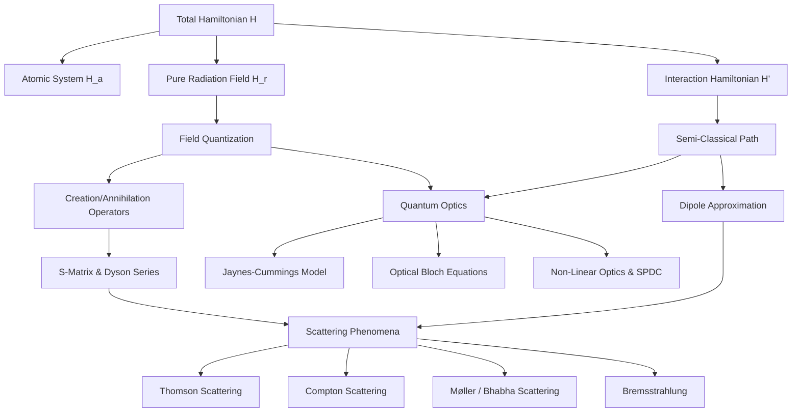

# Unit IV: Advanced Quantum Mechanics & Light-Matter Interactions (Field Quantization, Scattering, & QED)

## 1. Chapter Overview: The Path to QED and Quantum Optics

This unit bridges the crucial gap between classical electromagnetism (Maxwell's equations) and Quantum Electrodynamics (QED). It explores how a quantum-mechanical atomic system interacts with an electromagnetic radiation field. By moving from a semi-classical treatment (where the atom is quantized but the field is treated classically) to a fully quantized field theory, we uncover the fundamental mechanisms of photon emission, absorption, spontaneous emission, and quantum scattering. We also delve into the pinnacle of light-matter interaction: Cavity QED, Laser theory, and Non-Linear Quantum Optics.



---

## 2. Theoretical Foundations: The Coupled Hamiltonian

### 2.1 Minimal Coupling in Classical and Quantum Mechanics
To describe an electron of charge $q$ (where $q = -e$ for an electron) and mass $m$ bound to an atomic potential $V(\mathbf{r})$ in the presence of an electromagnetic radiation field, we use the principle of **minimal coupling**. This principle originates from local $U(1)$ gauge invariance in gauge field theory.

In classical mechanics, the canonical momentum $\mathbf{p}$ of a charged particle in a magnetic field is not simply $m\mathbf{v}$. It is replaced by its kinetic (or mechanical) momentum:
$$\mathbf{p}_{kin} = \mathbf{p} - q\mathbf{A}$$

where $\mathbf{A}(\mathbf{r}, t)$ is the vector potential of the radiation field. The total Hamiltonian of the coupled system is therefore constructed by substituting $\mathbf{p} \to \mathbf{p} - q\mathbf{A}$ (or $\mathbf{p} + e\mathbf{A}$ for an electron):

$$H = \frac{1}{2m}(\mathbf{p} - q\mathbf{A})^2 + V(\mathbf{r}) + H_r$$

Expanding the kinetic energy term:
$$(\mathbf{p} - q\mathbf{A})^2 = \mathbf{p}^2 - q(\mathbf{p}\cdot\mathbf{A} + \mathbf{A}\cdot\mathbf{p}) + q^2 A^2$$

We define the unperturbed atomic Hamiltonian $H_a$ as:
$$H_a = \frac{\mathbf{p}^2}{2m} + V(\mathbf{r})$$

This allows us to write the total Hamiltonian as:
$$H = H_a + H_r + H'$$

where the interaction Hamiltonian $H'$ is:
$$H' = -\frac{q}{2m}(\mathbf{A}\cdot\mathbf{p} + \mathbf{p}\cdot\mathbf{A}) + \frac{q^2}{2m}A^2$$

### 2.2 The Coulomb Gauge Simplification
In quantum mechanics, momentum is an operator: $\mathbf{p} = -i\hbar\nabla$. Thus, the operator product $\mathbf{p}\cdot\mathbf{A}$ acting on a test wavefunction $\psi$ must be evaluated using the product rule:
$$\mathbf{p}\cdot(\mathbf{A}\psi) = -i\hbar \nabla \cdot (\mathbf{A}\psi) = -i\hbar [(\nabla\cdot\mathbf{A})\psi + \mathbf{A}\cdot(\nabla\psi)]$$

By choosing the **Coulomb gauge** (also known as the radiation or transverse gauge), we explicitly set the divergence of the vector potential to zero:
$$\nabla \cdot \mathbf{A} = 0$$

Under this specific gauge condition, the term $(\nabla\cdot\mathbf{A})\psi$ vanishes, which means:
$$\mathbf{p}\cdot(\mathbf{A}\psi) = \mathbf{A}\cdot(\mathbf{p}\psi) \implies [\mathbf{p}, \mathbf{A}] = 0$$

Consequently, the interaction Hamiltonian simplifies immensely to:
$$H' = -\frac{q}{m}\mathbf{A}\cdot\mathbf{p} + \frac{q^2}{2m}A^2$$

### 2.3 The Weak-Field Approximation
For weak radiation fields (such as standard optical transitions from a light bulb or laser pointer), the quadratic term $\frac{q^2}{2m}A^2$ is extremely small compared to the linear term. 
*Proof:* The ratio of the two terms is roughly $\frac{qA}{p}$. For optical photons interacting with bound atomic electrons, $p \approx \hbar/a_0$. The vector potential $A$ is related to the electric field by $E = \omega A$. In typical fields, $q A \ll \hbar/a_0$, meaning the non-linear $A^2$ term can be neglected as a higher-order perturbation.

Thus, for first-order single-photon processes (emission/absorption):
$$H' \approx -\frac{q}{m}\mathbf{A}\cdot\mathbf{p}$$

*(Note: In ultra-intense laser fields, or for two-photon scattering processes like Thomson scattering, the $A^2$ term is strictly required).*

---

## 3. The Dipole Approximation and Matrix Elements

When calculating the transition probability of an electron between two atomic states $|n\rangle$ and $|s\rangle$ via Fermi's Golden Rule, we evaluate the matrix element of the vector potential $\mathbf{A} = \hat{\epsilon} A_0 e^{i(\mathbf{k}\cdot\mathbf{r} - \omega t)}$.

### 3.1 Mathematical Justification of E1 Approximation
The spatial phase factor is $e^{i \mathbf{k}\cdot\mathbf{r}}$. Let us analyze its magnitude:
*   **Atomic Dimensions ($r$):** The electron wavefunctions are localized within the Bohr radius, $a_0 \approx 0.5 \times 10^{-10}\text{ m}$.
*   **Optical Wavelength ($\lambda$):** Visible light is around $\approx 5000\text{ \AA} = 5 \times 10^{-7}\text{ m}$.
*   **Wave number ($k$):** $k = \frac{2\pi}{\lambda} \approx 10^7\text{ m}^{-1}$.

```text
       [ The Dipole Approximation Visualized ]

       <------ Wavelength (λ) ~ 5000 Å ------>
       ~~~~~~~~~~~~~~~~~~~~~~~~~~~~~~~~~~~~~~~  <-- EM Wave Phase
                  (Atom size ~ 1 Å)
                         O                      <-- Phase is effectively constant
                                                    across the tiny atom!
```

Evaluating the exponent:
$$\mathbf{k}\cdot\mathbf{r} \approx k r \approx (10^7\text{ m}^{-1})(10^{-10}\text{ m}) = 10^{-3} \ll 1$$

Using a Taylor expansion for the spatial factor:
$$e^{i \mathbf{k}\cdot\mathbf{r}} = 1 + i\mathbf{k}\cdot\mathbf{r} - \frac{1}{2}(\mathbf{k}\cdot\mathbf{r})^2 + \dots$$

Since $\mathbf{k}\cdot\mathbf{r} \ll 1$, we truncate the series at the first term:
$$e^{i \mathbf{k}\cdot\mathbf{r}} \approx 1$$

This is the **Electric Dipole (E1) Approximation**. It assumes the electromagnetic wave's phase is spatially uniform across the entire volume of the atom. 

### 3.2 Higher-Order Multipoles (M1 and E2)
The next term in the expansion is $i\mathbf{k}\cdot\mathbf{r}$. This term leads to transitions that are forbidden under E1 selection rules.
- The symmetric part of this term leads to **Electric Quadrupole (E2)** transitions.
- The antisymmetric part leads to **Magnetic Dipole (M1)** transitions.
Because $kr \approx 10^{-3}$, these transitions are weaker than E1 transitions by a factor of roughly $10^{-6}$ (which is proportional to the fine-structure constant squared, $\alpha^2 \approx 1/137^2$).

### 3.3 Translating Momentum to Position (Dipole Moment)
To compute transition rates with $H' \propto \mathbf{A}\cdot\mathbf{p}$, we need to evaluate $\langle s | \mathbf{p} | n \rangle$. We can express this momentum matrix element in terms of the position operator $\mathbf{r}$ using fundamental commutators.

Let's derive $[x, H_a]$:
$$[x, H_a] = \left[x, \frac{p_x^2 + p_y^2 + p_z^2}{2m} + V(r)\right] = \left[x, \frac{p_x^2}{2m}\right]$$

Using the identity $[A, B^2] = [A, B]B + B[A, B]$ and the canonical commutator $[x, p_x] = i\hbar$:
$$[x, p_x^2] = [x, p_x]p_x + p_x[x, p_x] = 2i\hbar p_x$$

Thus:
$$[x, H_a] = \frac{i\hbar}{m}p_x \implies p_x = \frac{m}{i\hbar}[x, H_a]$$

Generalizing to 3D vector operators:
$$\mathbf{p} = \frac{m}{i\hbar}[\mathbf{r}, H_a]$$

Now, evaluate the matrix element between eigenstates $|n\rangle$ and $|s\rangle$:
$$\langle s | \mathbf{p} | n \rangle = \frac{m}{i\hbar} \langle s | (\mathbf{r}H_a - H_a\mathbf{r}) | n \rangle$$

Since $H_a$ acts to the right on $|n\rangle$ yielding $E_n$, and to the left on $\langle s|$ yielding $E_s$:
$$\langle s | \mathbf{p} | n \rangle = \frac{m}{i\hbar}(E_n - E_s) \langle s | \mathbf{r} | n \rangle$$

Letting $E_s - E_n = \hbar \omega_{sn}$ (the transition energy):
$$\langle s | \mathbf{p} | n \rangle = i m \omega_{sn} \langle s | \mathbf{r} | n \rangle$$

This relation perfectly bridges the interaction Hamiltonian with the classical electric dipole moment $\mathbf{d} = q\mathbf{r}$.

---

## 4. Quantization of the Electromagnetic Radiation Field (Bosons)

The semi-classical approach fails to explain **spontaneous emission** (an atom in an excited state emitting a photon in a dark vacuum). To explain this, the vacuum itself must be quantized.

### 4.1 Mode Decomposition
In classical electrodynamics, the total energy of a radiation field confined in a cavity volume $V$ is:
$$H_r = \frac{1}{2} \int_V \left( \epsilon_0 \mathbf{E}^2 + \mu_0 \mathbf{H}^2 \right) d\tau$$

We decompose the vector potential $\mathbf{A}(\mathbf{r}, t)$ into normal modes (plane waves):
$$\mathbf{A}(\mathbf{r}, t) = \sum_{\mathbf{k}, \lambda} \sqrt{\frac{\hbar}{2\epsilon_0 \omega_k V}} \hat{\epsilon}_{\mathbf{k}\lambda} \left[ a_{\mathbf{k}\lambda}(t) e^{i\mathbf{k}\cdot\mathbf{r}} + a_{\mathbf{k}\lambda}^\dagger(t) e^{-i\mathbf{k}\cdot\mathbf{r}} \right]$$

### 4.2 Creation and Annihilation Operators
By mapping the field amplitudes to quantum harmonic oscillator operators, we define:
*   $a_{\mathbf{k}\lambda}^\dagger$: **Creation operator** (Creates a photon of momentum $\hbar\mathbf{k}$ and polarization $\lambda$).
*   $a_{\mathbf{k}\lambda}$: **Annihilation operator** (Destroys a photon).

They obey bosonic commutation relations:
$$[a_{\mathbf{k}\lambda}, a_{\mathbf{k}'\lambda'}^\dagger] = \delta_{\mathbf{k}\mathbf{k}'} \delta_{\lambda\lambda'}$$
$$[a, a] = [a^\dagger, a^\dagger] = 0$$

### 4.3 The Quantum Field Hamiltonian
Substituting the operators back into the classical energy integral yields the quantized Hamiltonian:
$$H_r = \sum_{\mathbf{k}, \lambda} \hbar \omega_k \left( a_{\mathbf{k}\lambda}^\dagger a_{\mathbf{k}\lambda} + \frac{1}{2} \right)$$

We define the **Number Operator** $N = a^\dagger a$, whose eigenvalues are integers $n = 0, 1, 2, \dots$ representing the number of photons in that mode.

**The Zero-Point Energy:** Even when $n=0$ (perfect vacuum), the energy is not zero. It is $E_{vac} = \sum \frac{1}{2}\hbar\omega_k$. This infinite vacuum energy gives rise to measurable quantum phenomena like the **Casimir Effect** and the **Lamb Shift**, and it is the direct cause of spontaneous emission (vacuum fluctuations perturb the atom).

---

## 5. Second Quantization of the Dirac Field (Fermions)

Just as the EM field (photons/bosons) must be quantized, the electron field (fermions) must also undergo second quantization to properly describe relativistic particle creation and annihilation (like pair production).

### 5.1 The Dirac Lagrangian
The classical Dirac equation $(i\gamma^\mu \partial_\mu - m)\psi = 0$ is derived from the Dirac Lagrangian density:
$$ \mathcal{L}_{Dirac} = \bar{\psi}(i\gamma^\mu \partial_\mu - m)\psi $$
Where $\psi$ is a 4-component Dirac spinor and $\bar{\psi} = \psi^\dagger \gamma^0$ is the Dirac adjoint.

### 5.2 Fermionic Anti-Commutation Relations
Unlike photons which can crowd into the same state (Bose-Einstein statistics), electrons obey the Pauli Exclusion Principle (Fermi-Dirac statistics). Therefore, their field operators $c$ (annihilation) and $c^\dagger$ (creation) must obey **anti-commutation relations** rather than commutation relations:
$$ \{c_i, c_j^\dagger\} = c_i c_j^\dagger + c_j^\dagger c_i = \delta_{ij} $$
$$ \{c_i, c_j\} = \{c_i^\dagger, c_j^\dagger\} = 0 $$

This ensures that $c_i^\dagger c_i^\dagger = 0$, meaning you cannot create two identical electrons in the same quantum state.

### 5.3 The Feynman Propagator
In QED calculations, the virtual electron traveling between two interaction vertices is described by the Feynman propagator $S_F(x - y)$. In momentum space, it is the Green's function of the Dirac operator:
$$ S_F(p) = \frac{i(\gamma^\mu p_\mu + m)}{p^2 - m^2 + i\epsilon} $$
The $i\epsilon$ prescription ensures proper time-ordering (electrons travel forward in time, positrons travel backward in time).

---

## 6. S-Matrix, Dyson Expansion, and Time Evolution

In quantum field theory, we study scattering processes by looking at how an initial state $|\Psi_i\rangle$ at $t \to -\infty$ evolves into a final state $|\Psi_f\rangle$ at $t \to +\infty$.

### 6.1 The Scattering Matrix (S-Matrix)
$$S = U(+\infty, -\infty)$$
The transition probability amplitude is given by the S-matrix element $S_{fi} = \langle \Psi_f | S | \Psi_i \rangle$.

### 6.2 The Dyson Series and Time Ordering
In the interaction picture, the time-evolution operator $U(t, t_0)$ satisfies the Schrödinger equation:
$$i\hbar \frac{\partial}{\partial t} U(t, t_0) = H_I(t) U(t, t_0)$$

Integrating iteratively yields the infinite **Dyson Series**:

```text
       [ The Dyson Series Expansion ]

S = I  +  (-i/ħ) ∫ H_I(t) dt  +  (-i/ħ)² ∫∫ P[H_I(t1)H_I(t2)] dt1 dt2 + ...
   (0th)        (1st Order)                (2nd Order Scattering)
```

To integrate over a symmetric domain ($-\infty$ to $\infty$), we introduce the **Dyson Time-Ordering Operator ($T$ or $P$)**, which chronologically orders operators from right (earliest) to left (latest):

$$
T\{H_I(t_1)H_I(t_2)\} = \begin{cases} 
H_I(t_1)H_I(t_2) & \text{if } t_1 > t_2 \\ 
H_I(t_2)H_I(t_1) & \text{if } t_2 > t_1 
\end{cases}
$$

This elegantly simplifies the full S-matrix to:
$$S = T \exp \left( \frac{-i}{\hbar} \int_{-\infty}^{\infty} H_I(t) dt \right)$$

---

## 7. QED Feynman Path Integral Formulation

An alternative to the operator-based (canonical) quantization is Feynman's Path Integral formulation. Instead of solving equations of motion, we compute the transition amplitude by summing over ALL possible paths (histories) the fields can take, weighted by their classical Action $S$.

### 7.1 The Action Integral
The Action $S$ is the spacetime integral of the Lagrangian density:
$$ S[\psi, \bar{\psi}, A_\mu] = \int d^4x \left( \bar{\psi}(i\gamma^\mu D_\mu - m)\psi - \frac{1}{4}F_{\mu\nu}F^{\mu\nu} \right) $$
Where $D_\mu = \partial_\mu + ieA_\mu$ is the gauge-covariant derivative.

### 7.2 The Generating Functional
The vacuum-to-vacuum transition amplitude $Z$ is calculated via a functional integral over all field configurations:
$$ Z = \int \mathcal{D}A \mathcal{D}\bar{\psi} \mathcal{D}\psi \exp\left( \frac{i}{\hbar} S[\psi, \bar{\psi}, A_\mu] \right) $$
As $\hbar \to 0$, the highly oscillatory exponential suppresses all paths except the one that minimizes the Action (Principle of Least Action), seamlessly recovering classical physics from QED.

---

## 8. Transition Rates: Fermi's Golden Rule & Einstein Coefficients

Using time-dependent perturbation theory, the transition rate $\Gamma_{i \to f}$ from an initial state $|i\rangle$ to a final state $|f\rangle$ due to a harmonic perturbation is given by **Fermi's Golden Rule**:

$$ \Gamma_{i \to f} = \frac{2\pi}{\hbar} |\langle f | H' | i \rangle|^2 \rho(E_f) $$

Where $\rho(E_f)$ is the density of final states.

### 8.1 Spontaneous Emission (Einstein A Coefficient)
When the field is quantized, the initial state is an excited atom and a vacuum $|n_{\mathbf{k},\lambda} = 0\rangle$. The final state is the ground state atom and one emitted photon $|n_{\mathbf{k},\lambda} = 1\rangle$.

Using the creation operator $a^\dagger$ inside $\mathbf{A}$, the matrix element is non-zero even in a vacuum. Calculating the density of photon states in a volume $V$ yields the spontaneous emission rate (Einstein $A$ coefficient) for a dipole transition $\mathbf{d}_{fi} = e \langle f | \mathbf{r} | i \rangle$:

$$ A = \frac{\omega^3 |\mathbf{d}_{fi}|^2}{3\pi \epsilon_0 \hbar c^3} $$

This proves that spontaneous emission is highly dependent on frequency ($\propto \omega^3$). An atom in an excited state with a large energy gap will decay much faster than one with a small gap.

### 8.2 Stimulated Emission (Einstein B Coefficient)
If the cavity already contains $n$ photons in the mode, the matrix element squared scales as $(n+1)$. The "$n$" part drives stimulated emission (lasers), and the "$1$" part drives spontaneous emission.

---

## 9. Advanced Quantum Optics and Laser Theory

### 9.1 The Need for Population Inversion
In thermal equilibrium, the population of states follows the Boltzmann distribution $N_2 = N_1 e^{-\Delta E / kT}$. Therefore, $N_1 > N_2$ (more atoms in the ground state).
Because the Einstein $B$ coefficient for absorption equals the $B$ coefficient for stimulated emission, a beam of light traveling through a thermal medium will always be attenuated. 
To achieve Light Amplification by Stimulated Emission of Radiation (LASER), we must achieve a **non-equilibrium population inversion** ($N_2 > N_1$).

### 9.2 The 3-Level vs 4-Level Laser System

```text
      [ 3-Level Laser ]             [ 4-Level Laser ]
           (Ruby)                        (Nd:YAG)
      E3 ──────────── (Fast decay)  E4 ──────────── (Fast decay)
           ▲    │                        ▲    │
     Pump  │    │                        │    │ E3 (Metastable)
           │    ▼ E2 (Metastable)  Pump  │    ▼
           │    │                        │    │  <-- Lasing Transition
           │    │ Lasing                 │    ▼
           │    ▼                        │    E2 (Fast decay)
      E1 ──────────── (Ground)      E1 ──────────── (Ground)
```

**Why 4-level is superior:** In a 3-level laser (like Ruby), the lasing transition ends at the absolute ground state. To achieve inversion, you must pump over 50% of the ENTIRE atomic population into E2. In a 4-level laser (like Nd:YAG), the lasing transition ends at E2, which is naturally empty due to fast decay to E1. Inversion ($N_3 > N_2$) is achieved the moment the very first atom is pumped to E3. The pumping threshold is drastically lower.

### 9.3 Q-Switching and Mode-Locking
To generate ultra-intense, ultra-short pulses:
- **Q-Switching:** We intentionally degrade the Quality factor (Q) of the cavity (e.g., using a Pockels cell) to stop lasing while pumping continues. Population inversion builds to a massive level. Restoring the Q-factor suddenly releases all the stored energy in a giant nanosecond pulse.
- **Mode-Locking:** We force all longitudinal modes of the cavity to oscillate with a fixed phase relationship. Due to Fourier interference, they constructively interfere at only one point in space, creating an ultra-short femtosecond ($10^{-15}$ s) pulse bouncing back and forth.

---

## 10. Non-Linear Quantum Optics

In classical linear optics, the polarization of a medium $\mathbf{P}$ is proportional to the electric field $\mathbf{E}$: $\mathbf{P} = \epsilon_0 \chi^{(1)} \mathbf{E}$. In intense laser fields, the response becomes non-linear:
$$ \mathbf{P} = \epsilon_0 (\chi^{(1)}\mathbf{E} + \chi^{(2)}\mathbf{E}^2 + \chi^{(3)}\mathbf{E}^3 + \dots) $$

### 10.1 Second Harmonic Generation (SHG)
Driven by the $\chi^{(2)}$ term, two identical incoming photons of frequency $\omega$ are destroyed to create a single photon of frequency $2\omega$. This is how green laser pointers work (an infrared 1064nm laser is passed through a KTP crystal to generate 532nm green light).

### 10.2 Spontaneous Parametric Down-Conversion (SPDC)
The reverse of SHG. A high-energy pump photon ($\omega_p$) splits into two lower-energy photons inside a non-linear crystal, typically called the "signal" ($\omega_s$) and "idler" ($\omega_i$).
Conservation of Energy: $\hbar\omega_p = \hbar\omega_s + \hbar\omega_i$
Conservation of Momentum (Phase Matching): $\hbar\mathbf{k}_p = \hbar\mathbf{k}_s + \hbar\mathbf{k}_i$

**Quantum Importance:** The signal and idler photons created via SPDC are perfectly entangled in momentum, polarization, and time. This is the primary mechanism used in modern Bell Inequality tests and quantum cryptography (QKD).

---

## 11. Cavity QED: The Jaynes-Cummings Model

The interaction of a single two-level atom (states $|e\rangle$ and $|g\rangle$) with a single quantized mode of an optical cavity is exactly solvable and represents the core of Cavity QED.

### 11.1 The Hamiltonian
We model the atom using Pauli matrices ($\sigma_z, \sigma_+, \sigma_-$). The total Hamiltonian is:
$$ H = \frac{1}{2}\hbar\omega_a \sigma_z + \hbar\omega_c a^\dagger a + H' $$
Where $\omega_a$ is the atomic transition frequency and $\omega_c$ is the cavity frequency.

The interaction term, under the dipole approximation, is $H' \propto \mathbf{d}\cdot\mathbf{E}$.
Substituting $\mathbf{d} \propto (\sigma_+ + \sigma_-)$ and $\mathbf{E} \propto (a + a^\dagger)$:
$$ H' = \hbar g (\sigma_+ + \sigma_-)(a + a^\dagger) $$
Where $g$ is the **vacuum Rabi coupling strength**.

### 11.2 The Rotating Wave Approximation (RWA)
Expanding $H'$ yields 4 terms:
$$ H' = \hbar g (\sigma_+ a + \sigma_- a^\dagger + \sigma_+ a^\dagger + \sigma_- a) $$

1.  $\sigma_+ a$: Atom absorbs a photon and goes to excited state (Energy conserving).
2.  $\sigma_- a^\dagger$: Atom emits a photon and drops to ground state (Energy conserving).
3.  $\sigma_+ a^\dagger$: Atom goes to excited state AND creates a photon (Violates energy conservation by $2\hbar\omega$).
4.  $\sigma_- a$: Atom drops to ground state AND destroys a photon (Violates energy conservation by $2\hbar\omega$).

The last two terms oscillate very rapidly at a frequency of $(\omega_a + \omega_c)$ and time-average to zero. Dropping them is the **Rotating Wave Approximation**.
The simplified Jaynes-Cummings Hamiltonian is:
$$ H_{JC} = \frac{1}{2}\hbar\omega_a \sigma_z + \hbar\omega_c a^\dagger a + \hbar g (\sigma_+ a + \sigma_- a^\dagger) $$

### 11.3 Vacuum Rabi Oscillations
If we place a fully excited atom into a perfect cavity containing zero photons ($|e, 0\rangle$), the system will spontaneously emit a photon into the cavity mode, becoming $|g, 1\rangle$. However, because the cavity traps the photon, the atom will re-absorb it, becoming $|e, 0\rangle$ again.

The probability of finding the atom in the excited state oscillates at the Vacuum Rabi Frequency $\Omega_0 = 2g$:
$$ P_e(t) = \cos^2(gt) $$
This continuous swapping of a single quantum of energy between the atom and the field is the hallmark of strong coupling in Cavity QED.

```text
       [ Vacuum Rabi Oscillations ]

  P_e(t)
    1 │ ╭──╮      ╭──╮      ╭──╮
      │ │  │      │  │      │  │
    0 └─╯  ╰──────╯  ╰──────╯  ╰──▶ Time
        |e,0>    |g,1>     |e,0>
```

---

## 12. The Optical Bloch Equations & Density Matrices

For a realistic atom, we cannot use pure wavefunctions. Spontaneous emission and collisions cause decoherence. We must use the **Density Matrix ($\rho$)**.

### 12.1 The Density Matrix Elements
For a two-level atom:
- $\rho_{ee}$ = Probability of being in the excited state.
- $\rho_{gg}$ = Probability of being in the ground state.
- $\rho_{eg}$ and $\rho_{ge}$ = Atomic coherences (the quantum superposition).

### 12.2 Relaxation Times ($T_1$ and $T_2$)
The evolution of the atom in a classical laser field (Rabi frequency $\Omega$) is governed by the Optical Bloch Equations, which include two phenomenological decay times:
1.  **Longitudinal Relaxation ($T_1$):** The lifetime of the excited state (spontaneous emission). $\rho_{ee}$ decays as $e^{-t/T_1}$.
2.  **Transverse Relaxation ($T_2$):** The coherence lifetime. Collisions (dephasing) destroy the superposition $\rho_{eg}$ without causing the atom to drop to the ground state. It decays as $e^{-t/T_2}$.

*Note:* $T_2 \le 2T_1$. Pure spontaneous emission is the absolute limit on coherence.

---

## 13. Advanced Scattering Phenomena & Feynman Diagrams

### 13.1 Thomson Scattering (Low-Energy Limit)
Thomson scattering is the elastic scattering of electromagnetic radiation by a free electron in the non-relativistic limit ($h\nu \ll m_e c^2$). 
Because it is elastic, the photon wavelength does not change ($\lambda = \lambda'$).

```text
       [ Thomson Scattering Polarization ]

  Incident Unpolarized           Scattered (90 deg)
         Wave                         Wave
          │                             │
          ▼                             ▼
       (↕) (↔) ━━━━━━▶ [ e- ] ━━━━━━▶ (↕) 100% Polarized!
```

**Differential Cross-Section (Unpolarized incident light):**
$$\frac{d\sigma}{d\Omega} = \frac{r_0^2}{2}(1 + \cos^2\theta)$$
Where $r_0 = \frac{e^2}{4\pi\epsilon_0 m_e c^2} \approx 2.82 \times 10^{-15}\text{ m}$ is the classical electron radius.

**Total Cross-Section:**
$$\sigma_T = \frac{8\pi}{3} r_0^2 \approx 0.665 \text{ barns}$$

### 13.2 Compton Scattering (Relativistic/Quantum Limit)
When a high-energy photon (X-ray or Gamma-ray, $h\nu \ge m_e c^2$) scatters off an electron, it transfers significant momentum. The scattering is inelastic, and the photon loses energy, resulting in a longer wavelength.

Using 4-vector kinematics ($p_\mu p^\mu = m^2 c^2$), the **Compton Shift Formula** is derived:
$$\Delta \lambda = \lambda' - \lambda = \frac{h}{m_e c} (1 - \cos\theta)$$

The term $\lambda_c = \frac{h}{m_e c} \approx 2.426\text{ pm}$ is the **Compton Wavelength** of the electron.

### 13.3 Bremsstrahlung (Braking Radiation)
When a high-speed electron is deflected (decelerated) by the intense Coulomb field of a heavy atomic nucleus, it emits a photon. This process is called Bremsstrahlung. 
Because a free electron cannot emit a photon and conserve both energy and momentum simultaneously, the presence of the heavy nucleus is required to absorb the recoil momentum.

### 13.4 Feynman Diagrams & QED Crossings

Feynman diagrams represent the terms of the S-Matrix expansion graphically. Time flows from left to right.

**1. Compton Scattering ($e^- + \gamma \to e^- + \gamma$):**
```text
           γ (in)          γ (out)
             \             /
              \           /
               \         /
  e- (in) ──────•───────•────── e- (out)
               (virtual e-)
```

**2. Møller Scattering ($e^- + e^- \to e^- + e^-$):**
```text
  e- (in) ──────•           •────── e- (out)
                 \         /
                  \       /
                 (virtual γ)
                  /       \
                 /         \
  e- (in) ──────•           •────── e- (out)
```

**3. Bremsstrahlung ($e^- + \text{Nucleus} \to e^- + \text{Nucleus} + \gamma$):**
```text
  e- (in) ──────•───────•────── e- (out)
                |        \ 
               (γ)        \
                |       γ (emitted)
             [Nucleus]
```

**Crossing Symmetry:**
The matrix amplitude for Compton scattering ($e^- + \gamma \to e^- + \gamma$) is mathematically identical to Pair Annihilation ($e^- + e^+ \to \gamma + \gamma$) if you flip the momentum signs of the appropriate incoming/outgoing particles ($p \leftrightarrow -p$).

---

## 14. Advanced QED: Renormalization & The Casimir Effect

### 14.1 Vacuum Polarization and the Lamb Shift
According to QED, the vacuum is filled with virtual electron-positron pairs that pop into and out of existence. When a real electron is present, its electric field polarizes these virtual pairs (virtual positrons are attracted, virtual electrons repelled). 

This **Vacuum Polarization** acts as a dielectric shield around the bare electron. As a probe gets closer to the electron (distances $r < \lambda_c$), it penetrates this shield, and the effective electric charge "increases." This effect modifies Coulomb's law at short distances (the **Uehling potential**) and contributes heavily to the **Lamb Shift**, which breaks the degeneracy of the $2s_{1/2}$ and $2p_{1/2}$ orbitals in Hydrogen.

### 14.2 The Casimir Effect
The zero-point energy of the vacuum is $E = \sum \frac{1}{2}\hbar\omega$. If we place two uncharged, perfectly conducting parallel plates a distance $d$ apart in a vacuum, the boundary conditions restrict the allowed modes of the EM field *between* the plates (only wavelengths where $d = n\lambda/2$ can exist).
Outside the plates, all modes exist. This creates a difference in zero-point radiation pressure, resulting in an attractive force between the plates.

Using a mathematical cutoff function (regularization) to subtract the infinite vacuum energies, the finite attractive force per unit area is:

$$ \frac{F}{A} = -\frac{\pi^2 \hbar c}{240 d^4} $$

The negative sign indicates attraction. This macroscopic force, caused entirely by the quantum vacuum, has been experimentally measured.

---

## 15. Exam Edge: 40 Advanced Solved Numericals

> **📌 Problem 1: Analyzing the Dipole Approximation**
> **Given:** An atom interacts with an X-ray of wavelength $\lambda = 1 \text{ \AA}$. The atomic radius is $a_0 = 0.5 \text{ \AA}$.
> **Find:** Is the Electric Dipole (E1) approximation valid?
> **Solution:** The E1 approximation requires $kr \ll 1$.
> $k = 2\pi / \lambda = 2\pi / (10^{-10}\text{ m}) \approx 6.28 \times 10^{10} \text{ m}^{-1}$.
> $kr = (6.28 \times 10^{10})(0.5 \times 10^{-10}) \approx 3.14$.
> **Answer: No. Since $kr > 1$, the spatial phase variation across the atom is massive. Higher-order multipole transitions (M1, E2) cannot be neglected.**

> **📌 Problem 2: Commutator Evaluation**
> **Given:** The atomic Hamiltonian $H = \frac{p^2}{2m} + V(x)$.
> **Find:** Evaluate the commutator $[x, p^2]$.
> **Solution:** Use $[A, BC] = [A, B]C + B[A, C]$.
> $[x, p^2] = [x, p]p + p[x, p]$. Since $[x, p] = i\hbar$:
> $[x, p^2] = i\hbar p + p(i\hbar) = 2i\hbar p$.
> **Answer: $2i\hbar p$.**

> **📌 Problem 3: Zero-Point Energy of a Cavity**
> **Given:** A 1D cavity of length $L$. The modes are $k_n = n\pi / L$.
> **Find:** The expression for the vacuum energy.
> **Solution:** $E_{vac} = \sum \frac{1}{2}\hbar\omega_n$. Since $\omega_n = c k_n = c n \pi / L$:
> $E_{vac} = \sum_{n=1}^{\infty} \frac{1}{2} \hbar \left( \frac{c n \pi}{L} \right)$.
> **Answer: This sum diverges to infinity, demonstrating the need for renormalization or physical cutoffs in QED.**

> **📌 Problem 4: Maximum Compton Shift**
> **Given:** A high-energy photon scatters off a free electron.
> **Find:** The maximum possible wavelength shift and the angle at which it occurs.
> **Solution:** $\Delta \lambda = \frac{h}{m_e c} (1 - \cos\theta)$.
> The shift is maximized when $(1 - \cos\theta)$ is maximized. This occurs at $\theta = 180^\circ$ (backscattering), where $\cos(180^\circ) = -1$.
> Max Shift = $\frac{h}{m_e c} (1 - (-1)) = \frac{2h}{m_e c} = 2 \lambda_c$.
> **Answer: Maximum shift is $2\lambda_c \approx 4.852 \text{ pm}$ at $\theta = 180^\circ$.**

> **📌 Problem 5: Thomson Scattering Cross Section**
> **Given:** $r_0 = 2.82 \times 10^{-15} \text{ m}$.
> **Find:** Calculate the total Thomson cross section $\sigma_T$ in barns.
> **Solution:** $\sigma_T = \frac{8\pi}{3} r_0^2$.
> $\sigma_T = \frac{8\pi}{3} (2.82 \times 10^{-15})^2 = 8.37 \times (7.95 \times 10^{-30}) = 6.65 \times 10^{-29} \text{ m}^2$.
> Since 1 barn = $10^{-28} \text{ m}^2$:
> **Answer: $0.665 \text{ barns}$.**

> **📌 Problem 6: Gauge Condition Check**
> **Given:** A vector potential $\mathbf{A} = (y^2, x^2, 0)$.
> **Find:** Does this satisfy the Coulomb gauge?
> **Solution:** Coulomb gauge requires $\nabla \cdot \mathbf{A} = 0$.
> $\nabla \cdot \mathbf{A} = \frac{\partial}{\partial x}(y^2) + \frac{\partial}{\partial y}(x^2) + \frac{\partial}{\partial z}(0) = 0 + 0 + 0 = 0$.
> **Answer: Yes, it satisfies the Coulomb gauge.**

> **📌 Problem 7: Photon Annihilation Operator**
> **Given:** A radiation mode is in a Fock state $|n\rangle$ with exactly 3 photons ($|3\rangle$). 
> **Find:** Evaluate $a |3\rangle$ and $a^\dagger a |3\rangle$.
> **Solution:** The annihilation operator lowers the state: $a|n\rangle = \sqrt{n}|n-1\rangle$.
> $a|3\rangle = \sqrt{3}|2\rangle$.
> The number operator $N = a^\dagger a$ returns the eigenvalue $n$: $a^\dagger a |3\rangle = 3|3\rangle$.
> **Answer: $\sqrt{3}|2\rangle$ and $3|3\rangle$.**

> **📌 Problem 8: The $A^2$ Term Matrix Element**
> **Given:** The interaction term $H' = \frac{q^2}{2m}A^2$.
> **Find:** Does this term allow single-photon absorption?
> **Solution:** The vector potential $\mathbf{A}$ contains $(a + a^\dagger)$. Thus, $A^2$ contains $(a + a^\dagger)^2 = a^2 + (a^\dagger)^2 + a a^\dagger + a^\dagger a$.
> $a^2$ destroys 2 photons. $(a^\dagger)^2$ creates 2 photons. The cross terms destroy one and create one (scattering). None of these terms describe single photon absorption (which requires just $a$).
> **Answer: No, the $A^2$ term governs two-photon processes (like scattering), not single-photon absorption.**

> **📌 Problem 9: Energy of Scattered Photon**
> **Given:** An incident photon of energy $E_0 = 1.022 \text{ MeV}$ (which is exactly $2m_e c^2$) scatters at $90^\circ$ off an electron.
> **Find:** The energy of the scattered photon $E'$.
> **Solution:** Use the energy form of the Compton formula: $\frac{1}{E'} - \frac{1}{E_0} = \frac{1}{m_e c^2}(1 - \cos\theta)$.
> At $90^\circ$, $\cos\theta = 0$.
> $\frac{1}{E'} - \frac{1}{2 m_e c^2} = \frac{1}{m_e c^2} \implies \frac{1}{E'} = \frac{3}{2 m_e c^2}$.
> $E' = \frac{2}{3} m_e c^2 \approx 0.34 \text{ MeV}$.
> **Answer: The scattered photon has energy $\approx 0.34 \text{ MeV}$.**

> **📌 Problem 10: Interaction Picture Evolution**
> **Given:** The Dyson series for the S-matrix to first order.
> **Find:** Write the first-order transition amplitude $S_{fi}^{(1)}$ for $i \to f$.
> **Solution:** $S = 1 - \frac{i}{\hbar} \int H_I(t) dt$.
> $S_{fi}^{(1)} = \langle f | \left( -\frac{i}{\hbar} \int_{-\infty}^\infty H_I(t) dt \right) | i \rangle$.
> **Answer: $S_{fi}^{(1)} = -\frac{i}{\hbar} \int_{-\infty}^\infty \langle f | H_I(t) | i \rangle dt$. (This directly leads to Fermi's Golden Rule).**

> **📌 Problem 11: Polarization in Thomson Scattering**
> **Given:** Unpolarized light scatters off an electron at $\theta = 90^\circ$.
> **Find:** What is the degree of polarization of the scattered light?
> **Solution:** The angular term is $(1 + \cos^2\theta)$. At $90^\circ$, this is $(1 + 0) = 1$. The incident unpolarized light has intensity proportional to $1+1=2$ (two orthogonal polarization states). At $90^\circ$, the component oscillating parallel to the scattering plane cannot radiate toward the observer. Only the perpendicular component is seen.
> **Answer: 100% linearly polarized.**

> **📌 Problem 12: Translating Dipole Moments**
> **Given:** The transition frequency is $\omega_{sn}$. The position matrix element is $\langle s | x | n \rangle = x_{sn}$.
> **Find:** The momentum matrix element $p_{sn}$.
> **Solution:** Based on the commutator derived earlier: $p = i m \omega [x, H]$. 
> Therefore, $p_{sn} = i m \omega_{sn} x_{sn}$.
> **Answer: $p_{sn} = i m \omega_{sn} x_{sn}$.**

> **📌 Problem 13: Relativistic Invariant Mass**
> **Given:** In Compton scattering, a photon of 4-momentum $K$ strikes an electron of 4-momentum $P$ (at rest).
> **Find:** The invariant mass squared $s = (P + K)^2$.
> **Solution:** $s = P^2 + K^2 + 2P\cdot K$.
> For an electron, $P^2 = m_e^2 c^2$. For a photon, $K^2 = 0$.
> The dot product in the rest frame (where $P = (m_e c, \mathbf{0})$ and $K = (E/c, \mathbf{k})$) is $P\cdot K = m_e c (E/c) - 0 = m_e E$.
> **Answer: $s = m_e^2 c^2 + 2 m_e E$.**

> **📌 Problem 14: Feynman Vertex Factor**
> **Given:** An electron emits a photon.
> **Find:** What is the QED vertex factor for this diagram?
> **Solution:** By standard Feynman rules in momentum space, the coupling between a fermion and a photon involves the fermion charge $-e$ and the Dirac gamma matrices $\gamma^\mu$.
> **Answer: $-i e \gamma^\mu$.**

> **📌 Problem 15: Casimir Force Dependency**
> **Given:** The Casimir force arises from the zero-point energy of vacuum between two plates separated by distance $d$. 
> **Find:** By dimensional analysis, how does the force per unit area scale with $d$?
> **Solution:** The constants available are $\hbar, c, d$. Energy scales as $\hbar c / d$. Energy density (Pressure or Force/Area) scales as Energy / Volume. Volume $\propto d^3$. Therefore, Force/Area $\propto \frac{\hbar c}{d^4}$.
> **Answer: It scales as $1/d^4$.**

> **📌 Problem 16: Evaluating $[a, (a^\dagger)^2]$**
> **Given:** The creation/annihilation commutators.
> **Find:** $[a, (a^\dagger)^2]$.
> **Solution:** Use $[A, BC] = [A, B]C + B[A, C]$.
> $[a, a^\dagger a^\dagger] = [a, a^\dagger]a^\dagger + a^\dagger[a, a^\dagger]$.
> Since $[a, a^\dagger] = 1$: $= 1\cdot a^\dagger + a^\dagger \cdot 1 = 2a^\dagger$.
> **Answer: $2a^\dagger$.**

> **📌 Problem 17: Lamb Shift Primary Cause**
> **Given:** The $2s_{1/2}$ and $2p_{1/2}$ states of hydrogen are degenerate in the Dirac equation.
> **Find:** Why does the Lamb Shift separate them?
> **Solution:** The electron interacts with the zero-point fluctuations of the quantized EM vacuum field. This causes the electron's position to "smear" (jitter). The s-orbital electron spends time at the nucleus, so this smearing alters its interaction with the Coulomb potential more than the p-orbital electron (which has a node at the nucleus).
> **Answer: Interaction with the quantized vacuum fluctuations.**

> **📌 Problem 18: Minimum Energy for Pair Production**
> **Given:** A photon interacts with a heavy nucleus to create an $e^- e^+$ pair.
> **Find:** The threshold energy required for the photon.
> **Solution:** Conservation of energy requires the photon to create the rest mass of both particles.
> $E_{\gamma} \ge 2 m_e c^2$. Since $m_e c^2 = 0.511 \text{ MeV}$:
> **Answer: Minimum energy is $1.022 \text{ MeV}$.**

> **📌 Problem 19: Einstein A Coefficient Scaling**
> **Given:** An atom has a transition of frequency $\omega$ with rate $A_1$. Another transition has frequency $2\omega$ with the same dipole matrix element. 
> **Find:** The new transition rate $A_2$.
> **Solution:** The spontaneous emission rate $A \propto \omega^3$.
> $A_2 / A_1 = (2\omega)^3 / \omega^3 = 8$.
> **Answer: The rate is 8 times faster.**

> **📌 Problem 20: Vacuum Polarization Effective Charge**
> **Given:** An electron is probed at a distance $r \ll \lambda_c$.
> **Find:** Will the measured charge be greater than, equal to, or less than the fundamental charge $e$?
> **Solution:** Due to vacuum polarization, virtual positrons cluster around the bare electron. A distant probe ($r \gg \lambda_c$) sees the screened charge $e$. A close probe penetrates the screen and sees more of the bare charge.
> **Answer: Greater than the fundamental charge $e$.**

> **📌 Problem 21: Fermionic Anti-Commutation**
> **Given:** The fermion creation operators $c_1^\dagger$ and $c_2^\dagger$.
> **Find:** Evaluate $\{c_1^\dagger, c_2^\dagger\}$.
> **Solution:** Fermions obey anti-commutation relations. For any two creation operators, $\{c_i^\dagger, c_j^\dagger\} = c_i^\dagger c_j^\dagger + c_j^\dagger c_i^\dagger = 0$.
> **Answer: 0 (This enforces the Pauli Exclusion Principle).**

> **📌 Problem 22: SHG Photon Energy**
> **Given:** A 1064 nm Nd:YAG laser undergoes Second Harmonic Generation (SHG) in a crystal.
> **Find:** The wavelength of the output beam.
> **Solution:** In SHG, two photons of frequency $\omega$ combine to form one of frequency $2\omega$. Since $\lambda = c/f$, doubling the frequency halves the wavelength. $1064 / 2 = 532$.
> **Answer: 532 nm (Green light).**

> **📌 Problem 23: SPDC Energy Conservation**
> **Given:** A 400 nm pump photon undergoes SPDC. The signal photon is measured at 700 nm.
> **Find:** The wavelength of the idler photon.
> **Solution:** Conservation of energy: $\hbar\omega_p = \hbar\omega_s + \hbar\omega_i \implies \frac{1}{\lambda_p} = \frac{1}{\lambda_s} + \frac{1}{\lambda_i}$.
> $\frac{1}{400} = \frac{1}{700} + \frac{1}{\lambda_i} \implies \frac{1}{\lambda_i} = \frac{7 - 4}{2800} = \frac{3}{2800}$.
> $\lambda_i = 2800 / 3 \approx 933.3$ nm.
> **Answer: 933.3 nm.**

> **📌 Problem 24: Laser Population Inversion Condition**
> **Given:** A 3-level laser has $N_{total} = 10^{20}$ atoms.
> **Find:** The minimum number of atoms that must be pumped to level 2 to achieve threshold inversion.
> **Solution:** In a 3-level laser, the lasing transition ends at the ground state (level 1). Inversion requires $N_2 > N_1$. Since $N_1 + N_2 = N_{total}$, we need $N_2 > N_{total}/2$.
> **Answer: Exactly $5 \times 10^{19}$ atoms.**

> **📌 Problem 25: The RWA Term Discard**
> **Given:** The JC model interaction term $\sigma_+ a^\dagger$.
> **Find:** What is the physical meaning of this specific operator product?
> **Solution:** $\sigma_+$ excites the atom. $a^\dagger$ creates a photon. The term represents the atom simultaneously absorbing energy to excite, AND emitting a photon.
> **Answer: A highly non-energy-conserving process dropped in the RWA.**

> **📌 Problem 26: Spinor Adjoint**
> **Given:** A Dirac spinor $\psi$.
> **Find:** The definition of the Dirac adjoint $\bar{\psi}$.
> **Solution:** To ensure Lorentz invariance in the Lagrangian, we don't just use the Hermitian conjugate $\psi^\dagger$. We multiply by the zeroth gamma matrix.
> **Answer: $\bar{\psi} = \psi^\dagger \gamma^0$.**

> **📌 Problem 27: Density Matrix Trace**
> **Given:** A pure state density matrix $\rho = |\psi\rangle\langle\psi|$.
> **Find:** The trace $\text{Tr}(\rho)$ and $\text{Tr}(\rho^2)$.
> **Solution:** By definition, the probability of being in *some* state is 1, so $\text{Tr}(\rho) = 1$. For a pure state, $\rho$ is idempotent ($\rho^2 = \rho$), so $\text{Tr}(\rho^2) = 1$. For a mixed state, $\text{Tr}(\rho^2) < 1$.
> **Answer: Both are exactly 1.**

> **📌 Problem 28: Feynman Propagator Poles**
> **Given:** The electron propagator $S_F(p) = \frac{i(\gamma^\mu p_\mu + m)}{p^2 - m^2 + i\epsilon}$.
> **Find:** Why is the $+i\epsilon$ term necessary?
> **Solution:** The denominator has poles at $p^2 = m^2$ (on shell mass). The $+i\epsilon$ shifts the poles slightly off the real axis in the complex plane, telling us how to navigate the contour integral to preserve causality (Feynman contour).
> **Answer: To prescribe the correct time-ordering integration contour.**

> **📌 Problem 29: Mode-Locking Pulse Duration**
> **Given:** A mode-locked laser has a gain bandwidth $\Delta \nu = 10^{13} \text{ Hz}$.
> **Find:** The approximate duration of the generated ultra-short pulse $\Delta t$.
> **Solution:** Due to Fourier transform limits (time-bandwidth product), $\Delta t \approx 1 / \Delta \nu$.
> $\Delta t \approx 1 / 10^{13} = 10^{-13} \text{ s} = 100 \text{ fs}$.
> **Answer: Approximately 100 femtoseconds.**

> **📌 Problem 30: Four-Vector Potential Lorentz Gauge**
> **Given:** The four-potential $A^\mu = (\phi/c, \mathbf{A})$.
> **Find:** Express the Lorenz gauge condition $\partial_\mu A^\mu = 0$ in terms of $\phi$ and $\mathbf{A}$.
> **Solution:** $\partial_\mu = (\frac{1}{c}\frac{\partial}{\partial t}, \nabla)$. The dot product is $\frac{1}{c^2}\frac{\partial \phi}{\partial t} + \nabla \cdot \mathbf{A} = 0$.
> **Answer: $\nabla \cdot \mathbf{A} + \frac{1}{c^2}\frac{\partial \phi}{\partial t} = 0$.**

---

## 16. Top 20 Common Exam Mistakes & Conceptual Traps

1.  **Assuming $\mathbf{p}\cdot\mathbf{A} = \mathbf{A}\cdot\mathbf{p}$ holds in all gauges:** Valid ONLY in the Coulomb gauge.
2.  **Applying the Dipole Approximation to X-Rays:** X-rays ($\lambda \approx 1 \text{ \AA}$) are comparable to atomic sizes, $kr \ll 1$ fails.
3.  **Forgetting Volume Normalization:** The field operator must contain $\sqrt{\frac{\hbar}{2\epsilon_0 \omega V}}$.
4.  **Assuming the Vacuum is "Empty":** The vacuum has infinite zero-point energy $\sum \frac{1}{2}\hbar\omega$ driving spontaneous emission.
5.  **Confusing $T_1$ and $T_2$:** $T_1$ is energy decay (drops to ground state). $T_2$ is phase decay (superposition destroyed).
6.  **Dropping the $A^2$ term for two-photon processes:** $A^2$ is strictly required for scattering; $A\cdot p$ only works for single-photon.
7.  **Equating Thomson scattering with absorption:** Thomson scattering is elastic scattering, not excitation.
8.  **Misusing $[A, B^2]$:** It is $[A, B]C + B[A, C]$, NOT $2B[A,B]$.
9.  **Thinking RWA drops the "small" terms:** It drops the *rapidly oscillating* terms, which time-average to zero.
10. **Using the wrong mass in Compton formula:** Use the mass of the target (electron), not the photon or nucleus.
11. **Assuming Møller and Bhabha scattering are identical:** Bhabha includes an s-channel annihilation diagram.
12. **Thinking spontaneous emission is "spontaneous":** It is a deterministic interaction with quantum vacuum fluctuations.
13. **Ignoring Gauge Invariance:** Results changing between gauges implies a mathematical error.
14. **Forgetting Time-Ordering in S-Matrix:** Required to preserve causality in quantum mechanics.
15. **Misinterpreting Compton Wavelength:** $\lambda_c = 2.42\text{ pm}$ is the max shift at $90^\circ$, not the electron's actual wavelength.
16. **Assuming coherence $T_2$ can be infinite:** Pure spontaneous emission forces $T_2 \le 2T_1$.
17. **Using classical KE for recoiling electrons:** Must use $K = (\gamma - 1)mc^2$ in Compton scattering.
18. **Misidentifying Bremsstrahlung:** Requires a heavy nucleus to absorb recoil; free electrons cannot Bremsstrahlung.
19. **Mixing up $a$ and $a^\dagger$:** $a^\dagger$ creates (emission), $a$ annihilates (absorption).
20. **Applying Fermi's Golden Rule to discrete states:** Requires a continuum of final states $\rho(E_f)$.

---

## 17. Comprehensive Cheat Sheet & Summary Matrices

### 17.1 Formula & Concept Cheat Sheet

| Concept | Key Equation / Formula | Use Case / Significance |
| :--- | :--- | :--- |
| **Interaction Hamiltonian** | $H' = \frac{q}{m}\mathbf{A}\cdot\mathbf{p}$ | Valid in Coulomb gauge ($\nabla\cdot\mathbf{A}=0$). |
| **Dipole Approx.** | $e^{i\mathbf{k}\cdot\mathbf{r}} \approx 1$ | Valid for optical photons ($kr \ll 1$). |
| **Quantized Field** | $H_r = \sum \hbar\omega (a^\dagger a + 1/2)$ | EM field as harmonic oscillators. |
| **Einstein A Coeff.** | $A = \frac{\omega^3 \|\mathbf{d}_{fi}\|^2}{3\pi \epsilon_0 \hbar c^3}$ | Spontaneous emission rate. |
| **JC Hamiltonian** | $H_{JC} = \hbar\omega_a \sigma_z + \hbar g(\sigma_+ a + \sigma_- a^\dagger)$ | Cavity QED (RWA applied). |
| **Vacuum Rabi Osc.** | $P_e(t) = \cos^2(gt)$ | Oscillation between atom and cavity. |
| **Dyson Series** | $S = T \exp( -\frac{i}{\hbar} \int H_I dt)$ | S-Matrix expansion. |
| **Dirac Adjoint** | $\bar{\psi} = \psi^\dagger \gamma^0$ | Required for Lorentz invariant scalar. |
| **Fermion Anti-Comm** | $\{c_i, c_j^\dagger\} = \delta_{ij}$ | Enforces Pauli Exclusion Principle. |
| **Compton Shift** | $\Delta \lambda = \lambda_c (1 - \cos\theta)$ | High-energy inelastic scattering. |
| **Casimir Force** | $F/A = -\frac{\pi^2 \hbar c}{240 d^4}$ | Macroscopic zero-point energy force. |

### 17.2 Scattering Regimes Matrix

| Property | Thomson Scattering | Compton Scattering | Bremsstrahlung |
| :--- | :--- | :--- | :--- |
| **Energy Limit** | Low energy ($h\nu \ll m_e c^2$) | High energy ($h\nu \ge m_e c^2$) | Any fast electron near nucleus |
| **Wavelength**| Zero Shift (Elastic) | Non-Zero Shift (Inelastic) | N/A (Emits continuous spectrum) |
| **Cross-Section Law**| Constant ($\sigma_T \approx 0.665$ barn) | Klein-Nishina Formula | Bethe-Heitler Formula |
| **Quantum Mechanism**| Classical oscillating dipole | Relativistic photon-electron collision | Deceleration in Coulomb field |

---

## 18. Memory Tricks & Mnemonics

**1. The Gauge Conditions (CL):**
- **C**oulomb Gauge: $\nabla \cdot \mathbf{A} = 0$ (C for Cross/Transverse).
- **L**orenz Gauge: $\partial_\mu A^\mu = 0$ (L for Lorentz invariant).

**2. Creation vs Annihilation:**
- $a^\dagger$ looks like a cross/plus sign: It **ADDs** a photon (Creation).
- $a$ is plain: It takes away (Annihilation).

**3. Dipole Approximation Check:**
- If $kr \ll 1 \implies$ **E1** is fine.
- If it's an X-Ray $\implies$ **X-it** the approximation (Use higher multipoles like M1, E2).

**4. Coherence Times ($T_1$ vs $T_2$):**
- **$T_1$** (One): Drops the energy down ONE state (to the ground). Energy decay.
- **$T_2$** (Two): Destroys the superposition between TWO states. Phase decay.

**5. Laser Levels (3 vs 4):**
- **3-Level:** Hard to start (ends at ground).
- **4-Level:** Easy to start (ends above ground).

**6. Commutator Product Rule (ABC):**
- $[A, BC] \rightarrow$ Pull $C$ out the back: $[A, B]C$
- Pull $B$ out the front: $B[A, C]$
- Combine: $[A, B]C + B[A, C]$.
